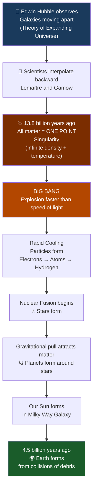
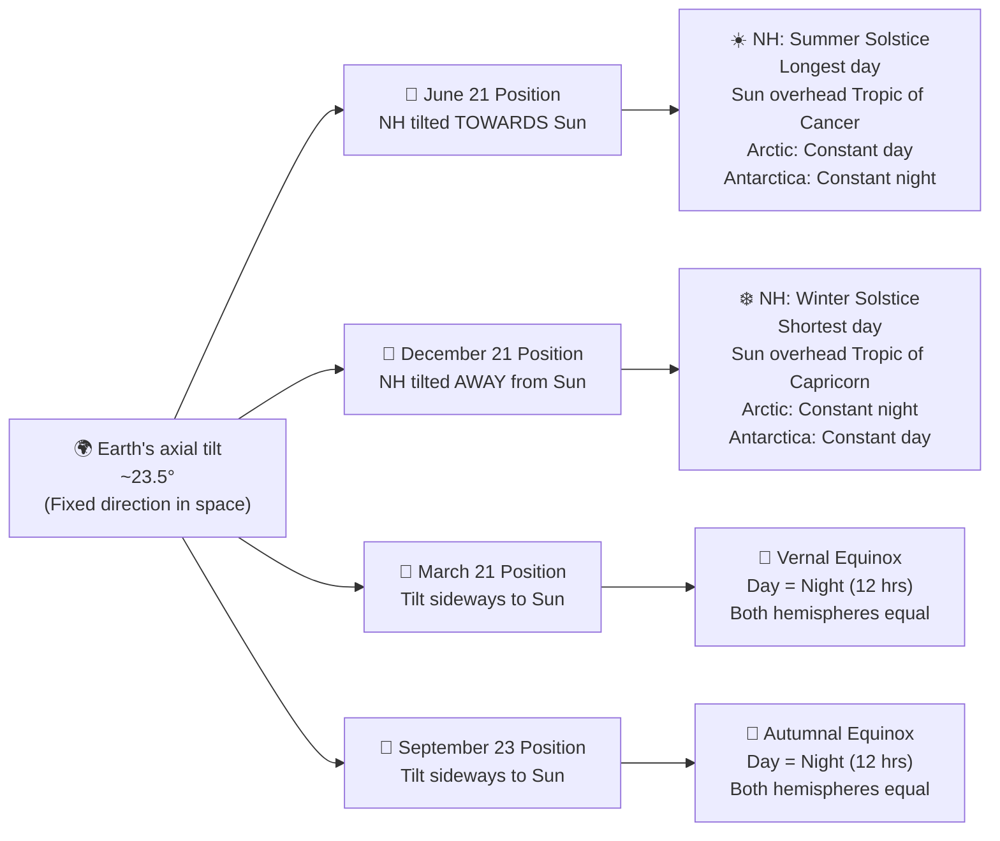
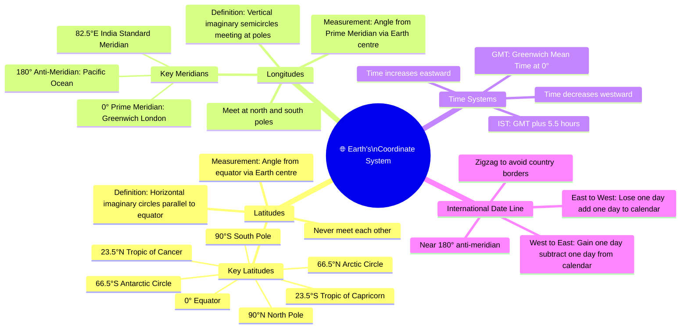
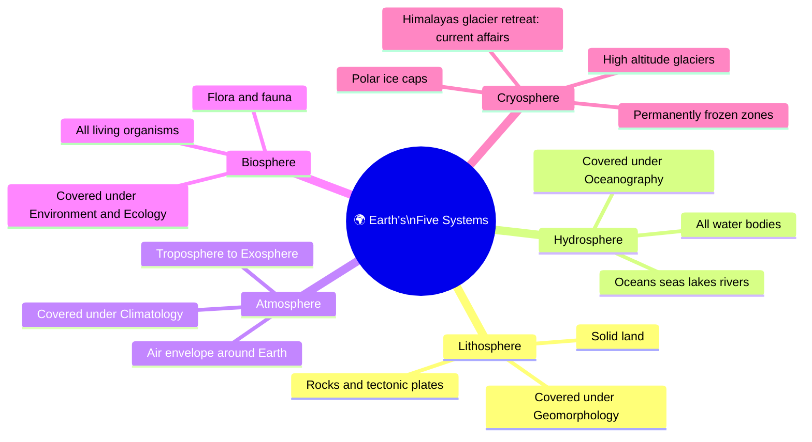

# 🌍 Geography – Module 1: Introduction, Geomorphology Basics & Earth's Motions

> **Syllabus Mapping:** GS Paper 1 (Geography) | Prelims (~15 direct Qs) | Mains GS1 (~105+ marks)
> **Source:** Lecture transcript – Baiju's Exam Prep | Corrections applied throughout

---

## 🧠 PART 1: STORY-BASED CONCEPTUAL EXPLANATION

---

### 📖 Why Geography Matters for UPSC — The Big Picture

Before diving into concepts, understand the *why* — because UPSC doesn't test random facts; it tests **applied geographical reasoning**.

Think about this: Why did Europeans colonise the tropics — India, Africa, Southeast Asia, the Caribbean — and not, say, the Arctic? The answer is geography. Tropical regions had resources, navigable coastlines, fertile land, and monsoon-driven agriculture. Without understanding geography, you cannot understand colonialism, migration, trade routes, or even modern geopolitics.

As a civil services officer, geography becomes your **lens for administration**:
- Why does Assam flood every year despite spending thousands of crore on management?
- Why are cloud bursts and landslides endemic to Himachal Pradesh?
- Why do fruit and grain prices spike in certain months? (→ agricultural geography)
- Why does India develop infrastructure in Andaman and Nicobar Islands? (→ strategic geography)

In the examination specifically:
- **Prelims:** ~15 direct questions → 8–10 from static, 4–5 from current affairs (dynamic)
- **Mains GS1:** 105+ marks directly from Geography
- **Environment & Ecology:** Understanding climate and landforms is prerequisite knowledge
- **Disaster Management (GS3):** All major disasters — earthquakes, cyclones, landslides, floods — are rooted in geographical processes
- **Interview:** Forest Service candidates with geography have been directly questioned on it

---

### 📖 The Module Roadmap — 25 Sessions

The 25-module journey is structured as follows:

| Modules | Topic | Why Important |
|---------|-------|---------------|
| 1–5 | **Geomorphology** | Foundation — landforms, rocks, continental theories, earthquakes, volcanoes |
| 6–12 | **Climatology** | Most conceptually demanding; monsoon, cyclones, jet streams, El Niño |
| 13–15 | **Oceanography** | Ocean currents, tides, salinity — feeds into climate and environment |
| 16–23 | **Indian Geography** | Human, economic, agricultural, industrial geography — directly exam-tested |
| 24 | **Mapping** | Mineral distribution, continental features |
| 25 | **Doubt Clearing** | Consolidation session |

**Key insight:** Physical geography (Modules 1–15) must be mastered conceptually. Once these foundations are clear, Indian and Human Geography become easy to understand — they are simply *applications* of the physical base.

---

### 📖 Books & Resources — What to Use

| Resource | Verdict | Notes |
|----------|---------|-------|
| **NCERT Class 11 & 12 Geography** | ✅ Primary and sufficient | Every UPSC question from last 10 years traceable to NCERT |
| NCERT Class 6–10 | ✅ If 11–12 feels heavy | No ego — start from basics if needed |
| **Atlas** | ✅ Essential companion | Use exploratively, not as a list-location exercise |
| G.C. Leong | ⚠️ Partial use only | Only Chapter on Climatic Classification of the World is useful; not written with UPSC in mind |
| Majid Husain | ⚠️ Optional | Recommended by some seniors for Indian Geography; not necessary |
| **Newspaper (daily)** | ✅ Non-negotiable | Builds integrative thinking — Geography + IR + Economy |

**Atlas approach (critical):** Don't just locate names. After every class, open the atlas, explore the discussed region, notice surrounding features, and link with any current affairs you've read. Example: When UPSC asked about nations bordering Ukraine (2022–23 Prelims), candidates who regularly used atlas alongside newspapers solved it instantly.

---

### 📖 The Origin of the Universe — From Geocentric to Big Bang

#### 🔹 Geocentric Model (Ancient)
Early humans observed the Sun rising in the east and setting in the west, stars moving across the sky every night. The natural inference: **We are the centre. Everything moves around us.** This is the **Geocentric Model** (Geo = Earth at centre).

This prevailed for centuries — not because ancient people were unintelligent, but because their observational tools were limited.

#### 🔹 Heliocentric Model (Replaced Geocentric)
As astronomical tools improved, scientists established that **the Earth moves around the Sun, not the other way around.** The Sun was considered the centre of everything — the **Heliocentric Model** (Helios = Sun). This too was eventually proven incomplete; the Sun itself is just one star among billions in the Milky Way galaxy.

#### 🔹 Theory of Expanding Universe — Edwin Hubble
In the 1900s, American astronomer **Edwin Hubble** observed something remarkable through his telescope: **every galaxy is moving away from every other galaxy.** Not towards each other — outward in all directions. He called this the **Theory of Expanding Universe**.

(Think of a balloon with confetti inside — as you inflate the balloon, all the confetti pieces move away from each other. The balloon is the universe; the confetti are the galaxies.)

The **Hubble Telescope** remained the most powerful telescope for decades. It was recently replaced by the **James Webb Space Telescope** — a UPSC-favourite current affairs topic.

#### 🔹 Big Bang Theory — Lemaître and Gamow
Once Hubble established that galaxies are moving apart, scientists **interpolated backwards in time** (interpolation = inferring past from present patterns; extrapolation = inferring future from present).

If everything is moving away now → they were closer before → much closer a billion years ago → even closer further back → at some point, perhaps **everything was one small mass.**

Scientists like **Lemaître and Gamow** calculated that approximately **13.8 billion years ago**, all matter in the universe existed as a single, infinitely dense, infinitely hot point — called a **Singularity**.

Due to extreme pressure and temperature, this singularity **exploded** — the **Big Bang** — releasing particles that travelled faster than the speed of light.

**Sequence of events after Big Bang:**

| Time After Big Bang | Temperature | Event |
|---------------------|-------------|-------|
| 10⁻⁴³ seconds | 10³²°C | Initial explosion |
| 10⁻³⁴ seconds | 10²⁷°C | Rapid cooling begins |
| 1 second | 10¹⁰°C | Significant cooling |
| ~3,00,000 years | ~3,000°C | Complex atoms form |
| ~1 billion years | — | First galaxies form |

As particles cooled → atoms formed → hydrogen created → nuclear fusion began → **stars ignited** → gravitational pull attracted more material → **planets formed** around stars.

Our Sun is one ordinary star in the Milky Way galaxy. **Age of the Universe: ~13.8 billion years. Age of Earth (our solar system): ~4.5 billion years.**

#### 🔹 Pulsating/Oscillation Theory
An alternative hypothesis: the universe expands, then contracts back into a singularity, then explodes again — cyclically. (Relevant for Science & Technology, not core geography.)

> 🔗 **Current Affairs Link:** The James Webb Space Telescope is sending back images of galaxies as they existed ~10 billion years ago — directly testing Big Bang predictions. UPSC has already asked questions on James Webb.

---

### 📖 The Solar System — Why Planets Orbit the Sun

**Why the Sun and not Earth?** Because the Sun has the greatest mass in the solar system, its gravitational pull dominates. Mass → Gravity → Orbital control.

**How do planets keep orbiting without falling into the Sun?**

Imagine holding a ball on a string and swinging it. The string (gravity) pulls it inward, but the ball's speed carries it sideways continuously — so it keeps moving in a circle. In space, there is no friction or air resistance to slow planets down, so this orbital motion continues indefinitely.

- A planet wants to fall toward the Sun (gravity pulling it in)
- But it has sideways velocity (from formation-era collisions)
- Result: it keeps "falling around" the Sun → **elliptical orbit**

This is why all orbits are **elliptical, not circular** — because a perfectly circular orbit would require artificially precise velocity, which doesn't occur naturally.

**Same principle applies to:**
- Moon orbiting Earth
- Satellites orbiting Earth
- Chandrayaan-3 and its insertion into lunar orbit

**Why launch satellites near the equator?**
The Earth's surface at the equator already moves at ~1,600 km/h (due to rotation). Launching from the equator means the rocket gets this speed "for free," reducing the fuel needed to reach orbit.
- USA launches from Texas and Florida (south = closer to equator)
- India launches from **Sriharikota** (southern India)
- France launches its heavy satellites (>4 tonnes) from **French Guiana** (South America) — because it sits near the equator

**Aphelion and Perihelion:**

| Term | Meaning | Distance |
|------|---------|----------|
| **Perihelion** | Earth closest to Sun | ~147 million km |
| **Aphelion** | Earth farthest from Sun | ~152 million km |

(Peri = near; Apo = far; Helion = Sun)

**For Moon–Earth system:**
- **Perigee** = Moon closest to Earth (Peri + Geo, Geo = Earth)
- **Apogee** = Moon farthest from Earth

You would have seen "Apogee/Perigee" displayed on ISRO screens during Chandrayaan-3 live broadcast — now you know exactly what it means.

---

### 📖 Earth's Rotation and Speed — Why Equatorial Regions Move Faster

The Earth rotates from **west to east** (that is why the Sun appears to rise in the east — the Earth is spinning towards it).

**Speed of rotation varies by latitude.** Here's the logical proof:

Speed = Distance ÷ Time

In one full rotation (one day = 24 hours), every point on Earth returns to its original position. But the **distance covered** differs:
- At the **Equator** — Earth is widest → longest circular path → most distance covered in 24 hours → **fastest speed (~1,600 km/h)**
- At **mid-latitudes** — smaller circle → less distance
- At the **Poles** — circle shrinks to nearly zero → a person at the pole just spins in place → **speed approaches zero**

**Exam application:** This differential speed drives the **Coriolis Effect**, which we'll study in Climatology — it deflects winds and ocean currents, causing cyclones to rotate in specific directions. UPSC has tested Coriolis-based reasoning multiple times.

**Why launch near equator?** Already answered above — you're piggybacking on Earth's rotational speed.

---

### 📖 Latitudes and Longitudes — The Coordinate System

#### 🔹 Latitudes (Lines of Parallel)

- Imaginary horizontal lines running **east–west**
- Measure angle from equator to the point, via the Earth's centre
- They **never meet** each other (parallel)
- **Equator = 0°** — largest circle on Earth

**How to measure latitude of point P:**
1. Draw a line from the Equator to Earth's centre (Line A)
2. Draw a line from point P to Earth's centre (Line B)
3. Measure the angle between A and B → that is the latitude
4. If north of equator → "N"; if south → "S"

**Important Latitudes (must memorise):**

| Latitude | Name | Significance |
|----------|------|-------------|
| 0° | **Equator** | Largest circle; max rotational speed; equal day-night year-round |
| 23½° N | **Tropic of Cancer** | Sun directly overhead on June 21 solstice |
| 23½° S | **Tropic of Capricorn** | Sun directly overhead on December 21 solstice |
| 66½° N | **Arctic Circle** | Boundary of midnight sun / polar night |
| 66½° S | **Antarctic Circle** | Boundary of Antarctic midnight sun / polar night |
| 90° N | North Pole | — |
| 90° S | South Pole | — |

#### 🔹 Longitudes (Meridians)

- Imaginary vertical lines running **north–south**
- **Meet at both poles** (unlike latitudes which never meet)
- Measure angle from Prime Meridian to the point, via Earth's centre

**Prime Meridian = 0° longitude**
- Passes through **Royal Observatory, Greenwich, near London**
- Chosen during British imperial dominance (1800s) — the Postmaster General of London standardised global timekeeping
- Divides Earth into **Eastern and Western Hemispheres**

**Anti-meridian = 180°** — exactly opposite to Prime Meridian, runs through the Pacific Ocean.

**Measuring longitude of point P:**
1. Draw line from Prime Meridian to Earth's centre (Line A)
2. Draw line from point P to Earth's centre (Line B)
3. Measure angle A–B → that is the longitude
4. If east of Prime Meridian → "E"; if west → "W"

**India's position:** Eastern Hemisphere + Northern Hemisphere

**Indian Standard Time (IST):**
- India's Standard Meridian = **82½° East** (passes through Mirzapur, UP)
- IST = GMT + 5½ hours
- If it is 8:00 PM in India → Greenwich time = 2:30 PM

---

### 📖 International Date Line (IDL)

The planet rotates continuously. Without a reference marker, there would be no consistent way to know when "tomorrow" begins globally.

**The IDL is placed approximately at 180° (the anti-meridian)** in the Pacific Ocean. However, it is **not a straight line** — it zigzags to avoid cutting through any country or island nation. (A straight IDL would split countries in half — one part celebrating one date, the other celebrating another.)

**Crossing the IDL:**

| Direction of Travel | Effect | Watch Adjustment |
|--------------------|--------|-----------------|
| East to West (e.g., India → Japan) | You *lose* one day | Add one day to calendar |
| West to East (e.g., Japan → USA) | You *gain* one day | Subtract one day from calendar |

**Example:** If your birthday is July 24th and you fly from India (July 24) to Japan, you land into July 25 — you've missed your birthday! Fly back and you relive it.

**New Year celebrations are NOT simultaneous** — Japan and Australia celebrate hours before India, which celebrates hours before Europe and Americas.

> 🔗 **Prelims Trap:** IDL is NOT the same as the Anti-Meridian. The anti-meridian is a mathematical line at 180°; the IDL is a legal/cartographic zigzag drawn near it for administrative convenience.

---

### 📖 Seasons — The Earth's Tilt and Orbital Position

**Why do seasons occur?** Two factors work together:

1. **Earth's axial tilt** (~23.5° from the perpendicular to its orbital plane) — the axis is never "straight up"; it leans
2. **Earth's position along its elliptical orbit** — different positions mean different hemispheres tilt towards or away from the Sun

**Important clarification:** Seasons are NOT caused by Earth's distance from the Sun. In fact, Earth is slightly *closer* to the Sun during the Northern Hemisphere's winter (Perihelion in early January). The difference in distance (147 vs 152 million km) is too small to significantly affect temperature. What matters is the **angle at which sunlight strikes and the duration of exposure**.

#### 🔹 Summer Solstice — June 21
- Northern Hemisphere tilted **towards** the Sun
- **Northern Hemisphere:** Longest day, shortest night → Summer
- **Southern Hemisphere:** Shortest day, longest night → Winter
- **Arctic Circle:** Permanent daylight (Sun never sets below horizon)
- **Antarctic Circle:** Permanent night
- Sun directly overhead at **Tropic of Cancer (23.5° N)** at noon

#### 🔹 Winter Solstice — December 21
- Northern Hemisphere tilted **away** from the Sun
- **Northern Hemisphere:** Shortest day, longest night → Winter
- **Southern Hemisphere:** Longest day, shortest night → Summer
- **Arctic Circle:** Permanent night
- **Antarctic Circle:** Permanent daylight
- Sun directly overhead at **Tropic of Capricorn (23.5° S)** at noon

#### 🔹 Equinoxes — March 21 and September 23
- Earth's tilt is **sideways** relative to the Sun (neither hemisphere tilted towards nor away)
- **Both hemispheres receive equal sunlight**
- Length of day = Length of night = 12 hours everywhere
- **Vernal Equinox:** March 21 (transition from winter to summer for Northern Hemisphere)
- **Autumnal Equinox:** September 23 (transition from summer to winter)

| Date | Event | Northern Hemisphere | Southern Hemisphere | Arctic | Antarctica |
|------|-------|---------------------|---------------------|--------|------------|
| June 21 | Summer Solstice | Longest day | Shortest day | Constant day | Constant night |
| Dec 21 | Winter Solstice | Shortest day | Longest day | Constant night | Constant day |
| Mar 21 | Vernal Equinox | Equal day-night | Equal day-night | Some sunlight | Some sunlight |
| Sep 23 | Autumnal Equinox | Equal day-night | Equal day-night | Some sunlight | Some sunlight |

> 🧾 **PYQ (2014 Prelims):** "On 21st June, the Sun does not set below the horizon at the Arctic Circle." — **Correct.** This is the June Solstice → permanent daylight in Arctic. The same question tested all four options listed above — a classic UPSC multi-statement question. Know all four phenomena for this date.

**Circle of Illumination:** The imaginary line separating the sunlit (day) and dark (night) halves of Earth at any point in time.

---

### 📖 Earth's Systems — Five Spheres

| Sphere | What It Includes | Covered Under |
|--------|-----------------|---------------|
| **Lithosphere** | Land, rocks, tectonic plates | Geomorphology |
| **Hydrosphere** | All water bodies — oceans, seas, lakes, rivers | Oceanography |
| **Atmosphere** | Air surrounding Earth | Climatology |
| **Biosphere** | All living organisms (flora and fauna) | Environment & Ecology |
| **Cryosphere** | Permanently frozen regions — polar ice, high-altitude glaciers | Geomorphology + Climatology |

---

### 📖 Basic Geomorphological Landforms — Introduction

| Landform | Features | UPSC Relevance |
|----------|----------|----------------|
| **Mountain** | Conical distinct peak, steep slopes, great height, often snow-capped | Fold mountains, Himalayas, Rockies — frequently tested |
| **Glacier** | Slow-moving mass of ice sliding down mountain slopes under gravity | Glacial erosion landforms in syllabus; Himalayan glaciers under climate change (current affairs) |
| **Hill** | Rounded top, lesser height, gentle slopes, no permanent snow | |
| **Plateau** | Flat table-land surface, steep surrounding slopes | Deccan Plateau, Tibetan Plateau — Indian geography |

---

## 🔄 PART 2: FLOWCHARTS / MINDMAPS

### Flowchart 1 — Origin of Universe to Earth Formation

---

### Flowchart 2 — Earth's Orbital Motion and Seasons

---

### Mindmap — Latitude, Longitude and Time Systems

---

### Mindmap — Earth's Five Systems

---

## ⚡ PART 3: QUICK REVISION NOTES

### 📌 Key Definitions

- **Geocentric Model:** Ancient model — Earth at centre of universe; everything revolves around it
- **Heliocentric Model:** Sun at centre of universe (replaced geocentric; also eventually superseded)
- **Big Bang Theory:** Universe originated ~13.8 billion years ago from a singularity explosion
- **Singularity:** The infinitely dense, infinitely hot single point that contained all matter before the Big Bang
- **Theory of Expanding Universe:** Edwin Hubble's observation that all galaxies are moving away from each other
- **Perihelion:** Earth closest to Sun (~147 million km) — early January
- **Aphelion:** Earth farthest from Sun (~152 million km) — early July
- **Perigee:** Moon closest to Earth
- **Apogee:** Moon farthest from Earth
- **Circle of Illumination:** Imaginary line separating day and night on Earth's surface
- **Solstice:** Day of maximum tilt of one hemisphere toward Sun (longest/shortest day)
- **Equinox:** Day when both hemispheres receive equal sunlight; day = night = 12 hours
- **Prime Meridian:** 0° longitude passing through Royal Observatory, Greenwich, London
- **IST (Indian Standard Time):** GMT + 5½ hours; Standard Meridian = 82.5° East
- **International Date Line (IDL):** Zigzag line near 180° in Pacific; separates calendar dates
- **Glacier:** Slow-moving mass of ice descending mountain slopes under gravity
- **Plateau:** Flat table-land with steep surrounding slopes
- **Cryosphere:** All permanently frozen areas on Earth

---

### 📌 Important Dates and Angles

| Date | Event | Sun Overhead |
|------|-------|-------------|
| March 21 | Vernal Equinox | Equator (0°) |
| June 21 | Summer Solstice (NH) / Winter Solstice (SH) | Tropic of Cancer (23.5°N) |
| September 23 | Autumnal Equinox | Equator (0°) |
| December 21 | Winter Solstice (NH) / Summer Solstice (SH) | Tropic of Capricorn (23.5°S) |

---

### 📌 Speed of Rotation

- **Equator:** ~1,600 km/h (fastest)
- **Mid-latitudes:** Decreases progressively
- **Poles:** Zero (person at pole spins in place)
- **Formula:** Speed = Distance ÷ Time; equatorial circle > polar circle → equatorial speed > polar speed

---

### 📌 Map-Based Facts

- **Prime Meridian:** Passes through Greenwich (London), not through India
- **India's Standard Meridian:** 82.5°E passes through Mirzapur, Uttar Pradesh
- **IDL:** Located in the Pacific Ocean; zigzags around island nations (Fiji, Samoa, etc.)
- **India's hemispheric position:** Northern Hemisphere + Eastern Hemisphere
- **Launch sites near equator:** Sriharikota (India); Kennedy Space Center, Florida (USA); French Guiana (ESA)
- **Japan:** "Land of the Rising Sun" — easternmost major country; first to see sunrise

---

### 📌 Prelims Traps

1. ❗ **Seasons ≠ Distance from Sun** — Earth is closest to Sun (Perihelion) in *January* yet Northern Hemisphere experiences winter. Seasons are caused by *axial tilt*, not distance.
2. ❗ **Aphelion is in July, Perihelion is in January** — counterintuitive; NH winter = Earth closer to Sun.
3. ❗ **IDL ≠ Anti-Meridian** — IDL is a zigzag administrative line; anti-meridian is the mathematical 180° line.
4. ❗ **Crossing IDL East → West: ADD a day; West → East: SUBTRACT a day** — many students get this backwards. Mnemonic: Going West loses your day (you're heading into "used" time zones).
5. ❗ **Arctic vs Antarctica in June Solstice:** Arctic = constant DAY; Antarctica = constant NIGHT. Reverse for December solstice.
6. ❗ **Equinox happens TWICE:** March 21 (Vernal) and September 23 (Autumnal) — not once.
7. ❗ **Hubble Space Telescope ≠ James Webb Telescope** — James Webb (launched 2021) replaced Hubble for deep space imaging. UPSC has asked about James Webb.
8. ❗ **Age of Universe ≠ Age of Earth:** Universe ~13.8 billion years; Earth ~4.5 billion years.

---

### 📌 PYQ-Focused Facts

- **PYQ 2014 Prelims:** "On 21st June, the Sun does not set below the horizon at the Arctic Circle" — **TRUE** (June Solstice → Arctic permanent day)
- **PYQ trend:** Questions on countries bordering Ukraine (atlas + current affairs), mineral distribution in Africa (atlas + mapping), Nagorno-Karabakh location (current affairs + atlas)
- **PYQ pattern:** Solstice and equinox multi-statement questions — know all conditions (NH/SH day-night + Arctic/Antarctica + sun's overhead position) for both solstices

---

### 📌 Current Affairs Linkages

| Current Affairs Event | Geography Connection |
|----------------------|---------------------|
| James Webb Telescope | Big Bang Theory, origin of universe, deep space observation |
| Chandrayaan-3 ISRO launch | Orbital mechanics, Perigee/Apogee, escape velocity, Sriharikota location |
| Glacial retreat in Himalayas | Cryosphere, climate change, disaster management (GLOF) |
| Europe heat waves | Jet streams, Atlantic Meridional Overturning Circulation (AMOC) — to be covered in Climatology |
| Assam floods / Yamuna floods | River geomorphology, monsoon — to be covered later |
| Nagorno-Karabakh dispute | Atlas-based question, resource geography (oil-rich region) |
| Ukraine war-related questions | Countries bordering Ukraine — atlas-linked Prelims question |

---

### 📌 Geography Module Sequence — Memory Aid

> **"G-C-O-I"** → **Geo**morphology → **C**limatology → **O**ceanography → **I**ndian Geography

Physical Geography (G+C+O) = Foundation; Indian Geography = Application.

---

*Notes prepared from Baiju's Exam Prep — Geography Module 1 | Integrated with NCERT Class 11–12, Atlas approach, and UPSC PYQ analysis*
