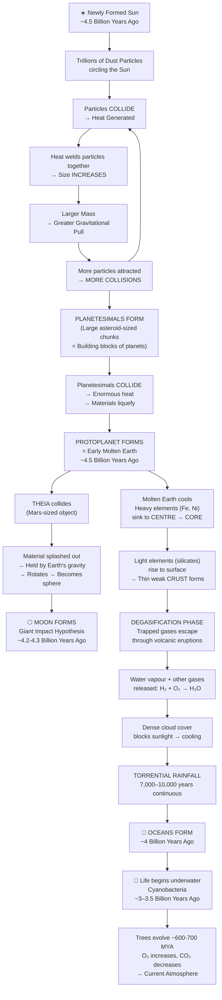
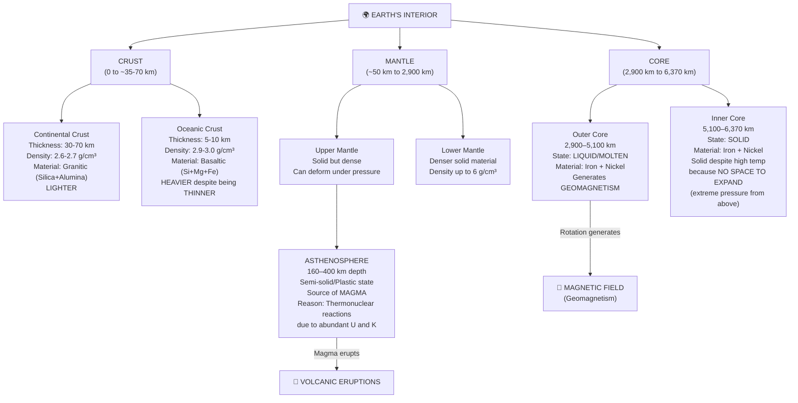
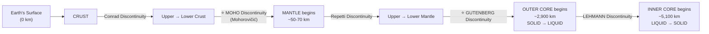
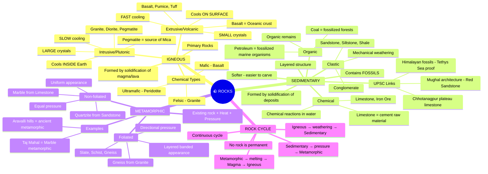

# 🌍 Formation of Earth, Interior Structure & Rocks
### *Physical Geography | GS Paper 1 | Prelims + Mains*

> **Exam Relevance:** UPSC Prelims (rock types, discontinuities, element abundance) + Mains GS-1 (formation theories, plate tectonics linkage, Himalayan formation) + Essay Paper (geological time, life evolution)

---

## 🧠 PART 1: STORY-BASED CONCEPTUAL EXPLANATION

---

### 📖 Chapter 1: The Birth of Planet Earth — The Accretion Theory

#### 🌟 Why Does This Matter for UPSC?

Before you understand earthquakes, volcanoes, the Himalayas, or even why the Deccan Plateau exists — you must understand *how Earth was born*. UPSC doesn't ask "describe the formation of Earth" directly, but it asks **implied questions** like:

- "The atmosphere of present-day Earth has been consistent since its formation — True or False?" *(Prelims trap!)*
- "The magnetic poles of Earth have remained consistent since formation — True or False?" *(Prelims 2019-type)*
- "What do you understand by primary rocks? Discuss its types." *(Mains 2022)*

Understanding formation gives you the **logical backbone** to answer all of these.

---

#### 🕰️ 4.5 Billion Years Ago: The Solar Nebula

Picture the early solar system — no planets, no Moon, just the **newly formed Sun** surrounded by trillions of dust particles of varying sizes drifting in space.

**Step 1 — Dust Particles Collide:**
These particles moved around the Sun constantly. With so many particles sharing the same space, **collisions were inevitable**. Two types of collisions occurred:
- **High-velocity head-on collision** → particles break apart, scatter, but generate heat
- **Glancing collision** (one particle moving at 5 km/h, another at 500 km/h) → particles generate immense heat at the point of contact → **materials weld together** (like natural soldering)

*(Think of it as the universe's own welding machine — heat from collision = glue for particles)*

**Step 2 — Size Increases → Gravity Increases:**
As particles stuck together, their mass grew. And here's the key physics:

> **Any object with mass exerts a gravitational pull. Larger the mass → Greater the gravitational pull.**

So larger clumps attracted more particles → more collisions → more heat → more welding → even larger clumps. This was a **self-reinforcing cycle**.

**Step 3 — Planetesimals Form:**
After millions of years of this cycle, instead of dust particles, you had **large chunks of matter** — the size of very large asteroids. These are called **Planetesimals** — the building blocks of planets.

> 📌 **Planetesimals** = Large chunks of matter formed by collision and welding of dust particles; building blocks of planets. *[The asteroid belt between Mars and Jupiter represents leftover planetesimals that never formed a planet — UPSC loves this fact!]*

**Step 4 — Protoplanet Forms (Molten Earth):**
Planetesimals collided with each other. These collisions were catastrophic — generating **so much heat** that materials liquefied and even vaporized at contact points. Eventually, massive amounts of material came together to form the earliest version of Earth — called a **Protoplanet**.

> 📌 **Protoplanet** = Earliest form of a planet; in the case of Earth, it was a **large molten mass** (~4.5 billion years ago)

**⚠️ This entire process is called the ACCRETION THEORY of planetary formation.**

---

#### 🌡️ Chapter 2: The Molten Earth — Differentiation of Layers

Early Earth was entirely in **molten (liquid) state**. Now imagine a glass cylinder with water, honey, and oil poured together. What happens?
- **Oil** (lightest) rises to the top
- **Water** (medium) sits in the middle
- **Honey** (densest) sinks to the bottom

The same principle applied to molten Earth. The **"bottom" of Earth = its centre** (gravity pulls everything towards the centre, from all directions).

**Heaviest elements sank to the centre:**
At that time, the heaviest available elements were **Iron (Fe) and Nickel (Ni)**. They sank to the centre and formed the **Core**.

> 🔹 This is why Earth's core is dominated by Iron and Nickel — *till today*. This is also why the core generates Earth's **magnetic field** (geomagnetism).

Lighter elements — silicates, alumina — floated upward, eventually forming the **Crust**.

---

#### 🌕 Chapter 3: Formation of the Moon — The Giant Impact Hypothesis

Around **4.2–4.3 billion years ago**, while Earth was still molten and rearranging itself, a **Mars-sized celestial object called Theia** collided with Earth.

Since Earth was still liquid (molten), the impact **splashed enormous amounts of material** outward. This splashed material was:
- Held by Earth's gravitational pull (it couldn't escape)
- Started rotating around Earth
- Continuous rotation in circular motion → naturally formed a **spherical shape**

> 📌 This spherical body became **the Moon** — Earth's natural satellite.
> 📌 This theory is called the **Giant Impact Hypothesis**

*(The Moon is literally a child of Earth — it was once part of Earth itself!)*

**UPSC Trap:** "Can the Moon be said to be a part of Earth?" → **YES**, based on the Giant Impact Hypothesis.

---

#### 🌊 Chapter 4: Cooling Down — Degasification → Torrential Rains → Oceans

**Cooling starts from outside inward** (just like boiling milk — the surface cools and forms a thin skin, but inside remains boiling hot).

As the outer surface started solidifying, lighter materials (silicates, alumina) rose to the top and formed a thin, weak outer crust.

**But inside — gases were trapped!**

When compounds like silica (SiO₂) were superheated, silicon liquefied but **oxygen escaped as gas**. Similarly, heating various compounds released gases like:
- Ammonia (NH₃)
- Methane (CH₄)
- Carbon dioxide (CO₂)
- **Oxygen (O) and Hydrogen (H)** — these combined to form **Water Vapour (H₂O)**

These gases were lighter → they rose toward the surface → the weak outer crust couldn't hold them → they burst through, causing **billions of volcanic eruptions** across the entire planet.

> 📌 **Degasification** = The phase in Earth's evolution when trapped gases escaped from the interior through massive volcanic eruptions, releasing water vapour and other gases into the early atmosphere.

**The Chain Reaction:**
Volcanic eruptions → Released gases including water vapour → Water vapour rose and formed **dense, thick clouds** covering the entire planet → Clouds blocked sunlight → Temperature dropped rapidly → Cooling accelerated → More clouds → Clouds rich in water vapour → **TORRENTIAL RAINFALL**

> 📌 Earth experienced **continuous rainfall for 7,000 to 10,000 years** (not days — *years!*)

This rainfall:
1. Further cooled the surface
2. Filled low-lying areas
3. Created the **oceans and seas** (the entire Hydrosphere)

**Life Emerged:** Around **3 to 3.5 billion years ago**, the earliest life — **cyanobacteria (blue-green bacteria)** — developed *underwater*. It consumed CO₂ and released O₂. This is how oxygen gradually built up in the atmosphere over hundreds of millions of years.

**Trees evolved ~600–700 million years ago** → Massive O₂ production → CO₂ levels fell → Current atmosphere was established over the last 400–500 million years.

> 🔹 **Prelims Trap:** "Earth's atmosphere has been consistent since formation." → **FALSE** — it has changed dramatically (degasification → water vapour → CO₂-rich early atmosphere → current N₂/O₂ atmosphere).

---

### 📖 Chapter 5: Interior Structure of the Earth

How do we **know** what's inside Earth when nobody has ever been there?

#### 🔬 Sources of Information

**Direct Sources:**
1. **Volcanic Eruptions** — Lava from the asthenosphere (upper mantle) gives us material samples
2. **Mining and Drilling** — Deepest borehole: **Kola Peninsula** (northern Eurasian continent, Soviet Russia), ~12 km deep. [China is currently drilling multiple ~10 km holes.]
   - This gives us the **Geothermal Gradient** — temperature increases with depth (approx. 20–25°C per km)

> 📌 **Geothermal Gradient** = Increase in temperature with increase in depth (due to residual heat from formation)

**Indirect Sources:**
1. **Seismic Waves** — Earthquake energy waves travel through Earth's interior; by studying their paths and behaviour, we map internal layers
2. **Magnetic Field (Geomagnetism)** — Changes in magnetic field reveal changes in the molten outer core composition
3. **Gravitational Force** — Gravity readings vary across Earth's surface (Earth is an oblate spheroid — slightly bulged at equator, flattened at poles) revealing interior density variations
4. **Meteorites** — Represent early solar system material; studying them tells us what elements were present when Earth formed

> 🔹 **UPSC PYQ:** "Magnetic poles of Earth have remained consistent since formation." → **FALSE** — they shift (e.g., in April–May 2020, magnetic north pole shifted slightly due to movement of iron-nickel concentration in outer core)

---

#### 🌐 The Three Main Layers

**Analogy: A Coconut**
- **Hard outer shell** = Crust
- **White fruity solid part** = Mantle
- **Liquid interior** = Outer Core (and solid inner core at the very centre)

---

#### Layer 1: THE CRUST

- **Outermost, thinnest, most brittle** layer
- Represents only **~1% of Earth's total mass**
- Everything we see — mountains, plains, ocean floors — is just the crust

| Feature | Continental Crust | Oceanic Crust |
|---|---|---|
| Thickness | ~30–35 km (up to ~70 km under Himalayas) | ~5–10 km |
| Dominant Material | Silica + Alumina (Granitic rocks) | Silica + Magnesium + Iron (Basaltic rocks) |
| Density | ~2.6–2.7 g/cm³ | ~2.9–3.0 g/cm³ |
| Weight | **LIGHTER** | **HEAVIER** |
| Also Called | SiAl layer | SiMa layer |

> ⚠️ **NCERT Error Alert:** NCERT has the density figures for continental and oceanic crust **interchanged** in some editions. Remember: **Oceanic crust is ALWAYS heavier than continental crust** (despite being thinner) because it has greater density — like comparing a thin iron sheet vs. a thick thermocol block.

**Why is the crust thicker under mountains like the Himalayas?**
Because mountain formation involves **compression from both sides** → the crust buckles upward AND downward → it thickens. Himalayan crust can be up to **70 km thick**.

*(Think of pushing a rubber mat from both sides — it rises in the middle but also sinks downward)*

---

#### Layer 2: THE MANTLE

- Starts ~50–70 km below the surface (immediately below the crust)
- Extends to ~2,900 km depth
- Represents ~**68% of Earth's mass**
- Average density: **3.4–3.5 g/cm³** (increases with depth, can reach ~6 g/cm³ in lower mantle)
- State: **Solid** — but under immense pressure, materials **deform** rather than break

**The Asthenosphere — The "Weak Zone":**

Within the upper mantle, at a depth of **~160 to 400 km**, there exists a special layer:

> 📌 **Asthenosphere** = A semi-solid, plastic/partially molten layer in the upper mantle (derived from Greek *Asthenos* = weak)

**Why is it semi-molten here specifically?**
At this depth, there is a **sudden abundance of radioactive materials** — particularly **Uranium (U)** and **isotopes of Potassium (K)**. Under the conditions of **high temperature + high pressure** already existing at this depth, these materials undergo **thermonuclear reactions** → generating additional intense heat → **partially melting the surrounding rock** → creating the semi-solid asthenosphere.

> 🔹 The **Asthenosphere is the primary source of magma** that erupts during volcanic eruptions.

**Lithosphere vs. Asthenosphere:**

> 📌 **Lithosphere** = Solid Crust + Solid Upper Mantle (above the asthenosphere). This is the rigid outer shell that is broken into **tectonic plates**.
> 📌 **Asthenosphere** = Weak, semi-solid layer below the lithosphere on which tectonic plates "float" and move.

*(Lithosphere = tectonic plate material; Asthenosphere = the "lubricant" that allows plates to move)*

---

#### Layer 3: THE CORE

- Starts at ~2,900 km depth
- Dominated by **Iron (Fe) and Nickel (Ni)** → also called the **"NiFe layer"**
- Represents ~**31% of Earth's mass**

| Feature | Outer Core | Inner Core |
|---|---|---|
| Depth | 2,900 km to ~5,100 km | ~5,100 km to 6,370 km (centre) |
| State | **LIQUID (Molten)** | **SOLID** |
| Temperature | Extremely high | Even higher |
| Pressure | Very high | Maximum — highest in Earth |

**Why is the Inner Core SOLID despite being hotter than the Outer Core?**

This is a classic logic question. For a solid to melt → it must **expand** (molecules move apart). But the inner core is surrounded by **thousands of kilometres of dense material pressing down on it from all sides**. There is **no space to expand** → molecules cannot free themselves → **it cannot melt regardless of temperature**.

*(Analogy: If you heat a metal block but weld it into a rigid box that allows zero expansion, it cannot melt — it stays solid under pressure)*

The outer core has slightly less pressure (a few thousand km less of material above it) → expansion is possible → it remains **liquid**.

---

#### ⚡ GEOMAGNETISM

**Why does Earth have a magnetic field?**

1. Earth rotates on its axis
2. The **liquid outer core** (made of molten iron and nickel) **rotates with Earth**
3. Iron and nickel exist as **ions (charged particles)** at these temperatures — free electrons
4. When these charged particles rotate in a **spiral/circular pattern** → they generate a **magnetic field** (just like electricity flowing through a coiled wire — a solenoid — generates magnetism)
5. Magnetic field lines concentrate at the **poles** (maximum density) and spread outward

> 📌 **Geomagnetism** = Earth's magnetic field generated by the rotation of the liquid outer core (rich in iron and nickel ions)

**Why do magnetic poles shift?**
When large chunks of iron-nickel in the outer core shift their position (due to convection in the liquid outer core), the **centre of magnetic field generation shifts** → magnetic poles move.

> 🔹 **2020 Current Affairs:** Earth's magnetic north pole shifted slightly in April–May 2020 → confirmed movement of iron-nickel concentration in the outer core.

**Residual Heat:**
The heat retained inside Earth since its formation is called **Residual Heat**. This drives all **endogenic forces** — volcanic eruptions, earthquakes, plate movement, Himalayan uplift — everything happening inside Earth is powered by this original heat of formation.

---

#### 📐 Discontinuities within Earth

A **Discontinuity** is a zone where the nature, density, molecular arrangement, and properties of Earth's material change **suddenly** due to changing temperature and pressure.

| Discontinuity | Separates | Importance |
|---|---|---|
| **Conrad Discontinuity** | Upper Crust and Lower Crust | — |
| **Mohorovičić (Moho) Discontinuity** | Crust and Mantle | ⭐ Most important for UPSC |
| **Repetti Discontinuity** | Upper Mantle and Lower Mantle | — |
| **Gutenberg Discontinuity** | Mantle and Outer Core | ⭐ Important for UPSC |
| **Lehmann Discontinuity** | Outer Core and Inner Core | — |

> 🔹 **Prelims Focus:** When you read "earthquake focus 50 km below the Moho" → Moho = Mohorovičić Discontinuity = boundary between crust and mantle. The two most important discontinuities for UPSC: **Moho** and **Gutenberg**.

---

#### 🧪 Elemental Abundance — Prelims Fact

| Considering WHOLE EARTH | Considering EARTH'S SURFACE (Crust only) |
|---|---|
| 1st: **Iron** | 1st: **Oxygen** |
| 2nd: **Oxygen** (as oxides) | 2nd: **Silicon** |
| 3rd: **Silicon** | 3rd: **Aluminium** |
| 4th: **Magnesium** | 4th: **Iron** |

> ⚠️ **Prelims Trap:** "Oxygen is the most abundant element in the whole Earth" → **FALSE** (it's the most abundant in the crust only; Iron is most abundant in whole Earth). Remember the **Top 4** for both cases.

---

### 📖 Chapter 6: Types of Rocks

Every rock you see is one of three types — classified by **how it was formed**.

---

#### 🔥 Type 1: Igneous Rocks (Primary Rocks)

> 📌 **Igneous** = From Latin *Ignis* = fire
> 📌 **Igneous Rocks** = Rocks formed by the cooling and solidification of molten magma or lava

**Why called Primary Rocks?**
When Earth first solidified, the first rocks formed were igneous. Every new landmass that forms starts as igneous rock. They are the **original, fundamental rock type** — hence "primary."

> ⚠️ **UPSC Mains 2022 Trap:** Many coaching institutes wrongly say primary rocks include all three types. **Correct answer: Primary rocks = Igneous rocks only.**

**Two Sub-types Based on Where Cooling Occurs:**

| Feature | Intrusive (Plutonic) | Extrusive (Volcanic) |
|---|---|---|
| Where it cools | **Inside Earth** (interior) | **On Earth's surface** |
| Rate of cooling | **Very SLOW** | **Very FAST** |
| Crystal size | **LARGE** (particles have time to bond extensively) | **SMALL** (rapid solidification) |
| Examples | Granite, Diorite, Pegmatite | Basalt, Pumice, Tuff |
| Special note | Pegmatite → source of **Mica** ore | Basalt → forms **oceanic crust** |

**Logic behind crystal size:**
- Slow cooling (inside) → each particle has time to form bonds with many surrounding particles → particles grow larger → **large crystals**
- Fast cooling (surface) → particles freeze quickly → little time to bond → **small crystals**

*(Analogy: Slowly freezing water makes large ice crystals; rapidly freezing water makes tiny ice crystals)*

**Chemical Classification of Igneous Rocks (Mains level):**
Based on silica (SiO₂) and iron-magnesium content:
- **Felsic** rocks (feldspar + silica rich) → e.g., Granite (continental crust)
- **Mafic** rocks (magnesium + iron rich) → e.g., Basalt (oceanic crust)
- **Ultramafic** rocks (very high iron + magnesium) → e.g., Peridotite (mantle material)

---

#### 💧 Type 2: Sedimentary Rocks

> 📌 **Sediment** = Any deposit carried and laid down by rivers, wind, glaciers, or water
> 📌 **Sedimentary Rocks** = Rocks formed by the solidification of accumulated deposits through compaction and cementation

**Formation Process:**
1. Existing rocks get **weathered and eroded** (broken down by sun, rain, cold, wind)
2. Deposits accumulate in layers (river deltas, sea floors, desert dunes)
3. More deposits pile on top → upper layers exert weight → **compaction** occurs
4. Minerals bind the particles together → **cementation** → rock forms

**Key Characteristics:**
- **Layered/stratified structure** (multiple different particles visible in layers)
- **Softer** and easier to carve than igneous rocks
- **Contains fossils** — dead organisms get buried between sediment layers and fossilize
- Most sedimentary rocks form **underwater** or in water-rich environments

> 🔹 **Art & Culture Connection (UPSC Mains):** Mughal architecture (Red Fort, Agra Fort, Fatehpur Sikri) primarily uses **Red Sandstone** — a sedimentary rock — because it is **easier to carve intricate designs**. Igneous rocks are too hard to carve.
> 🔹 **Historical example:** Hauz Khas Village (Delhi) — older structures (1200s, Khilji period) built with igneous rock → no decorative carvings; later structures (1300s, Tughlaq period) built with sedimentary rock → intricate designs visible.

**Three Sub-types of Sedimentary Rocks:**

| Type | How Formed | Examples |
|---|---|---|
| **Clastic** | Mechanical weathering → fragments deposit and solidify | Sandstone, Siltstone, Conglomerate, Shale |
| **Chemical** | Chemical reactions in water bodies → precipitates settle | Limestone, Iron Ore |
| **Organic** | Organic remains (plants/animals) accumulate, compress, solidify | Coal, some Limestone |

**Formation of Limestone (Chemical Sedimentary):**
In shallow seas → shell-bearing animals (crabs, lobsters, molluscs) die → calcium carbonate-rich shells deposit on seafloor → compressed over millions of years → **Limestone**

> 🔹 **Economy linkage:** Limestone is the primary raw material for **cement manufacturing**.
> 🔹 **Environment linkage:** Wherever you find limestone deposits today → that area was once **underwater** (e.g., limestone in the Himalayas proves it was once under the Tethys Sea).

**Formation of Iron Ore (Chemical Sedimentary):**
Shallow seas with dissolved iron → early plants perform photosynthesis → release O₂ → O₂ + dissolved Fe → Fe₂O₃ (Iron Oxide — solid) → settles on seafloor → **Iron Ore deposits**

**Formation of Coal (Organic Sedimentary):**
Forests die → buried under deposits → compressed over millions of years → **carbonification** → Coal. *(Coal = fossilized forests)*

**Formation of Petroleum (Organic Sedimentary):**
Marine animals die underwater → buried under deposits (preventing full decomposition) → compressed over millions of years → **Crude oil + Natural gas**. *(Petroleum = fossilized marine organisms)*

> 🔹 **Example:** Rajasthan has petroleum deposits → means Rajasthan was once underwater! Similarly, Saudi Arabia, Kuwait — all were once ocean floors.

**Why are Fossils found ONLY in Sedimentary Rocks?**
Igneous rocks form from liquid magma — any organism would be incinerated. Metamorphic rocks form under extreme heat/pressure — fossils would be destroyed. Only sedimentary rocks form through gentle layer-by-layer accumulation → organisms can be preserved between layers.

> 🔹 **Himalayan Proof:** Marine animal fossils found in the Himalayas at high elevations → Himalayas were once the floor of the **Tethys Sea** → this proves plate tectonic collision (Indian Plate colliding with Eurasian Plate) pushed the sea floor upward to form mountains.

---

#### 🔄 Type 3: Metamorphic Rocks

> 📌 **Metamorphic** = From Greek *Metamorphos* = to change form
> 📌 **Metamorphic Rocks** = Rocks formed when any existing rock (igneous or sedimentary) is subjected to high temperature and/or high pressure, causing complete change in its physical and chemical properties

**Formation:**
Any rock type + High Temperature + High Pressure → Molecular structure changes → New rock with completely different properties

**Two Sub-types:**

| Type | Appearance | How Formed | Examples |
|---|---|---|---|
| **Foliated** | Banded/layered appearance (like onion layers) | Directional pressure causes minerals to align in layers | Slate, Phyllite, Schist, **Gneiss** (from Granite) |
| **Non-foliated** | Uniform, no layers | Equal pressure from all directions | **Marble** (from Limestone), Quartzite (from Sandstone) |

**Famous Examples:**
- **Marble** = Limestone → exposed to high temperature + pressure → Marble
  - *Taj Mahal is built of marble — a metamorphic rock!*
  - Limestone (dull grey) vs. Marble (beautiful, crystalline) — same material, completely transformed
- **Gneiss** = Granite (igneous) → metamorphism → Gneiss
  - **Chhotanagpur Plateau** is one of the oldest landmasses, composed of ancient metamorphic and igneous rocks (gneiss, schist) — sometimes called Earth's oldest surviving landmass

---

#### 🔁 The Rock Cycle

No rock is permanent. Any rock type can transform into any other rock type given the right conditions.

**The Complete Cycle:**

```
Magma (molten material)
    ↓ cools slowly (inside)
Intrusive Igneous Rock (e.g., Granite)
    ↓ OR cools fast (surface)
Extrusive Igneous Rock (e.g., Basalt)
    ↓ weathering + erosion → deposits
Sediments → compaction + cementation
    ↓
Sedimentary Rock (e.g., Limestone, Sandstone)
    ↓ high temperature + pressure (e.g., mountain building)
Metamorphic Rock (e.g., Marble, Gneiss)
    ↓ further heat → melts → goes back underground
Magma (cycle restarts)
```

*(Any rock can skip steps — an igneous rock can directly become metamorphic; a sedimentary rock can melt back into magma — the cycle has no fixed start or end)*

---

## 🔄 PART 2: FLOWCHARTS & MINDMAPS

### Flowchart 1: Formation of Earth (Accretion Theory)



---

### Flowchart 2: Interior Structure of Earth



---

### Flowchart 3: Discontinuities



---

### Mindmap: Types of Rocks



---

## ⚡ PART 3: QUICK REVISION NOTES

---

### 📌 Key Definitions (1-liner each)

- **Accretion Theory** → Theory of planet formation through dust particle collisions, welding by heat, and gradual mass accumulation
- **Planetesimal** → Large asteroid-sized chunk of matter; building block of planets
- **Protoplanet** → Earliest form of a planet; early Earth was a large molten protoplanet
- **Theia** → Mars-sized celestial body whose collision with molten Earth ~4.2–4.3 Bya created the Moon
- **Giant Impact Hypothesis** → Theory explaining Moon's formation through Theia's collision with early Earth
- **Degasification** → Phase when trapped interior gases escaped via volcanic eruptions, releasing water vapour and forming atmosphere
- **Geothermal Gradient** → Increase in Earth's temperature with increasing depth (~20–25°C per km)
- **Residual Heat** → Heat retained in Earth's interior since formation; drives all endogenic forces
- **Asthenosphere** → Semi-solid, weak layer in upper mantle (160–400 km); source of magma; tectonic plates move over it
- **Lithosphere** → Solid crust + solid upper mantle above asthenosphere; broken into tectonic plates
- **Geomagnetism** → Earth's magnetic field generated by rotation of liquid outer core (Fe + Ni ions)
- **Moho Discontinuity** → Boundary between crust and mantle (most important discontinuity)
- **Gutenberg Discontinuity** → Boundary between mantle and outer core (solid → liquid transition)
- **Igneous Rock** → Formed by cooling and solidification of magma/lava; called Primary Rocks
- **Sedimentary Rock** → Formed by compaction and cementation of deposits; contains fossils; layered
- **Metamorphic Rock** → Formed when existing rocks are transformed by high heat and/or pressure
- **Rock Cycle** → Continuous process of transformation between igneous, sedimentary, and metamorphic rocks

---

### 🔢 Critical Numbers for Prelims

| Fact | Value |
|---|---|
| Age of Earth | ~4.5 Billion years |
| Torrential rainfall duration | 7,000–10,000 years |
| Earliest life (cyanobacteria) | ~3–3.5 Billion years ago |
| Trees evolved | ~600–700 Million years ago |
| Geothermal gradient | ~20–25°C per km depth |
| Deepest borehole (Kola Peninsula) | ~12 km |
| Oceanic crust thickness | ~5–10 km |
| Continental crust thickness | ~30–35 km (up to 70 km under Himalayas) |
| Mantle: starts at | ~50–70 km |
| Mantle: ends at | ~2,900 km |
| Asthenosphere depth | 160–400 km |
| Outer Core | 2,900–5,100 km (LIQUID) |
| Inner Core | 5,100–6,370 km (SOLID) |
| Earth's radius | ~6,370 km |
| Crust = % of Earth's mass | ~1% |
| Mantle = % of Earth's mass | ~68% |
| Core = % of Earth's mass | ~31% |
| Continental crust density | 2.6–2.7 g/cm³ |
| Oceanic crust density | 2.9–3.0 g/cm³ |
| Average mantle density | 3.4–3.5 g/cm³ |

---

### 🗺️ Map-Based Facts

| Location | Significance |
|---|---|
| **Kola Peninsula** (N. Eurasia, Russia) | World's deepest borehole (~12 km); drilled by Soviet Russia |
| **Himalayas** | Crustal thickness up to 70 km; marine fossils found → proof of Tethys Sea origin |
| **Chhotanagpur Plateau** | Among Earth's oldest landmasses; ancient igneous and metamorphic rocks |
| **Aravalli Hills** | Among world's oldest mountain ranges; ancient metamorphic rocks |
| **Deccan Plateau** | Formed by extrusive igneous activity (basalt/lava flows = Deccan Traps) |
| **Rajasthan** | Has petroleum deposits → was once underwater |
| **Red Fort, Agra Fort** | Built of Red Sandstone (sedimentary) → easier carving |
| **Taj Mahal** | Built of Marble (metamorphic — from limestone) |
| **Hauz Khas Village, Delhi** | Older parts (Khilji era, 1200s) = igneous rock = no carvings; Newer parts (Tughlaq, 1300s) = sedimentary = intricate carvings |

---

### ⚠️ Prelims Traps (Commonly Confused Facts)

| Trap Statement | Correct Answer |
|---|---|
| "Earth's atmosphere has been consistent since formation" | **FALSE** — changed drastically (degasification → CO₂-rich → current N₂/O₂) |
| "Magnetic poles have been consistent since formation" | **FALSE** — they shift continuously (e.g., 2020 shift) |
| "Continental crust is heavier because it is thicker" | **FALSE** — Oceanic crust is HEAVIER (higher density) despite being THINNER |
| "Moon is not related to Earth" | **FALSE** — Moon formed from Earth's material (Giant Impact Hypothesis) |
| "Primary rocks include all three rock types" | **FALSE** — Primary rocks = Igneous rocks ONLY |
| "Iron is most abundant on Earth's surface" | **FALSE** — Oxygen is most abundant in crust; Iron is most abundant in whole Earth |
| "Inner core is liquid because it's hotter" | **FALSE** — Inner core is SOLID due to extreme pressure preventing expansion |
| "Sun's distance from Earth causes seasons" | **FALSE** — Earth's axial tilt (23.5°) causes seasons, not distance |
| "Fossils can be found in igneous rocks" | **FALSE** — Fossils found ONLY in sedimentary rocks |
| "Magma and Lava are the same" | **FALSE** — Magma = molten rock INSIDE Earth; Lava = same material OUTSIDE (on surface) |
| "NCERT figures for crust density are reliable" | **CAUTION** — NCERT has continental and oceanic crust density interchanged in some editions |

---

### 🧾 PYQ-Focused Points

| PYQ Theme | Key Point to Remember |
|---|---|
| Mains 2022 — Primary Rocks | Igneous rocks only = Primary rocks; two types: intrusive (large crystals, slow cooling) and extrusive (small crystals, fast cooling); chemical classification: felsic, mafic, ultramafic |
| Prelims — Moho Discontinuity | Separates crust from mantle; when you read "earthquake focus at Moho depth" → boundary between crust and mantle |
| Prelims — Elemental Abundance | Whole Earth: Fe > O > Si > Mg; Earth's Crust: O > Si > Al > Fe |
| Prelims — Asthenosphere | Semi-solid layer; 160–400 km; source of magma; tectonic plates float on this |
| Prelims — Geothermal Gradient | Temperature increases with depth; source = residual heat from formation |
| Prelims — Asteroid Belt | Between Mars and Jupiter; leftover planetesimals; represents early solar system material |
| Prelims — Kola Superdeep Borehole | ~12 km deep; drilled by Soviet Russia; deepest direct sampling of Earth |
| Prelims — Geomagnetism | Generated by rotating liquid outer core (Fe + Ni ions); NOT by just presence of iron |

---

### 🔗 Current Affairs Linkages

| Current Event | Geography Connection |
|---|---|
| **China drilling 10 km boreholes (2023)** | Exploring Earth's interior; geothermal gradient research |
| **Magnetic North Pole shift (2020)** | Movement of Fe-Ni concentration in liquid outer core |
| **Asteroid missions (NASA's OSIRIS-REx, JAXA's Hayabusa)** | Studying planetesimals to understand early solar system and Earth formation |
| **Himalayan earthquake zones** | Compression of Indian Plate against Eurasian Plate; thickened crust (~70 km); seismic activity at Moho level |
| **Deccan Traps and mass extinction** | Volcanic eruption of extrusive igneous (basalt) at K-Pg boundary linked to dinosaur extinction |
| **Geothermal energy (Iceland, India's Puga Valley)** | Application of geothermal gradient — heat from Earth's interior used for energy |

---

### 🎯 Mnemonics

**Elements in Whole Earth (Fe O Si Mg):**
> **"Find Our Solar Magnets"** → Fe, O, Si, Mg

**Elements in Earth's Crust (O Si Al Fe):**
> **"Oh Silly Alfred, Fight!"** → O, Si, Al, Fe

**Discontinuities (Conrad → Moho → Repetti → Gutenberg → Lehmann):**
> **"Can My Rabbit Get Lost?"** → Conrad, Moho, Repetti, Gutenberg, Lehmann

**Layers of Earth (Crust → Mantle → Outer Core → Inner Core):**
> **"Clever Monkeys Often Improvise"** → Crust, Mantle, Outer Core, Inner Core

**Types of Rocks:**
> **"I Saw Mountains"** → Igneous, Sedimentary, Metamorphic

**Intrusive vs. Extrusive crystals:**
> **"Inside = Large; Outside = Little"** (Slow inside = Large crystals; Fast outside = Little/small crystals)

---

### 📝 One-Para Mains Answer Starters

**Q: What do you understand by primary rocks? Discuss its types.**
*"Primary rocks, also known as igneous rocks, are the fundamental rock type from which all other rocks are derived. They form through the cooling and solidification of magma (inside Earth) or lava (on surface). Intrusive igneous rocks (e.g., granite, pegmatite) cool slowly underground, forming large crystals, while extrusive igneous rocks (e.g., basalt, pumice) cool rapidly on the surface, forming small crystals. Chemically, they are classified as felsic (silica-rich), mafic (iron-magnesium rich), or ultramafic. They are called 'primary' because every new landmass begins as igneous rock during the initial solidification phase..."*

**Q: Explain the role of the asthenosphere in plate tectonics.**
*"The asthenosphere, located at a depth of 160–400 km in the upper mantle, exists in a semi-solid, plastic state due to thermonuclear reactions involving abundant uranium and potassium under high temperature and pressure. This weak, ductile layer serves as the 'lubricant' over which the rigid lithospheric tectonic plates float and move, driven by convection currents in the mantle. It is also the primary source of magma that fuels volcanic eruptions..."*

---

*🗒️ Note: Revise with NCERT Class 11 — Fundamentals of Physical Geography (Chapter 3: Interior of the Earth, Chapter 5: Minerals and Rocks) | Cross-reference with G.C. Leong's Certificate Physical and Human Geography (Chapter on Earth's Interior and Rocks)*
