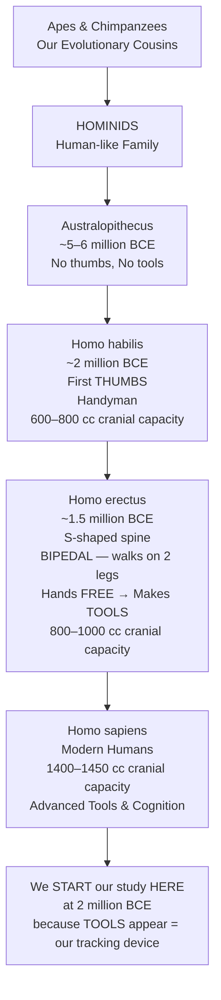
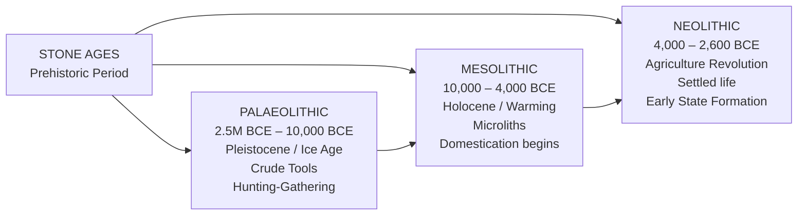
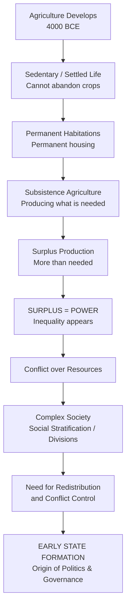
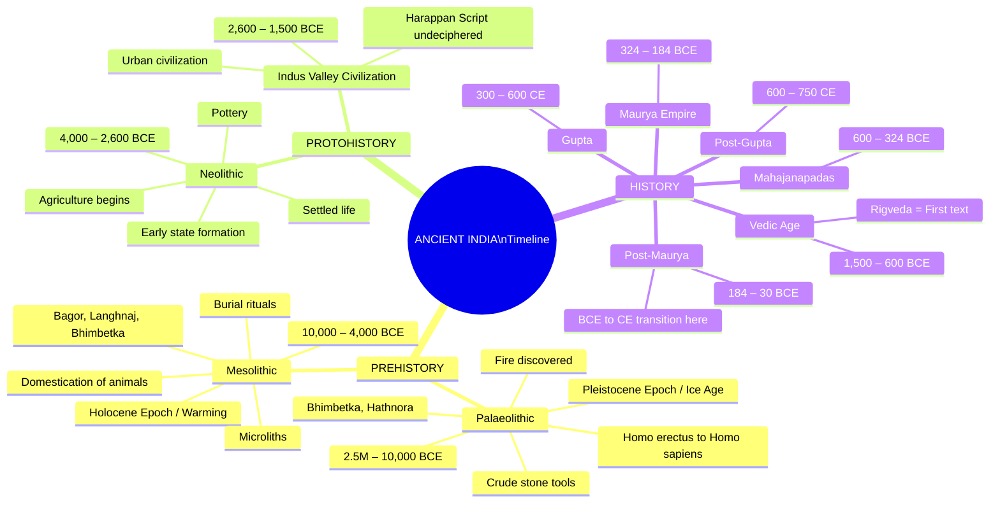
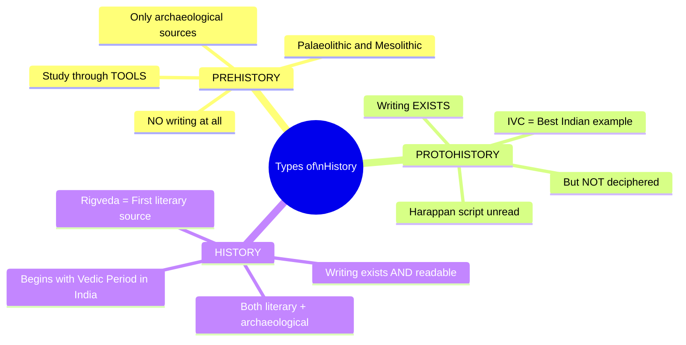

# 📚 UPSC Ancient India — Lecture 1: Topper Notes
### *Prehistory, Palaeolithic, Mesolithic & Neolithic Periods*
> **Course:** Ancient India & Art and Culture | **Level:** UPSC CSE Prelims + Mains (GS Paper I)

---

# 🧠 PART 1: STORY-BASED CONCEPTUAL EXPLANATION

---

## 🎯 Why Study Ancient & Medieval India? (Setting the Context)

Before diving in, let's understand **why** you cannot skip Ancient and Medieval India — a mistake many aspirants make on advice of so-called "experts."

The standard (wrong) advice floating on YouTube is:
> *"Ancient and Medieval India only gives 3–7 questions in Prelims, so skip it and focus only on Art & Culture."*

**This is intellectual suicide. Here is why:**

- Art & Culture is **not floating in the air**. It is deeply rooted in Ancient and Medieval history.
- When Nitin Singhania (the standard Art & Culture reference) mentions the **Chalukyas, Pallavas, Kushanas, Mauryas** — you will be completely lost if you haven't studied Ancient India first.
- You **cannot write the introduction** of an Art & Culture Mains answer without knowing the historical context (e.g., Maurya → Post-Maurya → Gupta → Post-Gupta period).
- **In 2023**, GS Paper I had questions mixing Ancient/Medieval content with Art & Culture — confirming this approach is essential.
- Nobody has cleared UPSC without attempting Ancient/Medieval questions in Prelims, and nobody has cleared Mains without the 3–5 Art & Culture descriptive questions.

**Thumb Rule:** Ancient + Medieval = Foundation. Art & Culture = Structure built on that foundation.

---

## 📖 Chapter Structure of History in UPSC

History in UPSC is not **one** subject — it is **six subjects**:

| Subject | Exam Relevance |
|---|---|
| Ancient India | Prelims (primary) + GS Paper I (occasionally) |
| Medieval India | Prelims (primary) + GS Paper I (occasionally) |
| Art & Culture | **Prelims + Mains both** |
| Modern India | **Prelims + Mains both** |
| Post-Independence India | Mains (GS Paper I) only |
| World History | Mains (GS Paper I) only |

**Module count in this course:**
- Ancient India → **7 modules**
- Medieval India → **7 modules**
- Art & Culture → **10 modules**

---

## 📚 Book Strategy (Simplified)

**Bare Minimum (Non-negotiable):**
1. **Teacher's PPTs** (primary — contain content from optional-level books like Upinder Singh)
2. **NCERTs**: Class 6 (Ancient), Class 7 (Medieval), Class 12 Part 1 (Ancient), Class 12 Part 2 (Medieval)

**Optional (For serious aspirants with 2+ years):**
3. **RS Sharma** — for Ancient India
4. **Satish Chandra** — for Medieval India
5. **Nitin Singhania** — for Art & Culture (mandatory for this section)
6. **Abhishek Mishra & Shubhangi Priya** (co-authored book) — covers Ancient + Medieval + Modern in one book

> **Pro Tip:** Old NCERT (1986 editions) by RS Sharma / Satish Chandra / Bipan Chandra = the "old NCERTs." Doing RS Sharma = doing old NCERT. NCERTs are available FREE on the official NCERT website.

**Golden Rule:** Don't run behind books during class. First understand concepts with the teacher, then books will start making sense automatically.

---

## 🕐 CONCEPT 1 — Understanding Time (The Foundation)

### Time is a Man-Made Concept

Here is a stunning truth that most teachers never tell you:

> **Time as we know it — hours, minutes, seconds, BC, AD — is entirely a human invention.**

Nature doesn't know what 5:48 PM means. A tree doesn't know what year it is. Animals don't follow time zones. It is **we, humans, who agreed** to a system of time measurement.

Evidence of this: Right now, if you are in India it might be 5:30 PM, but someone in London sees 12:00 PM and someone in New York sees 7:30 AM — for the exact same moment. **Time zones prove time is a human construct.**

---

### The Gregorian Calendar

The standard global calendar we use today is called the **Gregorian Calendar**.

- Developed by **Saint Gregory** (a Christian scholar/Pope)
- It is fundamentally a **Christian calendar**
- Its central reference point = **birth of Jesus Christ = Year Zero (0)**

How it divides time:

| Term | Full Form | Meaning | Direction |
|---|---|---|---|
| **BC** | Before Christ | Before Jesus's birth | Counts backward from 0 |
| **AD** | Anno Domini (Latin) | "In the Year of the Lord" | Counts forward from 0 |
| **BCE** | Before Common Era | Same as BC (secular version) | Counts backward from 0 |
| **CE** | Common Era | Same as AD (secular version) | Counts forward from 0 |

> **Why BCE/CE instead of BC/AD?**
> Historians worldwide realized that using "Before Christ" and "Anno Domini" imposes a Christian religious reference even on non-Christian civilizations (like India). So they secularized the nomenclature by replacing "Christ" with "Common Era." **The division of time remains identical — only the name changed.**

---

### The Number Line Rule — MOST IMPORTANT FOR PRELIMS

Think of the BC/BCE timeline exactly like a **number line** with negative numbers:

```
← More Ancient                                  More Recent →
...5000 BCE — 4000 BCE — 3000 BCE — 2000 BCE — 1000 BCE — 0 — 1000 CE — 2000 CE...
```

**Key Rules:**

1. **In BCE**: Higher number = more ancient (further from us). Lower number = more recent.
   - Write: **5000 BCE to 3000 BCE** (higher to lower, because time is moving forward toward zero)

2. **In CE**: Lower number = more ancient. Higher number = more recent.
   - Write: **3000 CE to 5000 CE** (lower to higher, moving away from zero)

3. **Calculating time difference between BCE and CE:**
   - Example: 2000 BCE to 2000 CE = 2000 + 2000 = **4000 years**
   - 10,000 BCE from today (2023 CE) = 10,000 + 2023 = **12,023 years ago**

**UPSC Thumb Rule:** If you see **Higher → Lower** = it's **BCE**. If you see **Lower → Higher** = it's **CE**.

> *(Roman numerals have no zero — so technically the Gregorian calendar starts at 1 CE, not 0. But for our purposes, treat the birth of Christ as the turning point.)*

---

### Indian History — Timeline at a Glance

| Period | Time Range | Name |
|---|---|---|
| 2.5 million – 10,000 BCE | Paleolithic Age (Old Stone Age) |
| 10,000 – 4,000 BCE | Mesolithic Age (Middle Stone Age) |
| 4,000 – 2600 BCE | Neolithic Age (New Stone Age) |
| 2600 – 1500 BCE | Indus Valley Civilization (Harappan) |
| 1500 – 600 BCE | Vedic Age |
| 600 – 324 BCE | Mahajanapadas |
| 324 – 184 BCE | Maurya Empire |
| 184 – 30 BCE | Post-Maurya (Shungas, Satavahanas, Kushanas, Shakas) |
| 30 BCE – 300 CE | Transition Period (BCE → CE happens here) |
| 300 – 600 CE | Gupta Empire |
| 600 – 750 CE | Post-Gupta Period |

> **Key Insight:** The **BCE → CE transition** in Indian history happens during the **Kushana-Shaka phase**.

---

## 🕐 CONCEPT 2 — Terminology: Prehistory, Protohistory, History

History is written through **sources**. Sources are of two types:

```
HISTORICAL SOURCES
├── Archaeological Sources
│   ├── Artifacts (material remains)
│   ├── Sites (excavated locations)
│   ├── Coins → study = Numismatics
│   └── Inscriptions → study = Epigraphy
└── Literary Sources
    ├── Texts, Books, Manuscripts
    └── Early written records
```

Based on the **availability of written sources**, we divide history into three phases:

### 1. PREHISTORY
- **Definition:** The period when **no writing existed at all**.
- Only archaeological sources available.
- Examples: Paleolithic, Mesolithic, early Neolithic periods.
- *(UPSC Alert: If a question says "prehistoric painting" — it refers to cave paintings from the Stone Age era, NOT Mughal miniatures!)*

### 2. PROTOHISTORY
- **Definition:** Writing **exists** but **has not been deciphered** (we cannot read it).
- Best example: **Indus Valley Civilization (Harappan Script)** — the script exists, but scholars worldwide have NOT been able to decode it yet.
- Mix of archaeological + early/unreadable writing sources.

### 3. HISTORY (Proper)
- **Definition:** Written sources exist **AND we can read/understand them**.
- Begins in India with the **Vedic period** — the **Rigveda** is India's **first decipherable text**.
- Rich in both literary and archaeological sources.

> **Exam Application:** Half the Art & Culture marks students lose is because they don't know this difference. A question on "prehistoric art" requires knowledge of cave paintings, not Mughal/medieval art.

---

## 🕐 CONCEPT 3 — Human Evolution & Why We Start at 2 Million BCE

### Why Start at 2 Million BCE?

UPSC says: "History of India." But India's land mass existed long before humans. So where do we start?

**Answer:** We start where **humans first appear** — approximately **2 to 2.5 million years ago** — because history is the **study of humans**, not rocks or dinosaurs.

### The Human Family Tree (Physical Anthropology)

```
Apes / Chimpanzees (our evolutionary cousins)
        ↓ Evolution
    HOMINIDS (Human-like family)
        ↓
    Australopithecus (our great-great ancestor)
    [NO THUMBS → Cannot be studied from tools]
        ↓
    HOMO family begins (~2 million BCE)
        ↓
    Homo habilis ("Handyman") → First THUMBS develop
    [Can grip tools, but walks on all fours — C-shaped spine]
        ↓
    Homo erectus → S-SHAPED SPINE develops
    [Walks upright = BIPEDAL → Hands become FREE → Makes TOOLS]
        ↓
    Homo sapiens ("Wise Man") → Us!
    [Cranial capacity: 1400–1450 cc]
```

### The Critical Link: Tools → Cognitive Ability → History

| Species | Cranial Capacity | Key Feature |
|---|---|---|
| Australopithecus | ~400–500 cc | No separate thumb |
| Homo habilis | 600–800 cc | First thumb; walks on all fours |
| Homo erectus | 800–1000 cc | S-shaped spine; bipedal; makes tools |
| Homo sapiens | 1400–1450 cc | Advanced cognition; complex tools |

**The Fundamental Insight:**
> **Tools = Window to Cognitive Ability = How we study prehistoric humans**

- We start at 2 million BCE because **that's when the first tools appear**.
- Tools are our **tracking device** — like GPS — for human evolution.
- Tool sophistication directly correlates with brain (cranial) development.
- Without writing, **tools are the only evidence** we have of our ancestors' existence.

**Why Lithic (Stone) Ages?**
- Stone is the **most durable material** — it survives millions of years.
- Wood, cloth, bone mostly decompose. Stone tools remain.
- Hence: **Paleo-lithic** (Old Stone), **Meso-lithic** (Middle Stone), **Neo-lithic** (New Stone).

**Indian Evidence:**
- India's oldest known Homo erectus skull found at **Hathnora** (Narmada Valley) by Arun Sonakia.
- Another early skull found at **Odai** (a small baby skull).
- These are why India is included in the **global narrative of human evolution**.

---

## ⛏️ THE THREE STONE AGES — Detailed Study

---

### 🪨 PERIOD 1: PALAEOLITHIC AGE (Old Stone Age)

**Timeline:** 2.5 million BCE to 10,000 BCE

**Geological Epoch:** **Pleistocene Epoch** = The Ice Age period

#### What is the Ice Age (Pleistocene)?
- Thousands of years of **extreme cold** (mean temperature: **-30°C to -40°C**) with small intervals of warming.
- This cold environment **shaped everything** — human bodies, animal bodies, tool design.

#### How Ice Ages Shaped Life:

**Animals:**
- Extremely **big and bulky** (e.g., Woolly Mammoth — 10x the size of today's elephant)
- Had **thick fur/fat** to retain body heat
- Moved **slowly** due to their bulk
- Examples: Mammoth, Sabre-tooth tiger, giant deer, giant wolves

**Humans:**
- Had **thick hair cover** all over the body (protective adaptation)
- Evidence: The hair on our bodies today is an **evolutionary remnant** of the Ice Age!
- Developed **fire** — the most crucial technology to survive -30°C temperatures

#### Six Characteristics of the Palaeolithic Period:

**1. Pleistocene Epoch — Extreme Cold (-30°C to -40°C)**
Animals are big, bulky; humans and animals both have thick fur/hair.

**2. Crude and Rudimentary Tools — But Improving**
Palaeolithic is divided into three sub-phases:

| Sub-Phase | Time | Dominant Species | Tools |
|---|---|---|---|
| **Lower Palaeolithic** | 2.5 million – 1 lakh BCE | Homo erectus | Choppers, Hand-axes (heavy, one-edged) |
| **Middle Palaeolithic** | 1 lakh – 40,000 BCE | Homo erectus → Homo sapiens (transition) | Scrapers, double-edged tools, flakes |
| **Upper Palaeolithic** | 40,000 – 10,000 BCE | Homo sapiens | Blades, scrapers, burins (hole-making tools), borers |

> **Key Understanding:** *Lower* = deepest layer in excavation = oldest. *Upper* = closest to surface = most recent. Think of digging a trench: what you find deepest is what existed first.

**3. Development and Control of Fire**
- Fire = warmth + cooking
- This is why humans survived in conditions of -30°C
- One of the **greatest technological milestones** in human history

**4. Small Population Living Together**
- Food resources were limited
- Humans lived in small bands/groups
- **Hunting and Gathering** was the **primary economic activity**

**5. Simple Society — No State, No Division**
- No political structure (no government, no king)
- No division based on caste, class, gender
- Absolute equality — a truly egalitarian society

**6. Settlements Close to Water Resources (During Warming Intervals)**
- Fresh water = survival (you can survive 2–4 days without food, but only 1–2 days without water)
- During warming phases, they lived near rivers, lakes, streams

#### Palaeolithic Sites in India:

> (Know at least **Bhimbetka** and the Narmada region)

- **Bhimbetka** (Madhya Pradesh) — most famous, extends into Mesolithic too
- **Hathnora** — Narmada Valley (where Homo erectus skull was found)
- Sites concentrated in river valleys: **Son Valley, Narmada Valley, Belan Valley**
- **No sites in Western Ghats** → because during the collision of Indian and Eurasian plates, the Western Ghats **subsided into the ocean** (sites are now underwater)
- **No sites in alluvial plains (Gangetic plains)** → still being formed during this period; any sites are buried too deep under silt deposits from Himalayan rivers

---

### 🏹 PERIOD 2: MESOLITHIC AGE (Middle Stone Age)

**Timeline:** 10,000 BCE to 4,000 BCE

**Geological Epoch:** **Holocene Epoch** = The Warming Period

#### The Great Warming:
- Mean temperature rises to approximately **15°C** (today's global average)
- Ice melts → more water → **more greenery, more plants**
- Environment transforms completely

#### How Warming Changed Everything:

**Animals:**
- Lost the need for heavy fat → became **smaller and leaner**
- Smaller = **faster** (they could now run much faster)
- Problem: How do you hunt a fast-moving deer with a heavy hand-axe?

**Humans:**
- Lost heavy hair cover (no longer needed)
- Need **new tools** — smaller, faster, throwable

#### Enter: MICROLITHS
- **Micro = small; Lith = stone**
- Tiny, sharp tools (triangles, trapezoids) designed to be **attached to sticks** and thrown as **spears or arrows**
- This is the origin of **bow and arrow**
- *Necessity is the mother of invention* — this is pure problem-solving (cognitive ability at work)

#### Five Characteristics of the Mesolithic Period:

**1. Animals become smaller and faster; humans lose body hair**
(Adaptation to the warming Holocene climate)

**2. Microliths developed**
Smaller, sharper tools needed to hunt faster animals.

**3. Domestication of Animals**
- Animals became smaller → some became **vulnerable** → humans could now keep them
- A **reciprocal relationship** developed: Animal protects human; human protects animal
- First domesticated animals: **Dogs, sheep, cattle, goats, cats**
- Trial and error process — they tried every animal (lions ate them, horses ran away, etc.)
- This is the **origin of pet-keeping and animal husbandry**

**4. Burial Rituals Begin**
- In the cold Palaeolithic period, dead bodies were simply left (cold preserved them)
- In warmer Mesolithic, decomposition began → hygiene concern → **burials developed**
- BUT evidence shows they **buried tools and pets along with the dead**
- This reveals early **conceptual understanding of death and afterlife**
- The idea: "This person has gone somewhere — give them their tools for the journey"
- **This is the stepping stone toward religion** — all religion is ultimately about death and afterlife

**5. Still a Hunting and Gathering Society**
- Larger population possible (more food from more plants)
- **Semi-permanent nomadic settlements** develop (basic huts, not permanent)
- Still **nomadic** — they follow animals and move when local food is exhausted

**6. No State Formation** — still a simple, egalitarian society

#### Key Mesolithic Sites in India:
- **Bhimbetka** (MP) — also has Mesolithic layers
- **Bagor** (Rajasthan) — Mesolithic site
- **Langhnaj** (Gujarat) — important Mesolithic site
- **Sarai Nahar Rai** (Uttar Pradesh) — also written as Saraini, important burial site

---

### 🌾 PERIOD 3: NEOLITHIC AGE (New Stone Age) — The REVOLUTION

**Timeline:** 4,000 BCE to 2,600 BCE (approximately)

This period is not just an age — it is called a **REVOLUTION** because it fundamentally changed human civilization. The trigger? **Agriculture.**

#### Why Agriculture is a Revolution:

Agriculture (domestication of plants) was extremely difficult to develop:
- Which seeds to use?
- When to sow?
- How much water?
- When to harvest without damaging grain?
- How to store?

It took **millions of years of trial and error** before agriculture developed in ~4000 BCE.

#### The Agriculture → Civilization Chain Reaction:

This is the most important logical sequence in all of ancient history:

```
AGRICULTURE develops (4000 BCE)
        ↓
Cannot leave crops unattended → SEDENTARY (settled) life
        ↓
Sedentary life → PERMANENT HABITATIONS / housing
        ↓
More food available → SUBSISTENCE AGRICULTURE
(producing just enough for the group)
        ↓
Accidental/intentional improvements → SURPLUS production
(producing MORE than needed)
        ↓
SURPLUS = POWER
(whoever controls surplus controls others)
        ↓
INEQUALITY develops (haves vs have-nots)
CONFLICT develops (fights over surplus)
        ↓
Need for redistribution of surplus + control of conflict
        ↓
COMPLEX SOCIETY (social stratification = divisions based on wealth)
        ↓
EARLY STATE FORMATION
(an authority/institution to manage redistribution and conflict)
        ↓
ORIGIN OF POLITICS, GOVERNANCE, AND CIVILIZATION
```

> **The Flat-share Analogy:** Four friends, equal salary, equal food contribution → everyone has equal say. One friend earns 5x more, contributes more → that person dictates food choices. **Surplus = Power.** This is the birth of inequality and state.

#### Five Characteristics of the Neolithic Period:

**1. Agriculture develops (4,000 BCE)**
Domestication of plants — wheat, millet, barley.
End of purely nomadic life begins.

**2. Complex Society based on Social Stratification**
Surplus production creates inequality.
Division of labour begins.
Have and Have-Nots appear for the first time.

**3. Early State Formation**
Need to redistribute surplus and control conflict leads to first political institutions.
This is the **genesis of all political philosophy and governance**.

**4. Pottery and Storage Tools developed**
Crops yield once a year → need storage → **pottery** invented
Agriculture tools also develop: **plough, sickle** (polished stone tools)
Tools become **ground and polished** (not just chipped like before)

**5. Hunting and Gathering still continues but Agriculture overtakes it**
Both coexist in transition, but agriculture gradually becomes dominant.

> **Neolithic = Birth of civilization, inequality, politics, storage, permanent settlement, and the state.**

---

# 🔄 PART 2: FLOWCHART / MINDMAP (MERMAID CODE)

### Flowchart 1: Human Evolution & Why 2 Million BCE



---

### Flowchart 2: Three Stone Ages — Overview



---

### Flowchart 3: Neolithic Revolution Chain



---

### Mindmap: Timeline of Indian History — Prelims Quick View



---

### Mindmap: Prehistory vs Protohistory vs History



---

# ⚡ PART 3: QUICK REVISION NOTES

---

## 🔑 KEY CONCEPTS AT A GLANCE

### Time & Calendar
- **Gregorian Calendar** → Christian calendar by **Saint Gregory**; based on birth of Jesus Christ (Year 0)
- **BC/AD = BCE/CE** → Same division; BCE/CE is the secular (non-religious) version
- **BC/BCE**: Higher number = more ancient *(e.g., 5000 BCE is older than 3000 BCE)*
- **CE**: Higher number = more recent *(e.g., 2023 CE is more recent than 500 CE)*
- **UPSC Thumb Rule:** Higher → Lower = BCE; Lower → Higher = CE
- **Roman numerals have no zero** → hence Gregorian calendar technically starts at 1 CE
- **All dates we write today** are CE (just unstated)

---

### Types of Historical Sources

| Type | Examples | Study Name |
|---|---|---|
| Archaeological | Sites, artifacts, material remains | Archaeology |
| Coins | Currency, medals | **Numismatics** |
| Inscriptions | Rock edicts, pillar inscriptions | **Epigraphy** |
| Literary | Books, manuscripts, texts | Literary history |

---

### Prehistory / Protohistory / History — UPSC Definitions

| Term | Definition | Indian Example |
|---|---|---|
| **Prehistory** | No writing existed | Palaeolithic, Mesolithic |
| **Protohistory** | Writing exists but undeciphered | **Indus Valley Civilization** |
| **History** | Written + readable sources exist | Vedic Age onwards (Rigveda) |

---

### Human Evolution — Quick Facts

| Species | When | Key Feature | Cranial Capacity |
|---|---|---|---|
| Australopithecus | 5–6 million BCE | No thumb; ancestor | ~400–500 cc |
| **Homo habilis** | ~2 million BCE | First thumb; **Handyman** | 600–800 cc |
| **Homo erectus** | ~1.5 million BCE | S-spine; **Bipedal**; Makes tools | 800–1000 cc |
| **Homo sapiens** | ~300,000 BCE | Modern humans | **1400–1450 cc** |

- **Bipedal** = walks on two legs (frees the hands for tool-making)
- **Cranial capacity** = volume of brain cavity (in cubic centimetres/cc)
- Hair on our body = evolutionary remnant of Ice Age (Pleistocene)
- Children today developing **bigger eyes and thumbs** = evolution continues!

---

### Palaeolithic Age — 6 Key Characteristics

1. ❄️ **Pleistocene Epoch** — Ice Age; mean temp **-30°C to -40°C**; animals big & bulky; thick fur
2. 🪨 **Crude tools** — Choppers, Hand-axes (Lower) → Scrapers, flakes (Middle) → Blades, burins (Upper)
3. 🔥 **Fire discovered and controlled** — for warmth and cooking
4. 👥 **Small population** — limited food; **Hunting & Gathering** economy
5. 🏛️ **Simple Society** — No state, no class, no caste; complete equality
6. 💧 **Settlement near water** — rivers and freshwater sources during warming intervals

**Tools by Sub-Period:**
- Lower Palaeolithic → **Choppers, Hand-axes** (Homo erectus)
- Middle Palaeolithic → **Scrapers, double-edged tools, flakes**
- Upper Palaeolithic → **Blades, burins, borers** (Homo sapiens)

**Sites:** Bhimbetka (MP), Hathnora/Narmada Valley, Son Valley, Belan Valley

**Why no sites in Western Ghats?** → Submerged underwater when Indian plate collided with Eurasian plate.

**Why no sites in Gangetic Plains?** → Plains still forming; sites buried under deep silt.

---

### Mesolithic Age — 6 Key Characteristics

1. 🌡️ **Holocene Epoch** — Earth warms to ~**15°C** mean temperature; ice melts; more greenery
2. 🔪 **Microliths** — Small, sharp tools (triangles, trapezoids) for throwing/spears/bow & arrow
3. 🐕 **Domestication of animals** — reciprocal relationship; dogs, cattle, goats, sheep, cats
4. ⚰️ **Burial rituals** — hygiene + early concept of afterlife (tools buried with dead)
5. 🏹 **Still Hunting & Gathering** — but larger population possible
6. 🏕️ **Semi-permanent nomadic settlements** — basic huts; still move to follow food

**Sites:** Bhimbetka (MP), Bagor (Rajasthan), Langhnaj (Gujarat), Sarai Nahar Rai (UP)

---

### Neolithic Age — 5 Key Characteristics

1. 🌾 **Agriculture develops** (~4000 BCE) — domestication of plants; wheat, millet, barley
2. 🏙️ **Complex society** — social stratification from surplus; Have and Have-Nots appear
3. 🏛️ **Early State formation** — authority to redistribute surplus and manage conflict
4. 🏺 **Pottery and storage tools** — seasonal crops need storage; plough, sickle invented
5. 🔄 **Hunting & Gathering still exists** — but agriculture becomes dominant

**The Chain:** Agriculture → Settled life → Surplus → Inequality → Complex society → State formation

---

## 📌 IMPORTANT TERMS — Prelims Glossary

| Term | Meaning |
|---|---|
| **Numismatics** | Study of coins |
| **Epigraphy** | Study of inscriptions |
| **Pleistocene** | Ice Age geological epoch |
| **Holocene** | Warming epoch (we live in it today) |
| **Bipedalism** | Walking on two legs |
| **Cranial capacity** | Volume of skull cavity (brain size indicator) |
| **Microliths** | Small stone tools of Mesolithic Age |
| **Hominid** | Human-like family (biological classification) |
| **Homo habilis** | "Handyman"; first species with distinct thumb |
| **Homo erectus** | "Upright man"; S-shaped spine; bipedal |
| **Homo sapiens** | Modern humans ("Wise man") |
| **Subsistence agriculture** | Producing only what is needed (no surplus) |
| **Surplus** | Production beyond need; creates power and inequality |
| **Sedentary** | Settled/stationary (opposite of nomadic) |
| **Nomadic** | Moving from place to place following food |
| **Social stratification** | Division of society into layers/classes |
| **Domestication** | Taming wild animals/plants for human use |
| **BCE** | Before Common Era (same as BC) |
| **CE** | Common Era (same as AD) |

---

## 🎯 UPSC PYQ RELEVANCE & EXAM TIPS

### For Prelims:
- Questions appear as **statement-based** (Assertion-Reason or "Which of the following is correct")
- Examples: "Which of the following is/are a feature of the Palaeolithic Age?"
- Often tested: Microliths (Mesolithic), Fire (Palaeolithic), Domestication of animals (Mesolithic), Agriculture/Pottery (Neolithic)
- **Bhimbetka** frequently appears — it covers Palaeolithic + Mesolithic + rock paintings (Art & Culture connection)
- Know which period Burial rituals, Pottery, and State Formation belong to

### For Mains (GS Paper I):
- Art & Culture Mains answers need historical context — knowing these three ages helps write introductions
- Topics like "evolution of social structures," "origin of state," "development of technology" can be answered using this framework

### Current Affairs Link:
- **Global Warming** — the concept of Holocene warming and its impact on human migration/evolution is directly analogous to the current climate crisis argument
- **Archaeological discoveries** in India (like new finds in Narmada Valley) regularly appear in news; this foundation helps contextualise them

---

## 📝 MEMORY AIDS & TRICKS

**Remembering BCE vs CE:**
> **B**efore = **B**igger number first (BCE: 5000 → 3000)
> **C**ommon Era = **C**ounts up (CE: 500 → 2000)

**Remembering the Three Ages:**
> **P**alaeolithic = **P**rimitive, **P**leistocene, **P**redatory (hunting)
> **M**esolithic = **M**icroliths, **M**elting (warming), **M**oving animals tamed
> **N**eolithic = **N**ew farming, **N**o longer nomadic, **N**ascent state

**Remembering Homo sequence:**
> **H**abilis → **E**rectus → **S**apiens
> **H**ands → **E**rect → **S**mart

**Neolithic Revolution Chain:**
> **A**griculture → **S**edentary → **S**urplus → **S**tratification → **S**tate
> (5 S's after Agriculture)

---

## ⚠️ COMMON MISTAKES TO AVOID

1. ❌ Writing **"3000 to 5000 BCE"** — WRONG (should be 5000 to 3000 BCE — higher to lower)
2. ❌ Confusing **Protohistory with Prehistory** — IVC is Protohistory (writing exists but unread)
3. ❌ Thinking **Art & Culture** can be studied without Ancient India foundation — impossible
4. ❌ Saying burial rituals = religion — they are the **stepping stone** toward religion, not religion itself
5. ❌ Assuming **Domestication of animals** happened in Palaeolithic — it's **Mesolithic**
6. ❌ Assuming **Pottery and Agriculture** are Mesolithic — they are **Neolithic**
7. ❌ Forgetting that **Bhimbetka** spans both Palaeolithic AND Mesolithic

---

*Notes prepared based on Lecture 1 | UPSC CSE Ancient India | Course: Ancient + Medieval + Art & Culture*
*Next Class: Chalcolithic Age → Indus Valley Civilization*
