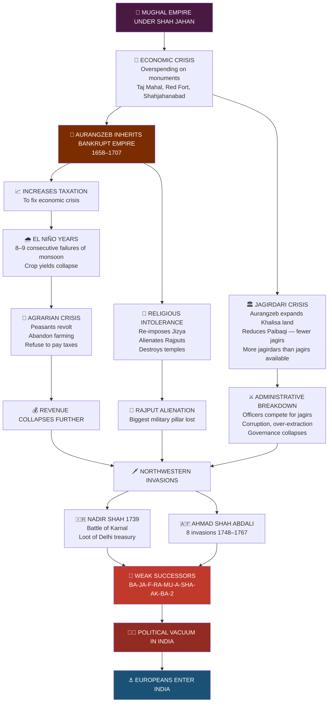
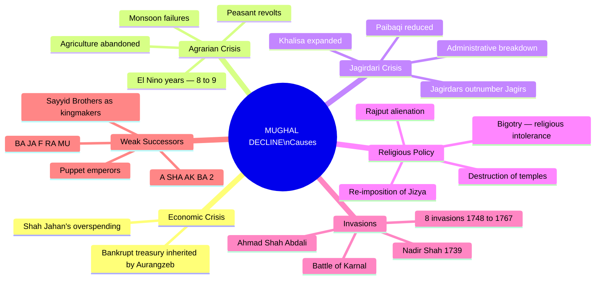

# 🇮🇳 UPSC Modern India — Module 1: Mughal Decline & Advent of Europeans
### Topper-Style Notes | GS Paper I | Prelims + Mains

---

> **📌 Why This Topic?**
> Before understanding how the British conquered India, you need to understand *why* India was vulnerable. The Mughal decline created the **political vacuum** that Europeans — especially the British — exploited. These notes cover the **context, causes, actors, and European entry** that set the stage for modern Indian history.

---

## 🧠 PART 1: STORY-BASED CONCEPTUAL EXPLANATION

---

### 📖 CHAPTER 0: Understanding History for UPSC — The Big Picture

Imagine history is not one subject but **six different subjects**, each serving a specific purpose in the UPSC exam:

| Subject | Exam Relevance |
|---|---|
| Ancient India | **Prelims only** (Factual) |
| Medieval India | **Prelims only** (Factual) |
| **Modern India** | **Prelims + Mains** ⭐ |
| **Art & Culture** | **Prelims + Mains** ⭐ |
| Post-Independence India | **Mains only** |
| World History | **Mains only** |

> **💡 Key Insight (Exam Strategy):** Modern India and Art & Culture are the **backbone** of history preparation. They carry **20–25 questions in Prelims (~50 marks)** and **3–5 questions in Mains (~65–70 marks)**. Never skip them.

**The UPSC syllabus says:** *"History of India and Indian National Movement"* — deliberately vague.
- **Indian National Movement** starts from **1885** (formation of the Indian National Congress) to **1947**.
- **History of India** covers everything else.

---

### 📖 CHAPTER 1: The Timeline — Where Are We Starting?

Think of this as a **"You Are Here" map in a mall**:

| Period | Timeline | Name |
|---|---|---|
| 2 million BCE – 750 CE | Ancient India | Ancient |
| 750 – 1206 CE | Early Medieval | Early Medieval |
| 1206 – 1707 CE | Medieval India | Medieval / Mughal |
| **1707 – 1757 CE** | **Early Modern** | **← We Start Here** |
| 1757 – 1947 CE | Modern India | Modern |

> **Why 1707?** — Death of **Aurangzeb**. This is when the Mughal Empire began its irreversible decline, and the British started taking root in India.

---

### 📖 CHAPTER 2: The Mughal Background — Casting the Movie

Think of Modern India as a **movie called "Expansion of the British in India."** Before the main story starts, you need to know the **actors** — and that requires understanding Mughal India briefly.

**The Main Mughal Rulers (Medieval India — to be studied separately):**

> **Babur → Humayun → [Sher Shah Suri interlude] → Akbar → Jahangir → Shah Jahan → Aurangzeb**

*(You will study these in detail in Medieval India. For now, just accept they exist.)*

The key point: **After Aurangzeb (died 1707), his successors are the "actors" who will interact with the British.** That is why we discuss them here.

---

### 📖 CHAPTER 3: The Mughal Decline — A Crisis in the Making

#### 🍳 The Recipe for Mughal Decline

Think of Mughal decline as **a recipe for disaster**:

```
Start the pan → Add Economic Crisis
                → Add Agrarian Crisis
                → Add Jagirdari Crisis
                → Add a pinch of Religious Intolerance
                = MUGHAL DECLINE
```

---

#### 🔴 CAUSE 1: Shah Jahan's Overspending → Economic Crisis

**Shah Jahan** is famous for:
- **Taj Mahal** (Agra)
- **Red Fort** (Delhi)
- **Jama Masjid** (Delhi)
- Building the entire city of **Shahjahanabad**

**But here's the problem:** Buildings cost money — *a lot of money.*

When **Aurangzeb** inherited the throne, he inherited an empire that was practically **bankrupt**. *(This is the first domino in a chain of disasters.)*

---

#### 🔴 CAUSE 2: Aurangzeb's Religious Policy → Destabilised the Empire

Aurangzeb is accused of being a **bigot** — meaning extremely intolerant of other religions.

**What he did:**
- Re-imposed the **Jizya** (tax on non-Muslims)
- Stopped **Nowroz** (Persian New Year celebrations)
- Stopped the tradition of being weighed in gold and silver on his birthday *(because he had no money, but also he considered it un-Islamic)*
- Destroyed several temples
- **Alienated the Rajputs** — the most important military pillar of the Mughal Empire — by interfering in Rathore (Rajput) politics

> **Historian's Note:** Jadunath Sarkar famously blamed only Aurangzeb's religious policy for the decline. But **modern historians take a more nuanced view** — religious policy was *one factor* among several systemic issues.

---

#### 🔴 CAUSE 3: El Niño Years → Failure of Agriculture → Agrarian Crisis

*(This is from the emerging field of **Environmental History** — a modern lens on history)*

Under Aurangzeb's rule, there were **8–9 El Niño years.**

**What is El Niño?** *(You'll study this in detail in Geography)*
- El Niño = pressure difference between **Australia and Chile coast**
- When high pressure is on the Chile side → monsoonal winds weaken → **rainfall in India decreases**
- Less rain = **crop failure**

**The Chain Reaction:**
1. Economic crisis → Aurangzeb increases taxes to compensate
2. El Niño years → monsoons fail → crops fail
3. Peasants cannot pay increased taxes
4. **Agrarian Revolt** — Peasants abandon farming, refuse to pay taxes
5. Empire loses its primary source of revenue

> **💡 Logic:** This is why Aurangzeb stopped distributing gold/silver on his birthday — he simply didn't have money. Shah Jahan could do it; Akbar started it; Aurangzeb had to stop it.

---

#### 🔴 CAUSE 4: Jagirdari Crisis — The Administrative Backbone Collapses

This is the **most important systemic cause** — documented brilliantly by historian **Satish Chandra**.

##### Understanding Mansabdari System (Backbone of Mughal Administration)

**Mansabdari System** = Mughal bureaucracy (ranking system for officers/soldiers)

- Every officer = a **Mansabdar** (has a rank/mansab)
- Officers get salaries in **two ways:**
  1. **Cash salary** — directly paid
  2. **Jagir** — a piece of land given as salary assignment

> **Definition: Jagir** = Revenue assignment given to an officer (mansabdar) in lieu of their service to the empire. The officer collects land revenue from this land as their salary.

**Simple Analogy:**
- You are a District Magistrate (DM) of Agra
- Government Option 1: Transfer ₹1.1 lakh/month to your bank account → **Cash salary**
- Government Option 2: "Collect the revenue from Agra district — that's your salary" → **Jagir**

> **Important Distinction:**
> - **Mansabdar** = Any officer (gets cash OR jagir)
> - **Jagirdar** = A mansabdar who gets salary in the form of a jagir
> - **Every jagirdar is a mansabdar, but NOT every mansabdar is a jagirdar**

##### Division of Land: Khalisa vs. Paibaqi

The empire was divided into two types of land:

| Type | Description | Revenue Goes To |
|---|---|---|
| **Khalisa** | Crown land — best, most fertile land (e.g., Doab — land between Ganga & Yamuna) | Directly to the Emperor (Agra/Delhi) |
| **Paibaqi** | Remaining land — allocated for jagirs | To individual jagirdars |

> **Analogy:** Khalisa is like a **Union Territory (UT)** — directly under central control.

##### What is the Jagirdari Crisis?

**Ideal situation (up to Shah Jahan):**
- Number of jagirs available > Number of jagirdars
- E.g., 1,000 jagirs for 500 officers → Stable, everyone gets a good jagir

**Crisis situation (under Aurangzeb):**
- Aurangzeb **expanded Khalisa land** to get more central revenue (due to economic crisis)
- This **reduced Paibaqi land** → Fewer jagirs available
- Aurangzeb also **fought constant wars** → rewarded more officers with jagirdar status → More jagirdars!
- Result: **Jagirdars > Jagirs available**

**Consequences:**
- Officers compete fiercely for good jagirs
- Officers **extract maximum revenue quickly** from their jagir (because they don't know if they'll keep it)
- Administrative breakdown, corruption, mismanagement
- No officer cares about governance — only extraction

> **Simple Analogy:** Like IAS officers fighting for the best postings — if posts are fewer than officers, chaos ensues.

---

#### 🔴 CAUSE 5: Invasions from the Northwest

Just when things couldn't get worse, two Central Asian invaders arrived:

| Invader | Key Events |
|---|---|
| **Nadir Shah** | Invaded India in **1739**, defeated Muhammad Shah Rangila at **Battle of Karnal**, looted Delhi's central treasury |
| **Ahmad Shah Abdali** | Invaded **8 times** between **1748–1767** — came, looted, left, came again |

> **Analogy:** Imagine you have borrowed ₹100 from a friend to manage your financial crisis, and then someone comes and steals that too. That's what these invasions did to the Mughals.

---

#### 🔴 CAUSE 6: Weak Successors of Aurangzeb

The successors were **puppet rulers** controlled by powerful nobles, with no ability to arrest the cascading crisis.

---

### 📖 CHAPTER 4: The Weak Successors — Meet the Actors

#### 🎭 The Mnemonic: **BA-JA-F-RA-MU / A-SHA-AKBA-2**

> **Trick to remember in chronological order:**
> **BA** – **JA** – **F** – **RA** – **MU** – **A** – **SHA** – **AK** – **BA** – **2**

| # | Short Code | Full Name | Key Fact |
|---|---|---|---|
| 1 | **BA** | **Bahadur Shah I** | Elder son of Aurangzeb; 63 years old when he came to power; fought 2-year succession battle |
| 2 | **JA** | **Jahandar Shah** | Installed by noble **Zulfikar Khan** who became the real power; abolished Jizya |
| 3 | **F** | **Farrukhsiyar** | ⭐ **VERY IMPORTANT** — Gave the crucial **Farman (Royal Order) to the British** in 1717; was a puppet of the **Sayyid Brothers** |
| 4 | **RA** | **Rafi-ud-Darajat** | Shortest rule — **February to June** only! |
| 5 | **MU** | **Muhammad Shah 'Rangila'** | Real name: Roshan Akhtar; known for **lavish lifestyle** (hence 'Rangila' = colourful/pleasure-loving); Nadir Shah invaded during his reign; lost **Battle of Karnal (1739)** |
| 6 | **A** | **Ahmad Shah** | Incompetent; Ahmad Shah Abdali invaded during his reign |
| 7 | **SHA** | **Alamgir II** | Ahmad Shah Abdali continued invasions; **Battle of Plassey (1757)** happened during his reign |
| 8 | **AK** | **Shah Alam II** | ⭐ **VERY IMPORTANT** — **3rd Battle of Panipat (1761)** (Marathas vs. Abdali); **Battle of Buxar (1764)**; gave **Diwani Rights** to the British |
| 9 | **BA** | **Akbar II** | Gave the title **'Raja'** to **Raja Ram Mohan Roy**; Mughal coins discontinued |
| 10 | **2** | **Bahadur Shah II (Zafar)** | **Last Mughal Emperor**; led the **1857 Revolt**; exiled to Rangoon |

> **⭐ THREE NAMES YOU MUST NEVER FORGET:**
> 1. **Farrukhsiyar** — Gave farman to the British (1717)
> 2. **Alamgir II** — Battle of Plassey happened during his reign (1757)
> 3. **Shah Alam II** — Battle of Buxar + Diwani Rights (1764–65)

---

#### 🎭 The Sayyid Brothers — The Real Kingmakers

**Abdullah Khan** and **Hussein Ali Khan** = The Sayyid Brothers

They were powerful nobles who:
- Installed **Farrukhsiyar** as emperor
- Later replaced him too when he became inconvenient
- Installed **Muhammad Shah Rangila**
- Represented the **complete powerlessness of the Mughal emperors** — nobles were appointing and removing kings!

---

### 📖 CHAPTER 5: Why Did Europeans Come to India? The Sea Route Story

#### 🌍 The Three Precious Commodities

Europeans were desperate to trade with India and China for three things:

| Commodity | Why Important |
|---|---|
| **Pepper (Black Gold)** | Best **preservative** for meat (no refrigerators in medieval Europe!) |
| **Cotton / Muslin / Calico** | Superior quality cloth — muslin, calico |
| **Silk** | From China via the Silk Route |

---

#### 🗺️ The Problem: The Land Route Gets Blocked (c. 1400–1500)

The land route from Europe to India passed through the **Middle East**.

Around 1500 CE, three empires rose simultaneously:
- **Mughal Empire** (India) — 1526
- **Safavid Empire** (Persia/Iran) — Muslim, but Persian
- **Ottoman Empire** (Turkey + 3 continents) — **The biggest problem for Europeans**

**Why was the Ottoman Empire a problem?**
- Europeans = **Christians**
- Ottomans = **Muslims**
- The land route to India passed through **Ottoman (and Safavid) territory**
- Traveling through = Risk of being **killed** or paying **extremely high taxes**
- Result: Pepper became **very expensive** because of Ottoman middlemen

> **Therefore:** Europeans desperately needed a **sea route** to India to bypass the Ottomans and get cheap pepper directly.

---

#### ⛵ The Problem with the Sea Route: Africa

If land is blocked, the only option is sea. But:
- Europe is on the **Atlantic Ocean** side
- India is on the **Indian Ocean** side
- In between = **The entire continent of Africa** (which is HUGE)

For **90 years (1400–1490)**, Europeans kept sailing down Africa's western coast, reaching land and thinking "This is India!" — only to find more Africa.

---

#### 🏁 The Breakthrough Moments

**Step 1: Bartholomeu Dias (1488)**
- Portuguese sailor funded by **Prince Henry the Navigator**
- First European to reach the **southern tip of Africa**
- Named it **"Cape of Storms"** (later renamed **Cape of Good Hope** — because it gave hope of finding the sea route to India)

**Step 2: Vasco da Gama (1498)**
- Used Dias's maps as a guide
- **Master stroke:** Hired a **Gujarati pilot named Abdul Majid** at the East African coast
- Abdul Majid knew the trade routes across the Indian Ocean (Indian traders had long been trading with East Africa)
- Vasco da Gama reached **Calicut (Kozhikode)** on the western coast of India in **1498**
- **First European to find a direct sea route to India** ⭐

> **Why was Abdul Majid there?** Indian traders — especially Gujaratis — had been trading with East Africa and the Arabian Sea region for centuries. The Indian Ocean was already a busy trade network.

---

### 📖 CHAPTER 6: Colonialism vs. Imperialism — A Critical Distinction

> **UPSC frequently tests conceptual clarity on this!**

#### 🎮 Imperialism — Indirect Control (Stage 1)

**Definition:** Domination of one country over another to **extract concessions** without directly taking over governance.

**Analogy 1:** The battery-operated car in a mall — the child thinks he's steering, but someone else holds the remote control.

**Analogy 2:** You're driving but your friend is navigating — you control the car, but they control the direction.

> **Key word:** *Indirect control, concessions, domination*

**In India's context:**
- British were **imperialistic** until the **Battle of Buxar (1764) / Grant of Diwani (1765)**
- They were getting trade concessions, rights, and influence — but not directly ruling.

---

#### 🏴 Colonialism — Direct Control (Stage 2)

**Definition:** Direct conquest and control over a territory, completely changing its **political, economic, and social systems**.

**Analogy:** Your friend takes over the steering wheel, makes you sit in the passenger seat, and drives wherever he wants.

> **Key word:** *Direct control, conquest, systemic change*

**In India's context:**
- British shifted to **colonialism after 1765** (Grant of Diwani)
- From indirect trade dominance → direct political and administrative control

> **💡 UPSC Insight:** When we say "India was colonized by the British," we mean this **second stage** — direct political, economic, and social domination through conquest and administrative takeover.

---

## 🔄 PART 2: FLOWCHART / MINDMAP (MERMAID CODE)






---

## ⚡ PART 3: QUICK REVISION NOTES

---

### 🔑 Structure of History in UPSC

- **6 components:** Ancient | Medieval | Modern | Art & Culture | Post-Independence | World History
- **Prelims only:** Ancient, Medieval
- **Prelims + Mains:** Modern India ⭐, Art & Culture ⭐
- **Mains only:** Post-Independence, World History
- **Prelims questions from History:** 20–25 questions | ~50 marks
- **Mains questions from Modern India:** 3–5 questions | ~65–70 marks

---

### 🔑 Timeline

- **1707** = Death of Aurangzeb → Start of Early Modern Period
- **1757** = Battle of Plassey → Start of Modern India proper
- **1885** = Formation of INC → Start of Indian National Movement
- **1947** = Independence

---

### 🔑 Causes of Mughal Decline (6 Causes)

1. **Economic Crisis** — Shah Jahan's overspending on monuments → Bankrupt treasury
2. **Aurangzeb's Religious Policy** — Re-imposed Jizya; alienated Rajputs; temple destruction
3. **Agrarian Crisis** — El Niño years → monsoon failure → peasant revolts → revenue collapse
4. **Jagirdari Crisis** — Khalisa expanded → fewer jagirs → jagirdars outnumber jagirs → administrative breakdown
5. **Northwestern Invasions** — Nadir Shah (1739, Battle of Karnal) + Ahmad Shah Abdali (8 invasions, 1748–1767)
6. **Weak Successors** — Puppet emperors controlled by nobles (Sayyid Brothers)

> **Exam Trap:** Never say only Aurangzeb's religious policy caused the decline. Give all systemic causes for full marks.

---

### 🔑 Mansabdari System — Key Terms

| Term | Meaning |
|---|---|
| **Mansabdari** | Mughal bureaucratic/military ranking system |
| **Mansabdar** | Officer with a rank (mansab) |
| **Jagir** | Revenue assignment given to officer as salary |
| **Jagirdar** | Mansabdar paid through jagir |
| **Khalisa** | Crown land — directly under emperor; revenue goes to centre |
| **Paibaqi** | Remaining land — where jagirs are allocated |

> **Rule:** Every jagirdar is a mansabdar, but NOT every mansabdar is a jagirdar.

---

### 🔑 The Jagirdari Crisis — Summary

- **Cause:** Aurangzeb expanded Khalisa → reduced Paibaqi → fewer jagirs available
- **Compounded by:** Constant wars → rewarded more officers → more jagirdars
- **Effect:** Jagirdars > Jagirs → competition → corruption → over-extraction → administrative collapse

---

### 🔑 The Mnemonic — Weak Mughal Successors (Chronological Order)

> **BA – JA – F – RA – MU – A – SHA – AK – BA – 2**

| Code | Ruler | Key Fact |
|---|---|---|
| BA | Bahadur Shah I | Elder son; 63 years old |
| JA | Jahandar Shah | Installed by Zulfikar Khan; abolished Jizya |
| **F** | **Farrukhsiyar** ⭐ | **Gave Farman to British (1717); puppet of Sayyid Brothers** |
| RA | Rafi-ud-Darajat | Shortest rule (Feb–June only!) |
| MU | Muhammad Shah Rangila | Nadir Shah invaded; lost Battle of Karnal (1739) |
| A | Ahmad Shah | Abdali invasions begin |
| **SHA** | **Alamgir II** ⭐ | **Battle of Plassey (1757)** |
| **AK** | **Shah Alam II** ⭐ | **Battle of Buxar (1764); gave Diwani Rights to British** |
| BA | Akbar II | Gave title 'Raja' to Raja Ram Mohan Roy |
| **2** | **Bahadur Shah II (Zafar)** ⭐ | **Last Mughal Emperor; led 1857 Revolt; exiled to Rangoon** |

---

### 🔑 Europeans & Sea Route — Key Facts

| Fact | Detail |
|---|---|
| Land route blocked by | **Ottoman Empire** (~1400–1500 CE) |
| Why land route was blocked | Ottomans charged heavy taxes; Christians risked their lives |
| What Europeans wanted | **Pepper (Black Gold), Cotton, Silk** |
| Why pepper was "Black Gold" | Best meat preservative; no refrigeration existed |
| First to reach Cape of Good Hope | **Bartholomeu Dias, 1488** (funded by Henry the Navigator) |
| Original name of Cape | **Cape of Storms** (renamed Cape of Good Hope) |
| First to reach India by sea | **Vasco da Gama, 1498** |
| How Vasco da Gama found the route | Hired **Gujarati pilot Abdul Majid** at East African coast |
| Where Vasco da Gama landed | **Calicut (Kozhikode)**, Malabar Coast |
| Significance | Opened the **sea route to India** — beginning of European colonisation |

---

### 🔑 Colonialism vs. Imperialism

| Feature | Imperialism | Colonialism |
|---|---|---|
| **Type of control** | Indirect | Direct |
| **Means** | Concessions, domination | Conquest, administration |
| **Change in political system** | No | Yes |
| **In India** | British before 1765 | British after 1765 |
| **Analogy** | Friend navigates your car | Friend takes the wheel |

> **Turning point in India:** Grant of **Diwani Rights (1765)** after **Battle of Buxar (1764)** = Shift from imperialism to colonialism.

---

### 🔑 15-Minute Rule — The Fact Retention Technique

1. **Morning (15 min):** Learn specific facts (e.g., the mnemonic, the three key names)
2. **Throughout the day:** Recall those facts periodically
3. **Night (15 min):** Revise the same facts — ensure they are retained
4. Repeat daily. After 30 days, retention becomes automatic.

> **Key:** History is like a pizza — eat it slice by slice, not whole at once.

---

### 🔑 Three Names You Must Never Forget

| Name | Why Critical |
|---|---|
| **Farrukhsiyar** | Gave farman/royal order to the British East India Company in **1717** — crucial for British establishment in Bengal |
| **Alamgir II** | **Battle of Plassey (1757)** happened during his reign — British begin political dominance |
| **Shah Alam II** | **Battle of Buxar (1764)** + **Diwani Rights (1765)** — British become revenue collectors of Bengal; shift to colonialism |

---

### 🔑 UPSC PYQ Relevance & Exam Tips

- **Chronological order questions:** Use the mnemonic BA-JA-F-RA-MU-A-SHA-AK-BA-2
- **Matching questions:** Know which ruler corresponds to which event (Nadir Shah → Muhammad Shah Rangila; Plassey → Alamgir II; Buxar → Shah Alam II)
- **Reason-based questions (Prelims):** "Why did Europeans seek sea route to India?" → Ottoman blockade of land route
- **Mains questions:** "Discuss the causes of Mughal decline" → Give ALL 6 causes with logical connections; avoid fixating only on Aurangzeb's religious policy

> **⚠️ Common Mistake to Avoid:** Many students write only "Aurangzeb's religious policy" as the cause of Mughal decline. A UPSC topper gives a **multi-causal, systemic answer** linking economic crisis → agrarian crisis → jagirdari crisis → religious policy → invasions → weak successors.

---

### 🔑 Coming Next (Module 1 Continued)

- **Portuguese** in India — Vasco da Gama's arrival and Portuguese establishment
- **Dutch, English, French, Danish** — All European powers in India
- How the **British outcompeted** the French to become the dominant power
- **Battle of Plassey (1757)** — The real turning point

---

*📝 Notes prepared from classroom lecture. PPT (annotated) is your primary source. Then NCERT (8th & 12th Part III). Then Bipin Chandra — History of Modern India.*

*🔁 Revision Schedule: Use the 15-minute rule every morning and night. Focus today on: (1) BA-JA-F-RA-MU-A-SHA-AK-BA-2 mnemonic, (2) Three key names — Farrukhsiyar, Alamgir II, Shah Alam II, (3) Six causes of Mughal decline in logical order.*
