# 📚 Modern Indian History — Visual Class Notes
### UPSC Prelims | Quick Revision with Diagrams

---

## 🗺️ THE BIG PICTURE — 4 Units at a Glance

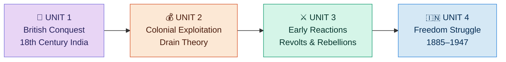

---

## ⏳ UNIT 1 — TIMELINE: Decline of Mughal Empire (1707–1857)

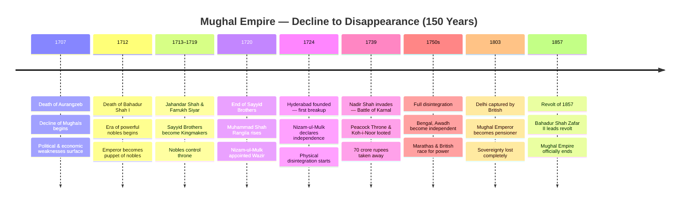

---

## 👑 LATER MUGHAL KINGS — Gantt Timeline (1707–1857)

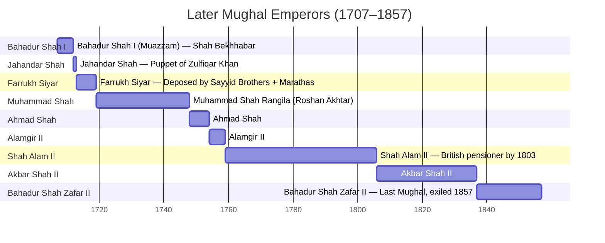

---

## 🧠 MIND MAP — Characteristics of 18th Century India

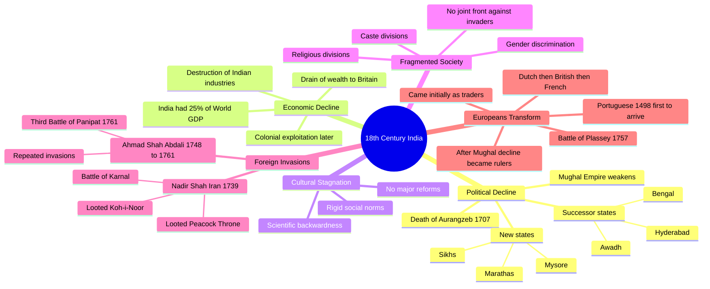

---

## 🔁 WAR OF SUCCESSION — After Aurangzeb's Death (1707)

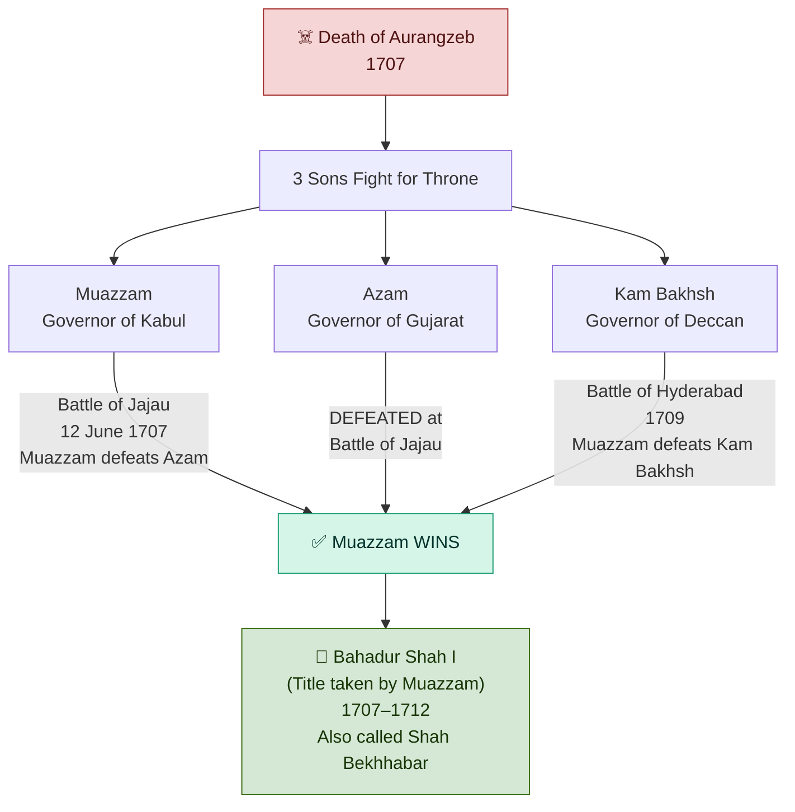

---

## 🏛️ ERA OF NOBLES — How Emperors Became Puppets

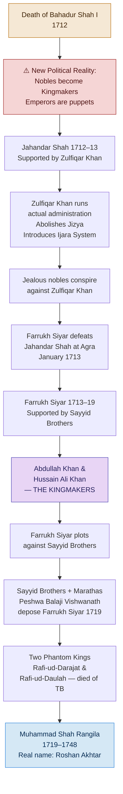

---

## 💡 IJARA SYSTEM — Revenue Farming Explained

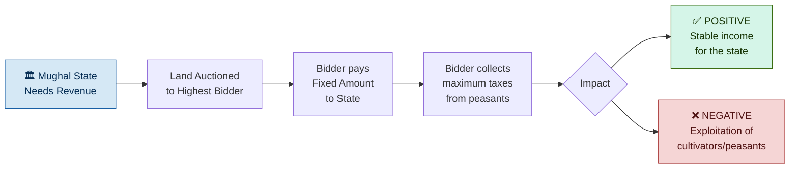

---

## ☄️ NADIR SHAH'S INVASION — 1739

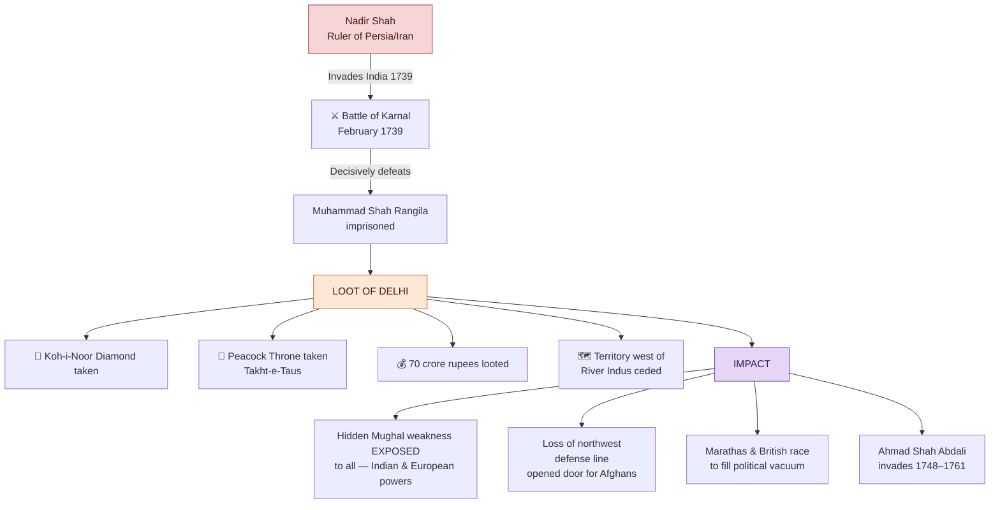

---

## 🏰 REGIONAL STATES — After Mughal Disintegration

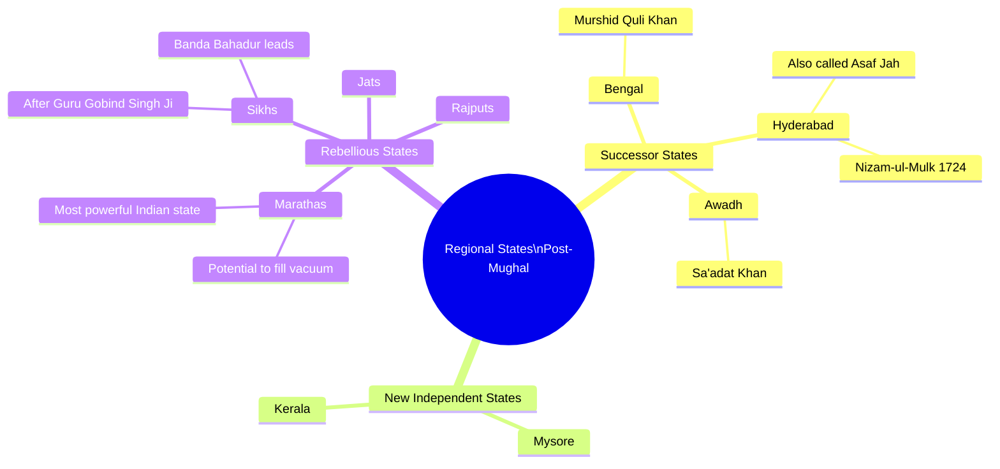

---

## ⚔️ WHO WILL FILL THE VACUUM? — The Race for Power

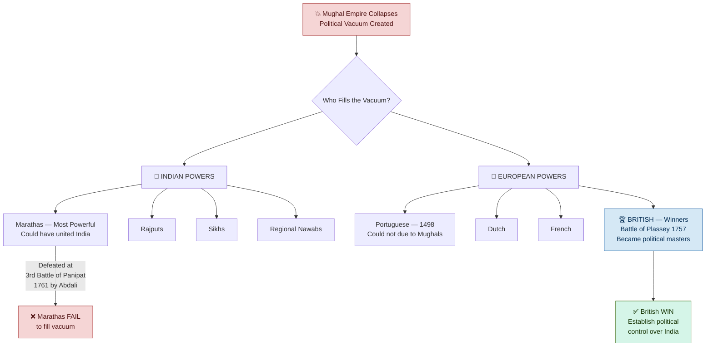

---

## 👤 KING CHARACTERISTICS — Quick Reference

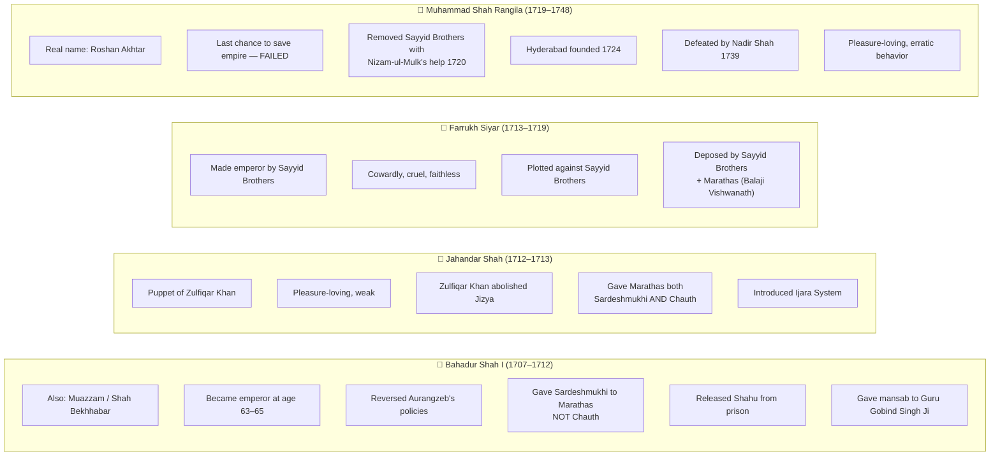

---

## 🔑 EXAM TRAP — Sardeshmukhi vs Chauth

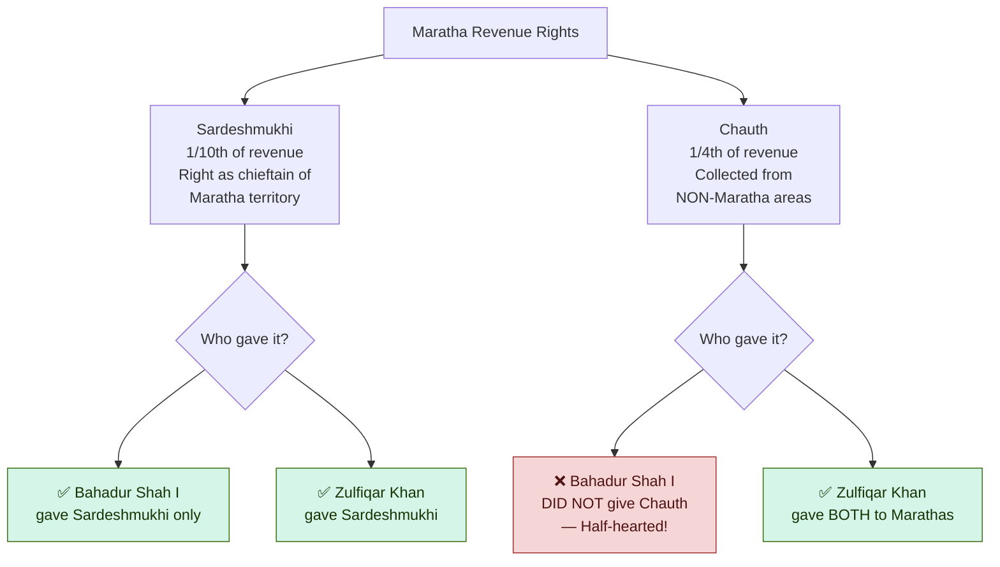

---

## 📋 UNIT 2, 3, 4 — Preview Mind Map

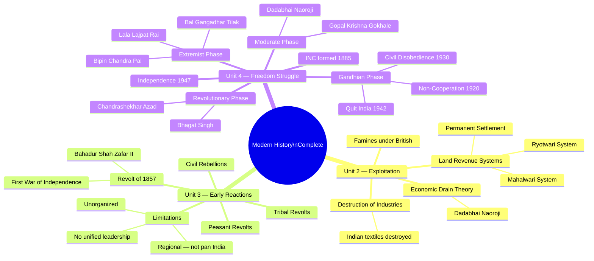

---

## ⚡ QUICK REVISION — Key Facts Table

| Year | Event | Key Person |
|------|-------|-----------|
| **1707** | Death of Aurangzeb — Mughal decline begins | Aurangzeb |
| **1707** | Battle of Jajau — Muazzam defeats Azam | Muazzam (Bahadur Shah I) |
| **1709** | Battle of Hyderabad — Muazzam defeats Kam Bakhsh | Muazzam |
| **1712** | Death of Bahadur Shah I — Era of nobles begins | Bahadur Shah I |
| **1712** | Ijara (Revenue Farming) system introduced | Zulfiqar Khan |
| **1713** | Jahandar Shah defeated at Agra | Farrukh Siyar |
| **1719** | Farrukh Siyar deposed | Sayyid Brothers + Balaji Vishwanath |
| **1720** | End of Sayyid Brothers' dominance | Nizam-ul-Mulk + Muhammad Shah |
| **1724** | Hyderabad independent state founded | Nizam-ul-Mulk (Asaf Jah) |
| **1739** | Battle of Karnal — Delhi looted | Nadir Shah vs Muhammad Shah Rangila |
| **1748–1761** | Afghan invasions | Ahmad Shah Abdali/Durrani |
| **1757** | Battle of Plassey — British become political power | Robert Clive vs Siraj-ud-Daulah |
| **1761** | Third Battle of Panipat | Ahmad Shah Abdali defeats Marathas |
| **1803** | Delhi captured by British | Shah Alam II becomes pensioner |
| **1857** | Revolt of 1857 — End of Mughal Empire | Bahadur Shah Zafar II |

---

## 🧩 CONNECT THE DOTS — Story Flow

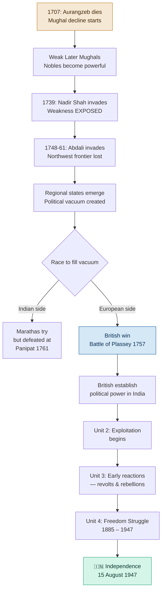

---

*📌 Compiled from Modern History Marathon Session | UPSC Prelims 2026*
*All Mermaid diagrams render in GitHub, Obsidian, Typora, Notion and VS Code preview*
