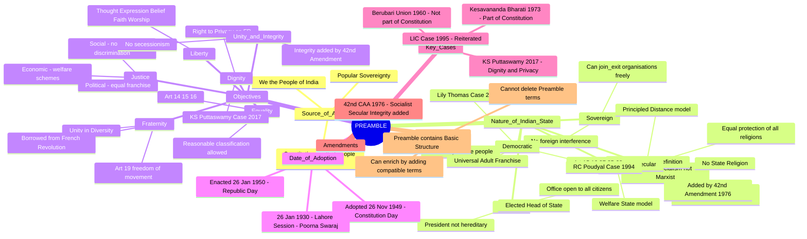
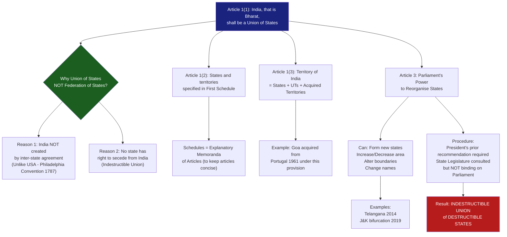

# 📘 UPSC Polity Topper Notes: Preamble + Union & Its Territory

---

## 🧠 PART 1: STORY-BASED CONCEPTUAL EXPLANATION

---

### 🔷 Chapter 1: The Preamble of the Indian Constitution

#### Why Does This Matter for UPSC?

The Preamble is one of the **most frequently tested topics** in both UPSC Prelims and Mains GS Paper 2. Questions appear on:
- Whether Preamble is part of the Constitution (Prelims trap)
- Whether Preamble can be amended (Mains conceptual)
- Terms like Sovereign, Socialist, Secular, Democratic, Republic (Prelims definitions)
- Landmark cases: Berubari Union, Kesavananda Bharati, LIC case (Prelims + Mains)

---

#### 📌 What is the Preamble?

Think of the Preamble as the **preface of a book**. Just as a preface tells you what the book is about and reveals the mindset of the author — the Preamble tells you:
1. **What this Constitution is about** (its philosophy and objectives)
2. **The mindset of the makers** who drafted it

> 🔹 *Simple Definition:* The Preamble is the philosophy of the Indian Constitution — a concise statement of its ideals, objectives, and the nature of the Indian state.

The Supreme Court confirmed this in:
- 🔹 **Berubari Union Case (1960):** "Preamble is a key to unlock the minds of the makers of the Constitution." *(PYQ: This exact line was asked in Prelims)*
- 🔹 **Kesavananda Bharati Case (1973):** Preamble is **part of the Constitution** and can be amended.
- 🔹 **LIC Case (1995):** Reiterated that Preamble is part of the Constitution.

---

#### 📌 Basis of the Preamble: The Objectives Resolution

The Preamble is **not original** — it is based on the **Objectives Resolution** moved by **Pandit Jawaharlal Nehru** in the Constituent Assembly and **adopted on 22nd January 1947**. The Objectives Resolution (with some changes in wording and syntax) became the Preamble to the Constitution.

> *(This is important because UPSC often asks about the relationship between the Objectives Resolution and the Preamble)*

---

#### 📌 The Full Text of the Preamble

> *"WE, THE PEOPLE OF INDIA, having solemnly resolved to constitute India into a SOVEREIGN SOCIALIST SECULAR DEMOCRATIC REPUBLIC and to secure to all its citizens:*
> *JUSTICE, social, economic and political;*
> *LIBERTY of thought, expression, belief, faith and worship;*
> *EQUALITY of status and of opportunity; and to promote among them all*
> *FRATERNITY assuring the dignity of the individual and the unity and integrity of the Nation;*
> *IN OUR CONSTITUENT ASSEMBLY this twenty-sixth day of November, 1949, do HEREBY ADOPT, ENACT AND GIVE TO OURSELVES THIS CONSTITUTION."*

---

#### 📌 Four Themes of the Preamble (UPSC Framework)

For exam purposes, break the Preamble into **4 broad themes**:

| Theme | Content |
|---|---|
| **Theme 1** | Source of Authority → "We the People of India" |
| **Theme 2** | Nature of the Indian State → Sovereign Socialist Secular Democratic Republic |
| **Theme 3** | Objectives of the Constitution → Justice, Liberty, Equality, Fraternity, Dignity, Unity & Integrity |
| **Theme 4** | Date of Adoption → 26th November 1949 |

---

#### 🔶 Theme 1: "We the People of India" — Source of Authority

The Constitution begins with "We the People" to establish that the **source of authority of this Constitution is the people of India themselves** — not the UN, not Britain, not any foreign power.

This reflects the concept of **Popular Sovereignty** — ultimate power rests with the people. They can elect a government, they can vote it out. This is democracy in action.

> 🔗 *Current Linkage:* Every general election in India is a manifestation of this principle — the people are the sovereign, and they decide who governs.

---

#### 🔶 Theme 2: Nature of the Indian State

**"Sovereign Socialist Secular Democratic Republic"** — these five words define what kind of state India is.

> ⚠️ *Prelims Trap:* There is NO comma between these words. They are ONE phrase and must be read in totality, not in isolation.

---

##### 🔹 1. SOVEREIGN

India can take **any decision, make or unmake any policy, join or leave any international organisation** without the interference of any foreign power.

- Before Independence: India was NOT sovereign — Britain took decisions on India's behalf.
- After Independence: India is fully sovereign.

> *Common doubt:* "India is part of WTO which imposes restrictions — does that mean India is not sovereign?"
> **Answer:** No. India **voluntarily** joined the WTO. Joining an organisation of your own free will does not compromise sovereignty. India can exit WTO whenever it chooses. Sovereignty means the freedom to make that choice.

---

##### 🔹 2. SOCIALIST

> ⚠️ *Prelims Trap:* The words **Socialist, Secular, and Integrity** were **NOT** in the original Constitution. They were added by the **42nd Constitutional Amendment Act, 1976** during the tenure of Prime Minister Indira Gandhi.

**What kind of Socialism does India follow?**

The lecture distinguishes between three types:

| Type | Description |
|---|---|
| **Marxist/Leninist Socialism** | Violent revolution, abolition of private property, state controls everything, eventually state "withers away" into communism |
| **Fabian Socialism** | No violent revolution; achieve socialist goals through gradual government action and welfare measures |
| **India's Socialism** | Closest to Fabian Socialism — welfare state model; government uses taxation and policy to reduce inequality; private property is NOT abolished |

The Supreme Court in **D.S. Nakara vs. Union of India** defined Indian socialism as the elimination of **inequality in income, status, and standards of living**.

> 🔗 *Current Linkage:* Schemes like MGNREGA, PM-KISAN, Ayushman Bharat, free ration under PMGKAY are all expressions of India's socialist character.

---

##### 🔹 3. SECULAR

> ⚠️ *Prelims Trap:* Secularism was also added by the **42nd Constitutional Amendment, 1976**. Before 1976, secularism was **implicit** (present in spirit through articles like 15, 16, 27). After 1976, it became **explicit** (directly stated in the Preamble).

**How is Indian Secularism different from Western Secularism?**

| Country | Model of Secularism |
|---|---|
| **France** | Strict separation — no religious symbols in public spaces |
| **USA** | Complete non-interference — state neither promotes nor inhibits religion |
| **China** | Anti-religion — communist state actively discourages religious practice |
| **India** | **Principled Distance** — State equally protects ALL religions; no state religion; no discrimination on grounds of religion |

**Key Constitutional Articles supporting Secularism:**
- 🔹 **Article 15:** State shall not discriminate on grounds of religion, race, caste, sex, or place of birth.
- 🔹 **Article 16:** Equality of opportunity in public employment — no discrimination on grounds of religion.
- 🔹 **Article 27:** No tax shall be used for the promotion of any particular religion.
- 🔹 **Article 25–28:** Freedom of religion guaranteed to all citizens.

> 🔗 *Current Linkage:* Debates on majoritarianism, hijab controversy, and state-funded religious pilgrimages (Kashi Yatra, Haj subsidy) are all connected to the concept of Indian secularism. This is a Mains GS1 topic (social issues).

---

##### 🔹 4. DEMOCRATIC

Democracy means **government of the people, by the people, for the people** (Abraham Lincoln).

India chose democracy over monarchy, one-party rule, or dictatorship. In a democracy:
- Every citizen has equal political participation.
- No one can be prevented from contesting elections based on religion, caste, gender, language.

> 🔹 **RC Poudyal vs. Union of India (1994):** Supreme Court said "Democracy denotes people's power and equal participation of all citizens in polity."

**Landmark Case — Lily Thomas vs. Union of India (2013):**
- Section 8(4) of the Representation of the People Act, 1951 gave sitting legislators 3 months to appeal after conviction — ordinary citizens were disqualified immediately.
- Supreme Court struck this down as violative of the principle of **political justice** (arbitrary distinction between an ordinary citizen and a legislator).
- Now: A legislator is **immediately disqualified** on the date of conviction for an offence carrying 2+ years imprisonment.

> 🔗 *Current Linkage:* Rahul Gandhi's disqualification from Lok Sabha (2023) following conviction in a criminal defamation case was a direct application of this judgment.

---

##### 🔹 5. REPUBLIC

India is a **Republic** because the **Head of State (President) is an elected office**, NOT a hereditary position.

| Country | Type |
|---|---|
| **Britain** | Constitutional Monarchy (King/Queen is hereditary) |
| **India** | Constitutional Republic (President is elected) |

> *(The current President, Smt. Droupadi Murmu, was elected by elected representatives — MLAs and MPs — through an indirect election process.)*

**Republic also means:**
- The office of President is open to **all citizens regardless of religion, caste, sex, or place of birth**.
- No hereditary privilege in public offices.

---

#### 🔶 Theme 3: Objectives of the Constitution

##### JUSTICE (Social, Economic, Political)

| Type | Meaning | Example |
|---|---|---|
| **Social Justice** | No discrimination based on caste, sex; end of untouchability and discrimination | Reservation policy, Prohibition of Manual Scavenging Act |
| **Economic Justice** | State must uplift the poor; reduce income inequality | MGNREGA, PM-KISAN, old-age pensions |
| **Political Justice** | Universal Adult Franchise; no discrimination in political participation | Right to vote from age 18 for all; Lily Thomas case |

---

##### LIBERTY

Freedom of thought, expression, belief, faith, and worship.

> 🔹 *This is also linked to the secular character of India — you are free to follow any religion or none at all.*

---

##### EQUALITY

No discrimination on grounds of religion, race, caste, sex, or place of birth. This is operationalised through Articles 14, 15, and 16.

> ⚠️ *Prelims Trap:* Equality does NOT mean identical treatment. **Reasonable classification** is permitted. For example, reservation for SC/ST/OBC is valid because it is based on a logical and constitutionally recognised classification. The Preamble cannot stop what the Constitution itself allows.

---

##### FRATERNITY

The sense of brotherhood among all citizens — ensuring unity despite India's enormous diversity (religion, language, caste, food, dress, tribal identity).

> 🔹 The slogan **Liberty, Equality, Fraternity** was borrowed from the **French Revolution**.

Fraternity is operationalised through:
- Article 19(1)(d): Right to move freely throughout India.
- Article 19(1)(e): Right to reside and settle anywhere in India.

---

##### DIGNITY OF THE INDIVIDUAL

Every person must be treated with dignity. This is also where the **Right to Privacy** was derived.

> 🔹 **K.S. Puttaswamy vs. Union of India (2017):** The Supreme Court ruled that **Right to Privacy is a Fundamental Right** under Article 21, using the Preamble's objective of assuring the dignity of the individual as interpretive support.

---

##### UNITY AND INTEGRITY OF INDIA

> ⚠️ *Prelims Trap:* The word **Integrity** was added by the **42nd Constitutional Amendment, 1976** — same as Socialist and Secular.

- **Unity:** Despite diversity, we are all Indians — one nation, one soil.
- **Integrity:** The territorial integrity of India must be preserved. No state or region has the right to secede.

> 🔗 *Current Linkage:* Khalistan movement, insurgencies in Northeast India — these are secessionist movements against which the concept of Integrity of India is invoked.

---

#### 🔶 Theme 4: Date of Adoption

- **26th November 1949:** Constitution was **adopted** by the Constituent Assembly. *(Now celebrated as Constitution Day / Samvidhan Divas)*
- **26th January 1950:** Constitution **came into force** (enacted/implemented). *(Celebrated as Republic Day)*

**Why the gap?** Pandit Nehru requested that the Constitution be enacted on 26th January because:
- On **26th January 1930**, at the **Lahore Session of the Indian National Congress (1929)** under Nehru's presidentship, a resolution for **Poorna Swaraj (Complete Independence)** was passed.
- For the first time on **26th January 1930**, Independence Day was celebrated and the Indian flag was hoisted.
- This date was historically significant, so Nehru wanted the Constitution to come into force on this date.

---

#### 📌 Is Preamble Part of the Constitution?

| Case | Ruling |
|---|---|
| **Berubari Union Case (1960)** | Preamble is NOT part of the Constitution (not enforceable in court) |
| **Kesavananda Bharati Case (1973)** | Preamble IS part of the Constitution; can be amended |
| **LIC Case (1995)** | Reiterated — Preamble is part of the Constitution |

**Why was the Preamble adopted last?**
The Constituent Assembly first drafted the entire Constitution, then adopted the Preamble last — to ensure the Preamble accurately reflects the completed Constitution and that no article contradicts the Preamble's philosophy.

---

#### 📌 Can Preamble Be Amended?

**YES** — but with important restrictions:

- Preamble is part of the **Basic Structure** of the Constitution.
- Parliament **CANNOT** delete or alter the basic structure elements (e.g., cannot delete Sovereign, Democratic, Republic, Secular).
- Parliament **CAN** add new terms to **enrich** the Preamble — as long as they are **not incompatible** with existing terms.
- This is exactly what happened in 1976 — Socialist, Secular, and Integrity were **added** without changing or deleting anything.

> 🔹 **US Constitution** was the first to begin with a Preamble ("We the People of the United States of America").

---

#### 📌 Role of the Preamble in Legal Interpretation

The Preamble **aids in interpreting ambiguous constitutional provisions** — it is used as a tool of interpretation when constitutional language is unclear.

> 🔹 **K.S. Puttaswamy Case (2017):** When the court needed to determine whether Right to Privacy was a fundamental right, it used the Preamble's assurance of **Dignity** as an interpretive anchor.

**Important limitations:**
- Preamble **cannot grant a power** that is not already given in the Constitution.
- Preamble **cannot restrict a power** that the Constitution does not restrict.
- Example: Constitution allows reasonable classification (reservation). Preamble talks about equality. But Preamble cannot override what the Constitution explicitly permits.

---

### 🔷 Chapter 2: Union and Its Territory (Part I, Articles 1–4)

#### Why Does This Matter for UPSC?

Articles 1–4 are tested for:
- Name of India and constitutional basis
- Why "Union of States" and not "Federation of States"
- Indestructible Union of destructible States
- Parliament's power to reorganise states (Article 3)

---

#### 📌 Article 1: Name and Territory

**Article 1(1):** "India, that is Bharat, shall be a Union of States."

**Why two names?**
- During the Constituent Assembly debates, there was intense discussion on what to call the newly independent country.
- Some wanted **India** (widely recognised name).
- Some wanted **Bharat** (ancient Sanskrit name, not given by colonisers).
- Some wanted **Hindustan** (rejected — name given by Persians and Arabs).
- Some wanted a name inspired by USSR (Union of Socialist States of India).
- Some even suggested **Jambudvipa** (ancient name).

**Compromise reached:** Both names — India AND Bharat — are official. Either can be used interchangeably.

> ⚠️ *Important:* In the **English version** of the Constitution, primacy is given to "India, that is Bharat." In the **Hindi version**, it reads "Bharat, arthat India."

> 🔹 *A PIL was filed in the Supreme Court requesting that only "Bharat" be used. Supreme Court dismissed it — both names are valid per Article 1.*

> 🔗 *Current Linkage (2023):* The G20 Summit invitation read "President of Bharat." PM Modi was referred to as PM of Bharat at ASEAN India Summit. Debate arose on whether the government intends to officially rename India to Bharat. For such a change: (a) Constitutional Amendment required to remove "India" from Article 1, and (b) formal intimation to United Nations required (like Turkey did when it changed its name).

---

#### 📌 Why "Union of States" and NOT "Federation of States"?

Dr. B.R. Ambedkar gave **two reasons** for using "Union of States":

**Reason 1:** India is NOT the result of an agreement between states.

Compare with the USA:
- 13 British colonies declared independence → became 13 independent sovereign countries → they signed an agreement at Philadelphia (1787) → this agreement created the United States of America.
- USA was BORN out of an inter-state agreement.

India is different:
- India already existed as a political entity.
- The princely states (562 of them — Hyderabad, Baroda, Mysore, Patiala, Jammu & Kashmir, etc.) chose to **merge/accede into India** through the **Instrument of Accession** — but India was not created by this process.
- India was already there; these states joined India.

> ⚠️ *Common confusion:* "But the princely states signed Instruments of Accession — isn't that an agreement?" 
> **Answer:** Yes, but there is a key difference. In the USA, the agreement CREATED the country. In India, the Instrument of Accession was about states JOINING a pre-existing nation. India was not created by those agreements.

**Reason 2:** No state has the right to secede from the Union of India.

In a federation formed by agreement (like the USA theoretically), a state might argue it can leave the agreement. India does not allow this. No state can come out of the Union. The country must remain an integral whole.

> 🔗 *Current Linkage:* Khalistan movement, Naga secessionism, J&K insurgency — all are constitutionally illegitimate because the Indian state is indestructible and no part may secede.

---

#### 📌 Article 1(2): Names of States in First Schedule

Article 1(2) says: "The States and the territories thereof shall be as specified in the First Schedule."

**Why use a Schedule instead of listing states directly in the article?**
- If all 28 states and 8 union territories (with their boundaries and territories) were listed in the article itself, the article would be impossibly long and bulky.
- Schedules are **explanatory memoranda** of articles — they provide detailed information at the end of the Constitution to keep the articles concise.
- The **First Schedule** lists the names of all states and union territories along with their territories.

> ⚠️ *Note:* "Union of States" in Article 1 refers to **States only** — **NOT Union Territories**. 
> Union Territories do NOT share a federal relationship with the Union (no dual government, no distribution of powers — Centre directly governs them). Therefore, they are excluded from this federal terminology.

---

#### 📌 Article 1(3): Territory of India

Territory of India comprises:
1. Territories of the states (28 states)
2. Union territories (8 UTs)
3. Other territories that may be acquired by India

> 🔹 *"Other territories that may be acquired"* — this gives Parliament the power to acquire foreign territory. Example: Goa was acquired from Portugal in 1961.

---

#### 📌 Articles 3 & 4: Power of Parliament to Reorganise States

> *(Full detail to be covered in subsequent lecture as promised — brief overview here)*

**Article 3** gives Parliament the power to:
- Form new states (e.g., Telangana from Andhra Pradesh in 2014)
- Increase/decrease the area of any state
- Alter the boundaries of any state
- Change the name of any state

> ⚠️ *Key constitutional feature:* This is WHY India is called an **"Indestructible Union of Destructible States"** — the Union of India cannot be broken, but individual states CAN be reorganised, merged, divided, or renamed by Parliament.

**Procedure under Article 3:**
- Bill must be introduced in Parliament with **prior recommendation of the President**.
- Before the President recommends, the Bill is referred to the **concerned State Legislature** for expressing its views.
- But the President/Parliament is **NOT bound** by the State Legislature's views.

> 🔗 *Current Linkage:* Creation of Telangana (2014), bifurcation of J&K into two Union Territories (J&K and Ladakh) in 2019 under Article 3 read with Article 4.

---

## 🔄 PART 2: MINDMAP / FLOWCHART

### Mindmap: The Preamble

---

### Flowchart: Union and Its Territory (Articles 1–4)

---

## ⚡ PART 3: QUICK REVISION NOTES

### 🔷 The Preamble

**Key Facts:**
- Preamble is based on the **Objectives Resolution** moved by Pandit Nehru, adopted on **22 January 1947** by the Constituent Assembly.
- Preamble was the **last item voted upon** in the Constituent Assembly (to ensure consistency with completed Constitution).
- **US Constitution** was the first to begin with a Preamble.
- Constitution adopted: **26 November 1949** (Constitution Day)
- Constitution enacted: **26 January 1950** (Republic Day)
- 26 January chosen because of the **Lahore Session 1929** and celebration of first Independence Day on **26 January 1930**.

**Words Added by 42nd Constitutional Amendment, 1976:**
- **Socialist**
- **Secular**
- **Integrity**

**Key Articles Linked to Preamble Objectives:**
- Art. 14 → Equality before law
- Art. 15 → No discrimination on grounds of religion, race, caste, sex, place of birth
- Art. 16 → Equality of opportunity in public employment
- Art. 21 → Right to life and personal liberty (includes Right to Privacy)
- Art. 25–28 → Freedom of religion (Secularism)
- Art. 27 → No tax for promotion of any religion
- Art. 19(1)(d),(e) → Right to move freely, right to reside anywhere (Fraternity)

**Landmark Judgments:**
- **Berubari Union Case (1960):** Preamble NOT part of Constitution; key to unlock minds of makers.
- **Kesavananda Bharati Case (1973):** Preamble IS part of Constitution; Parliament can amend it; Basic Structure doctrine.
- **LIC Case (1995):** Reiterated Preamble is part of Constitution.
- **D.S. Nakara vs. Union of India:** Socialism in India = elimination of inequality of income, status, standards of life.
- **RC Poudyal vs. Union of India (1994):** Democracy = people's power and equal participation.
- **Lily Thomas vs. Union of India (2013):** Struck down S.8(4) of RPA 1951; legislator disqualified immediately on conviction.
- **K.S. Puttaswamy vs. Union of India (2017):** Right to Privacy is a Fundamental Right under Art. 21; Preamble's dignity objective used as interpretive tool.

**Prelims Traps:**
- Socialist, Secular, Integrity → added in **1976** by **42nd CAA**, NOT original.
- India's secularism = **principled distance**, NOT separation of church and state (Western model).
- Before 1976, secularism was **implicit**; after 1976, it became **explicit**.
- Preamble is enforceable **indirectly** (through constitutional articles) but **NOT directly** in a court of law.
- Preamble **contains** Basic Structure but is not the only source of Basic Structure.
- Parliament **can add** to the Preamble if compatible; **cannot delete** Basic Structure elements.
- "Government of the people, by the people, for the people" → Abraham Lincoln (not the Constitution; not a PYQ trick to attribute it elsewhere).

---

### 🔷 Union and Its Territory (Articles 1–4)

**Key Facts:**
- **Article 1(1):** India, that is Bharat, shall be a Union of States.
- Both "India" and "Bharat" are official names; both can be used interchangeably.
- In English version: "India, that is Bharat." In Hindi version: "Bharat, arthat India."
- To formally change name and remove "India" → Constitutional Amendment required + intimation to UN.

**Why "Union" not "Federation"?**
- India is NOT the result of an inter-state agreement (unlike USA — Philadelphia Convention, 1787, 13 colonies).
- No state has the right to secede from India.

**First Schedule:**
- Lists names of all **28 States** and **8 Union Territories** with their territories.
- UTs are NOT part of "Union of States" — they do NOT share a federal relationship with the Union.

**Article 3 — Power to Reorganise States:**
- Parliament can: form new states, alter boundaries, change names, increase/decrease area.
- Requires: President's prior recommendation; State Legislature must be consulted (but NOT binding).
- Examples: Telangana (2014), J&K bifurcation into J&K UT and Ladakh UT (2019).
- Result: **Indestructible Union of Destructible States**.

**Instrument of Accession:**
- Signed by all 562 princely states (not just Kashmir).
- Princely states JOINED India — they did not CREATE India.

**Prelims Traps:**
- "Union of States" does NOT include Union Territories.
- India ≠ Federation (never use "Federation of States" for India).
- Article 1(3) includes territories that may be **acquired** — Parliament can acquire foreign territory.
- The concept of Indestructible Union of Destructible States is from Articles 1 and 3 read together.
- Constituent Assembly met for first time: **9 December 1946**.
- Constitution drafted over approximately **2 years, 11 months, 18 days**.

---

### 🎯 PYQ-Focused Summary

| PYQ Theme | Key Point |
|---|---|
| Key to unlock minds of makers | Preamble (Berubari Union Case 1960) |
| Words added by 42nd CAA | Socialist, Secular, Integrity |
| First country to begin Constitution with Preamble | USA |
| India's socialism type | Fabian/Welfare Socialism, NOT Marxist |
| Why "Union" not "Federation" | Two reasons by Ambedkar (see above) |
| Lily Thomas case | Immediate disqualification of convicted legislators |
| Preamble — part of Constitution? | Yes (Kesavananda 1973, LIC 1995) |
| Right to Privacy | Art. 21, K.S. Puttaswamy 2017, linked to Dignity in Preamble |
| Date Constitution adopted | 26 Nov 1949 |
| Date Constitution enacted | 26 Jan 1950 |
| First Schedule | Names of States and UTs |
| Article 3 | Parliament's power to reorganise states |

---

*Notes compiled from classroom lecture. For exam use: Always integrate with M. Laxmikanth's Indian Polity and recent Supreme Court judgments.*
