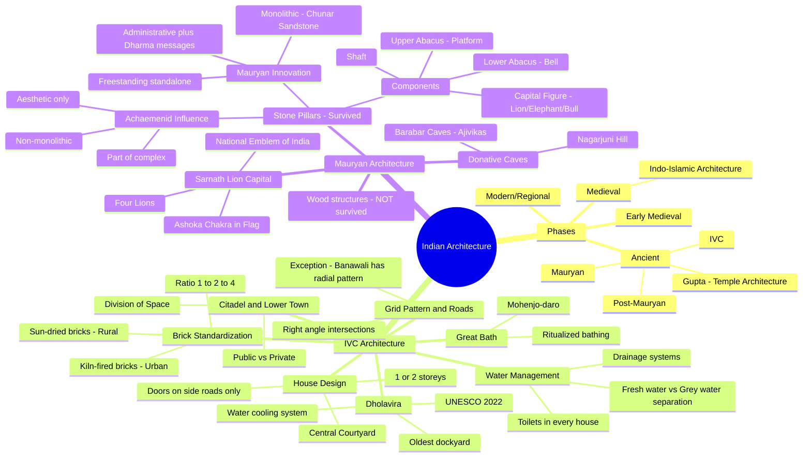
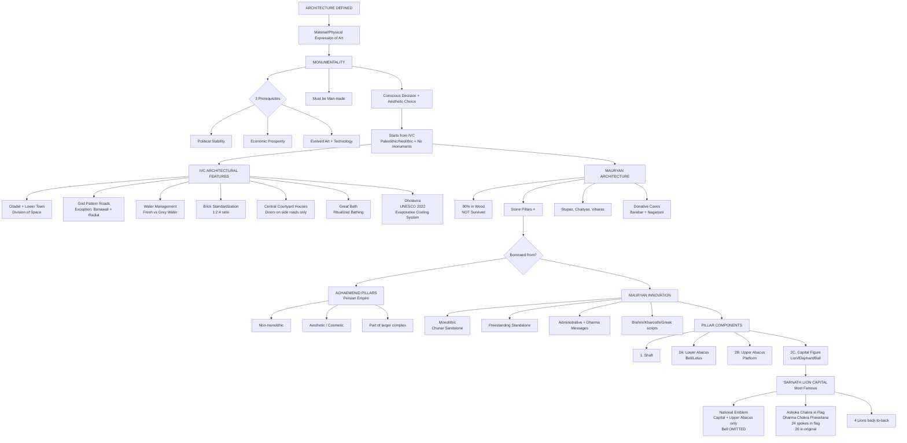

# 🏛️ UPSC Art & Architecture — Topper Notes
### Module: Ancient Indian Architecture | IVC → Mauryan Period

> 📌 **Exam Relevance:** 3–5 questions in UPSC Mains from Art & Culture. Cannot clear UPSC without mastering this module.

---

# 🧠 PART 1: STORY-BASED CONCEPTUAL EXPLANATION

---

## 📖 Chapter 1: What is Architecture? — Setting the Stage

Imagine you want to leave a mark on the world — something that says *"I was here, I was powerful, I was civilized."* That's exactly what **architecture** is.

> **Definition:** Architecture = **Material / Physical expression of Art**. This physical expression at a monumental scale is called **Monumentality**.

*(This distinction matters for UPSC because questions often ask "what do monuments represent?" — they represent civilization, not just buildings.)*

### 🔑 Three Prerequisites for Monumentality

For great monuments to be built, **three conditions must exist simultaneously**:

| # | Prerequisite | Why It Matters |
|---|---|---|
| 1 | **Political Stability** | No stability = no long-term building projects |
| 2 | **Economic Power & Prosperity** | Monuments need massive funding |
| 3 | **Evolved Art + Technology** | Need skilled craftsmen and engineering knowledge |

> **Key Insight:** Monuments are NOT random buildings. They are expressions of at least 5–6 different socio-political factors. That's why they are crucial to history.

### ⚠️ Architecture Must Be:
- **Man-made** (geological formations = NOT architecture)
- A **conscious decision** to create
- Made with **aesthetic choices** (deliberate design intent)

---

## 📖 Chapter 2: The Four Phases of Indian Architecture

Think of Indian architecture as a **4-act play**:

```
Act 1: ANCIENT          → IVC, Mauryan, Post-Mauryan, Gupta
Act 2: EARLY MEDIEVAL   → Early temple traditions
Act 3: MEDIEVAL         → Indo-Islamic Architecture ⭐ Very Important
Act 4: MODERN/REGIONAL  → Colonial + Regional styles (Misc. topics)
```

> **Why start with IVC?** Because Palaeolithic/Mesolithic/Neolithic periods either have no monuments OR surviving evidence is too poor. **IVC is our starting point** for architecture.

**Exam Flow to Remember:**
- **Ancient** → IVC → Mauryan → Post-Mauryan → Gupta (Temple Architecture arrives here!)
- **Temple Architecture is a GUPTA-period phenomenon** — not Mauryan. This is a common confusion trap.

---

## 📖 Chapter 3: Indus Valley Civilization (IVC) Architecture

The beautiful thing about IVC is that **its salient features ARE its architectural features**. If you know ancient India, you already know IVC architecture!

*(This is why studying ancient India first makes art & culture easier — the teacher's strategic sequencing.)*

### 🏙️ Feature 1: Citadel & Lower Town — Division of Space

```
  ┌──────────────────────────────┐
  │     CITADEL (Upper Town)     │
  │  Public Buildings, Admin     │
  │  Granaries, Great Bath       │
  └──────────────────────────────┘
           ↕ Separation
  ┌──────────────────────────────┐
  │     LOWER TOWN               │
  │  Residential / Private Area  │
  │  Living Spaces, Workshops    │
  └──────────────────────────────┘
```

> **Architectural Term: Division of Space** — Conscious separation of **public vs. private** zones.

**Why is this remarkable?** 99% of Indian cities TODAY lack this planned separation. IVC did this 4,000–5,000 years ago! Most modern Indian cities suffer from **non-planned, hodgepodge urbanization**.

---

### 🛣️ Feature 2: Grid Pattern, Roads & Water Management

**Grid Pattern:**
```
        N
        ↑
  ──────┼──────  ← Roads intersect at RIGHT ANGLES (90°)
        │
W ──────┼────── E
        │
  ──────┼──────
        ↓
        S
```

> **Exception:** **Banawali** had a **radial pattern** instead of a grid. *(Prelims favourite!)*

**Water Management — Genius of IVC:**
- Strict separation of **Fresh Water** (supply) vs. **Grey Water** (used/waste water)
- **Drainage system** on one side of roads, **sewage system** on the other
- **Toilets in every house** or public space
- **Wells** for water supply to every household

---

### 🧱 Feature 3: Standardization & House Designs

**Brick Size Ratio — 1 : 2 : 4 (Standardized!)**

| Brick Type | Dimensions |
|---|---|
| Standard brick | 10 × 20 × 40 cm |
| Alternate size | 7 × 14 × 28 cm |

> **Architectural Marvel:** Uniform brick sizes across thousands of kilometres — with **no modern tools, advanced mathematics, or geometry**. This standardization itself is extraordinary.

**House Design:**

```
  ┌─────────────────────────┐
  │  Room  │ OPEN  │  Room  │
  │        │CENTRAL│        │
  │        │ COURT │        │
  │  Room  │ YARD  │  Room  │
  └─────────────────────────┘
       ↑ Doors & Windows
    Open ONLY to side roads
    NEVER towards main roads
```

- Houses: **1 or 2 storeys**
- **Central courtyard** — defining feature of IVC homes
- Doors/windows face **side lanes**, never main roads (privacy + noise management)

---

### 🧱 Feature 4: Sun-Dried vs. Fired Bricks

| Type | Colour | Usage |
|---|---|---|
| **Sun-dried bricks** (Terra Cotta) | Light/beige | Rural IVC sites (Rakhigarhi, Ropar) |
| **Kiln-fired/Fired bricks** | Red (like today's bricks) | Urban sites, important buildings |

> **Pro Tip:** The **colour of bricks** can tell archaeologists the **importance and urban/rural nature** of a site!

---

### 🌊 Feature 5: The Great Bath

- Located at **Mohenjo-daro** in the **Citadel** (upper town)
- Purpose: **Ritualized/public bathing** — not just hygiene but religious/ceremonial significance
- One of the world's earliest large public water structures

---

### 💧 Star Feature: Dholavira & Water Management

**Dholavira** (Gujarat, Rann of Kutch) is in a league of its own.

**Why is Dholavira special?**
- It is the **ONLY UNESCO World Heritage Site** (recognized in **2022**) among ALL known Harappan sites (out of 1,000+ sites known).
- It has a **unique water management system** that surpasses even modern cities.

**How Dholavira's Cooling System Worked:**

```
     River/Stream ──→ [Water Reservoirs] ──→ Channels into city
                              ↓
                       Water EVAPORATES
                              ↓
                    Evaporation = COOLING EFFECT
                    (Water absorbs heat → becomes vapour)
                              ↓
              Entire city stays COOL despite Rann of Kutch heat!
```

> **Science connection:** Evaporation causes cooling — just like sweat cools our body. Dholavira used this principle at a **city-wide scale, 4,000–5,000 years ago!**

**Dholavira's Unique Layout:**
- Situated **between two rivers/streams**
- Has a **Citadel area** + **Middle Town** + residential zones
- Entire settlement designed around water reservoirs for cooling
- Also has: **Step wells**, **water reservoirs**, and **the oldest dockyard** in the world (saline deposits found under the dock bed prove sea water access)

---

## 📖 Chapter 4: Mauryan Architecture

The Vedic period leaves **very few architectural evidences**. So we jump directly to the **Mauryan period** — the next major milestone.

> **Why no Vedic architecture?** Most structures were likely wood or perishable material with limited textual references of construction but nothing archaeologically significant survives.

### Mauryan Architecture: 4–5 Categories

```
MAURYAN ARCHITECTURE
├── 1. Palaces & Houses (90% in WOOD — mostly NOT survived)
├── 2. Stone Pillars (Ashokan Pillar Edicts) ⭐ Most Important
├── 3. Stupas
├── 4. Chaityas & Viharas
└── 5. Rock-cut Caves (Donative Caves — for Ajivika, Buddhist, Jain sects)
     └── First example: Barabar & Nagarjuni Hill Complex (for Ajivikas)
```

> **Why did 90% of Mauryan architecture not survive?** Because it was made of **WOOD**, which decays over ~3,000 years. Termites and natural decay destroy wood. Stone survives; wood doesn't.

---

## 📖 Chapter 5: Ashokan Pillar Edicts — The Masterpiece

Three questions frame the entire discussion:

### ❓ Question 1: Were Mauryan Pillars an Original Innovation?

**Answer: NO.** The concept of pillars was **borrowed from the Achaemenid (Persian) Empire**.

> **Context connection:** You remember the Achaemenid Empire from Alexander's conquests. Alexander (from Macedonia) fought through Persia — the **Battle of Issus** and **Battle of Persepolis** — to reach the Indus. This is that same Persian dynasty whose pillars Ashoka drew inspiration from!

---

### 🏛️ Achaemenid Pillars — Features

| Feature | Description |
|---|---|
| **Non-monolithic** | Made in pieces (3+ components joined together) |
| **Aesthetic/Cosmetic purpose** | Just decorative — no messages or inscriptions |
| **Part of larger complex** | Always within a temple/palace complex; NOT standalone |

> **Visual:** Achaemenid pillars are like decorative columns in a hall — placed in open spaces to fill them, with no deeper purpose.

---

### ❓ Question 2: How Are Mauryan Pillars DIFFERENT?

This is where Ashoka's genius comes through:

| Feature | Achaemenid Pillars | **Mauryan/Ashokan Pillars** |
|---|---|---|
| Material | Pieces joined together | **Monolithic** (single piece of rock) |
| Stone type | Various | **Chunar Sandstone** (quarried from Chunar, UP) |
| Structure | Part of complex | **Freestanding / Standalone** |
| Purpose | Aesthetic only | **Administrative orders + Dharma messages** |
| Inscriptions | None | **Brahmi (Pali/Prakrit)** or **Kharosthi/Greek** scripts |

> **Monolith = Mono (one) + Lithos (rock)** — carved from a single piece of stone. A remarkable engineering feat!

---

### ❓ Question 3: Basic Components of Mauryan Pillars

This is the technical/diagram part — crucial for Mains answers!

```
        ╔══════════╗
        ║  CAPITAL ║  ← 2C: Capital Figure
        ║  FIGURE  ║     (Lion / Elephant / Bull)
        ╠══════════╣
        ║  UPPER   ║  ← 2B: Upper Abacus (Platform)
        ║  ABACUS  ║
        ╠══════════╣
        ║  LOWER   ║  ← 2A: Lower Abacus / Bell Structure
        ║  ABACUS  ║     (Lotus/Bell shape)
        ╠══════════╣
        ║          ║
        ║          ║
        ║  SHAFT   ║  ← 1: Shaft (Rock-cut monolithic pillar)
        ║          ║
        ║          ║
        ╚══════════╝
        ▓▓▓▓▓▓▓▓▓▓▓  ← Ground
```

**Components breakdown:**

| Component | Sub-part | Description |
|---|---|---|
| **1. Shaft** | — | Single monolithic sandstone column |
| **2. Capital** | 2A: Lower Abacus | Bell/Lotus shaped base of capital |
| | 2B: Upper Abacus | Platform/disc on which capital figure sits |
| | 2C: Capital Figure | Animal on top: **Lion, Elephant, or Bull** |

> **Note:** Sometimes shaft and capital are two separate rocks joined at a joint. But each remains individually monolithic.

---

### 🦁 Capital Figures & Their Symbolism

| Animal | Symbolism |
|---|---|
| **Lion** | Royalty, Power, Aggressiveness |
| **Elephant** | Grandeur, Bigness |
| **Bull** | Fertility, Prosperity |

**Pillar sites:** Sanchi, Sarnath, Rampurva, Vaishali, Sankisa, Lauriya Nandangarh, Allahabad (Prayagraj)

---

## 📖 Chapter 6: The Sarnath Lion Capital — National Symbols

The **Sarnath Lion Capital** is the most famous Ashokan pillar capital. It is significant for **THREE reasons:**

### 🎯 Reason 1: National Emblem of India

```
    ┌────────────────────────┐
    │  Original Sarnath      │
    │  Capital (complete)    │
    │                        │
    │  [4 Lions back-to-back]│  ← 2C: Capital Figure (4 lions)
    │  [  Abacus + Chakra  ] │  ← 2B: Upper Abacus (with Dharma Chakra, bull, horse)
    │  [ Bell/Lotus shape  ] │  ← 2A: Lower Abacus (OMITTED from National Emblem)
    └────────────────────────┘

    Indian National Emblem =
    Capital Figure (Lions) + Upper Abacus ONLY
    ❌ Lower Abacus (bell) is OMITTED
```

> **Prelims Trap:** The National Emblem has **ONLY the top two parts** — capital figure + upper abacus. The **lower abacus (bell structure) was omitted**.

---

### 🎯 Reason 2: Ashoka Chakra in National Flag

- The **Dharma Chakra** (wheel) from the Sarnath capital's abacus inspired the **Ashoka Chakra** in the Indian National Flag.
- **What does the Chakra represent?** → **Dhamma Chakra Pravartana** = "The wheel of Dharma turns" — referring to Buddha's first sermon at Sarnath after enlightenment.

**Spokes controversy — Clarified:**

| Context | Spokes |
|---|---|
| **Original Sarnath Abacus** | **26 spokes** |
| **Ashoka Chakra in National Flag** (adopted post-independence) | **24 spokes** |

> The national flag uses 24 spokes (a post-independence adaptation). The original has 26. Both are correct in their respective contexts.

---

### 🎯 Reason 3: New Parliament Controversy

- The **National Emblem installed on the new Parliament building** (2022) faced controversy due to the **fiercer/more aggressive expression** of lions compared to the original Sarnath sculpture.
- Critics argued the sculptor did poor work; the government justified it as representing "New India."

---

### 🏆 Oldest Rock-Cut Structure in India

> **Dhauli (Odisha)** — has the oldest surviving **rock-cut elephant** (capital figure). The shaft didn't survive due to weathering, but the elephant capital did.

---

# 🔄 PART 2: FLOWCHART / MINDMAP



---



---

# ⚡ PART 3: QUICK REVISION NOTES

---

## 🔹 Architecture — Core Definitions

- **Architecture** = Material / Physical expression of art
- **Monumentality** = Expression of power/art through physical structures
- **3 Prerequisites** for monumentality: Political stability + Economic prosperity + Evolved art/technology
- Architecture must be **man-made** with **conscious aesthetic choices**
- Starts from **IVC** (Palaeolithic/Neolithic = no surviving monuments)

---

## 🔹 IVC Architecture — Key Points

| Point | Detail |
|---|---|
| Division of Space | Citadel (public/admin) + Lower Town (residential/private) |
| Grid Pattern | Roads at right angles (N-S, E-W) |
| Exception | **Banawali** = Radial pattern *(Prelims!)* |
| Water management | Fresh water ≠ Grey water (strictly separated) |
| Toilets | Present in every house or public space |
| Brick ratio | **1:2:4** (e.g., 10×20×40 cm) |
| Sun-dried bricks | Rural IVC sites (light colour) |
| Kiln-fired bricks | Urban/important sites (**red colour**) |
| House design | **Central courtyard** + doors/windows on **side roads only** |
| Great Bath | Mohenjo-daro, ritualized bathing |
| Dholavira | UNESCO 2022, evaporative water cooling, oldest dockyard |

---

## 🔹 Dholavira — Special Facts

- Located in **Rann of Kutch, Gujarat**
- **Only UNESCO World Heritage Site** among all Harappan sites (2022)
- Built **between two rivers/streams**
- Used **water evaporation for city-wide cooling**
- Has: **step wells + water reservoirs + oldest dockyard**
- Saline deposits under dock bed = proof of sea water access

---

## 🔹 Mauryan Architecture — Key Points

- **90% was wood** → Did NOT survive (3,000 years of decay + termites)
- Surviving forms: **Stone pillars, Stupas, Chaityas, Viharas, Donative Caves**
- First donative caves: **Barabar + Nagarjuni Hill Complex** (for **Ajivikas**)
- Temple architecture comes in **Gupta period** (NOT Mauryan!)

---

## 🔹 Ashokan Pillars — Comparison Table

| Feature | Achaemenid | Mauryan (Ashokan) |
|---|---|---|
| Material | Multiple pieces | **Monolithic — Chunar Sandstone** |
| Purpose | Cosmetic/Aesthetic | **Admin orders + Dharma messages** |
| Location | Within larger complex | **Freestanding/Standalone** |
| Inscriptions | None | Brahmi (Pali/Prakrit), Kharosthi, Greek |

---

## 🔹 Pillar Components — Diagram Recall

```
    [Capital Figure]   ← 2C: Lion / Elephant / Bull
    [Upper Abacus  ]   ← 2B: Platform (with animals/chakra)
    [Lower Abacus  ]   ← 2A: Bell/Lotus shape
    [    Shaft     ]   ← 1:  Monolithic sandstone column
```

---

## 🔹 Capital Figure Symbolism

| Animal | Meaning |
|---|---|
| **Lion** | Royalty, Power, Aggressiveness |
| **Elephant** | Grandeur, Size |
| **Bull** | Fertility, Prosperity |

---

## 🔹 Sarnath Lion Capital — 3 Importances

1. **National Emblem of India** — Capital figure (4 lions) + Upper abacus only *(Lower abacus/bell OMITTED)*
2. **Ashoka Chakra** in National Flag — Dharma Chakra Pravartana (Buddha's first sermon at Sarnath) → **24 spokes in flag**, **26 in original**
3. **Parliament controversy** (2022) — New Parliament's emblem faced criticism for aggressive lion expression

---

## 🔹 Oldest Structures — Quick Facts

| Superlative | Site |
|---|---|
| Oldest rock-cut structure in India | **Dhauli (Odisha)** — rock-cut elephant |
| Only UNESCO Harappan site | **Dholavira** (2022) |
| Oldest dockyard in world | **Lothal** (Dholavira area, Gujarat) |

---

## 🔹 Mains Practice Questions (from Lecture)

> **Q1:** *"What are the salient features of Indus Valley Civilization architecture?"* (10 marks)
> → Same as IVC salient features! Answer using all features above + mention "Division of Space", "Grid Pattern", "Standardization" as architectural terminology.

> **Q2:** *"Mauryan pillars were an innovation in implementation but a borrowed concept in conception. Discuss."* (15 marks)
> → **Para 1:** Achaemenid origin (conception = borrowed)
> → **Para 2:** Mauryan innovations (implementation = monolithic, freestanding, inscribed)
> → **Para 3:** Components + significance (Sarnath, national emblem)
> → **Diagram:** Draw pillar components in right-hand corner (30 seconds)

---

## 🔹 UPSC Keywords to Use in Answers

`Monumentality` | `Division of Space` | `Grid Pattern` | `Citadel` | `Water Management` | `Monolithic` | `Freestanding Structure` | `Chunar Sandstone` | `Achaemenid/Achaemenid Empire` | `Dharma Chakra Pravartana` | `Lower/Upper Abacus` | `Capital Figure` | `Donative Caves` | `Ajivikas`

---

## 🔹 Next Topics (Coming Up)

1. **Stupa Architecture** (Post-Mauryan)
2. **Chaitya & Vihara**
3. **Temple Architecture** — Nagara, Vesara, Dravida styles (Gupta period onwards)
4. **Ajanta Caves** — Twice: (a) Cave architecture, (b) Murals/Paintings separately
5. **Indo-Islamic Architecture** (Medieval module)

---

> 📝 *Notes prepared from lecture transcript | UPSC Mains-level conceptual clarity focus*
> 🎯 *Exam tip: Always draw the pillar diagram in Mains answers — it takes 30 seconds and gives your answer a visual edge over other candidates.*
