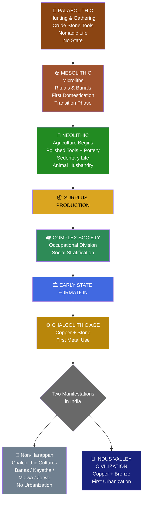
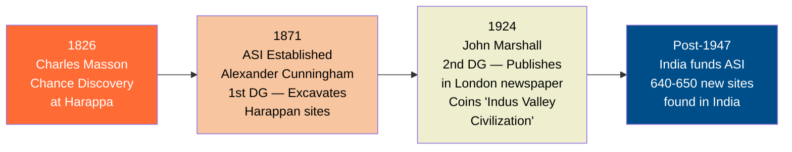
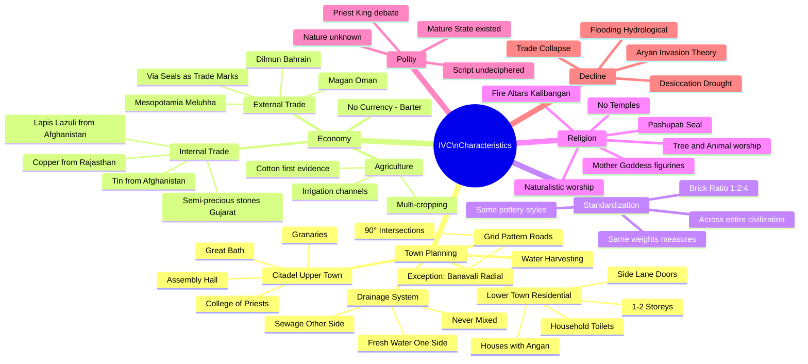
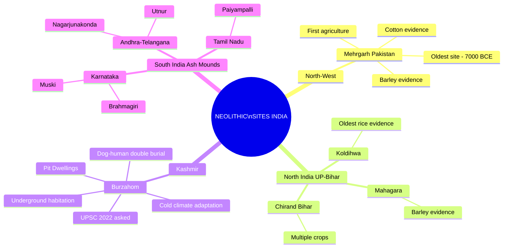

# 📚 UPSC TOPPER NOTES — ANCIENT INDIA
## Module 1: Prehistoric India → Indus Valley Civilization
> *Prepared from Lecture Transcript | Exam-Oriented | Prelims + Mains Ready*

---

# 🧠 PART 1: STORY-BASED CONCEPTUAL EXPLANATION

---

## 🌄 CHAPTER 1: THE BIG PICTURE — WHY THIS MATTERS

The teacher begins with a **roadmap**: Ancient India covers three major phases —
1. **Prehistoric Period** (Palaeolithic → Mesolithic → Neolithic)
2. **Chalcolithic Period** (non-Harappan cultures)
3. **Indus Valley Civilization (IVC)**

> *(UPSC insight: At least 1 question from IVC appears in almost every Prelims. It also feeds directly into Art & Culture Mains questions.)*

The key teaching method used here is a **Timeline Approach** — everything is seen as a **progressive evolution** of human society. Think of it as a river that starts as a small stream (Palaeolithic) and grows into a mighty river (IVC). Every stage adds new features to human life.

---

## 🪨 CHAPTER 2: STONE AGE — FROM PALAEOLITHIC TO NEOLITHIC

### The Common Thread
All three Stone Age periods — **Palaeolithic, Mesolithic, and Neolithic** — share one thing:
> **Tools made entirely of stone. No metal whatsoever.**

### The Progressive Story

**Palaeolithic ("Old Stone Age"):**
- Humans are purely **hunters and gatherers**
- Large, crude stone tools
- Nomadic life — no fixed settlement
- No domestication, no agriculture
- Simple societies — no social stratification

**Mesolithic ("Middle Stone Age"):**
- **Microliths** appear — tiny, pointed stone blades
- Still hunting and gathering, but tools become sharper and more refined
- Evidence of **rituals and burials** (first signs of belief systems)
- Transition phase — first hints of **domestication of animals** (e.g., dog buried with human at Burzahom)

**Neolithic ("New Stone Age") — The Big Leap:**
- The most transformative phase
- **Domestication of plants → Agriculture begins**
- **Domestication of animals → Animal husbandry**
- **Polished stone tools + Pottery** appear
- **Sedentary (settled) life** begins
- Surplus production → need for storage → redistribution
- Surplus → Complex society → **Early State Formation**

> *(This is the Golden Chain: Agriculture → Surplus → Settlement → Complex Society → Early State. UPSC loves this chain!)*

---

## 🏡 CHAPTER 3: NEOLITHIC SITES IN INDIA — THE IMPORTANT ONES

### Site 1: **Mehrgarh** (Baluchistan, now Pakistan)
- **Oldest Neolithic site** of the Indian subcontinent
- Dates back to **~7000 BCE** (often taken as 4000–5000 BCE for exam purposes)
- First evidence of **agriculture in the subcontinent**
- Evidence of **barley cultivation**
- Also yields early evidence of **cotton cultivation**

### Site 2: **Koldihwa & Mahagara** (Uttar Pradesh)
- Evidence of **rice** (Koldihwa — oldest rice evidence)
- Evidence of **barley** (Mahagara)

### Site 3: **Chirand** (Bihar)
- Evidence of **multiple crops**
- Known for its variety of plant domestication

### Site 4: **Burzahom** (Kashmir) ⭐ *UPSC Favourite — appeared in 2022!*
- Located in Kashmir → **cold climate** → unique adaptation
- People lived in **pit dwellings** (underground habitations dug into the earth)
- Why? To protect from cold and snow — *a brilliant example of environmental adaptation*
- Also found: **double burial** — a dog buried alongside a human
  > *(Keyword: "Pit Dwellings" = Burzahom. If exam says pit dwellings → answer is Kashmir/Burzahom)*

### South Indian Neolithic Sites — The Ash Mound Peculiarity ⭐
In South India, excavations reveal **Ash Mounds** — thick layers of ash formed from thousands of years of burning at the same spot (likely cattle dung burning).

> **Trick: Ash Mount = South India. Always.**

Key South Indian sites:
- **Karnataka**: Muski, Brahmagiri
- **Andhra Pradesh / Telangana**: Nagarjunakonda, Utnur
- **Tamil Nadu**: Paiyampalli

---

## ⚗️ CHAPTER 4: CHALCOLITHIC AGE — COPPER MEETS STONE

### What is Chalcolithic?
- **Chalco** = Copper | **Lithic** = Stone
- The age when **copper is first used**, alongside stone
- **Copper is the first metal ever used by humans** (after stone)
- Within Chalcolithic, **Bronze** appears — Bronze = Copper + Tin + Nickel

> *(Important: Chalcolithic is the BIGGER term. Bronze Age is INSIDE Chalcolithic. IVC is also inside Chalcolithic.)*

### Two Manifestations in India:

| Type | Description |
|------|-------------|
| **Non-Harappan Chalcolithic cultures** | Copper-using cultures OUTSIDE the IVC zone — localized, rural, no urbanization |
| **Indus Valley Civilization (Bronze Age)** | The grand, urbanized, standardized civilization — uses both copper AND bronze |

---

## 🏺 CHAPTER 5: NON-HARAPPAN CHALCOLITHIC CULTURES

These are **four small cultures** that existed simultaneously with IVC but are completely different. They have:
- Limited/no urbanization
- Their own localized pottery styles
- Copper usage (but NO bronze)
- No uniformity or standardization across sites

### The Four Cultures:

| Culture | Key Sites | Notable Feature |
|---------|-----------|-----------------|
| **Banas Culture** | **Ahar** (Rajasthan) | Maximum copper usage — near Khetri mines |
| **Kayatha Culture** | **Kayatha** | Distinctive painted pottery |
| **Malwa Culture** | **Navdatoli, Eran, Nagda** | Three important sites |
| **Jorwe Culture** | **Inamgaon, Sonegaon, Chandoli** | Least copper, most bone tools |

> *(Exam shortcut: Just know 4 non-Harappan cultures exist. Questions rarely go deeper. The real focus is IVC.)*

**Culture vs. Civilization — The Key Distinction:**
- **Culture** = A small group following the same traditions, ideas, patterns
- **Civilization** = A culture that has SCALED UP — large population, standardization, uniformity across a vast geography
- One culture expanding = Civilization. Example: 100 people follow something = culture; 10 million people follow it uniformly = civilization.

---

## 🌊 CHAPTER 6: INDUS VALLEY CIVILIZATION — THE CROWN JEWEL

### Discovery — How Did We Find It?

The story of IVC's rediscovery is fascinating:

**1826** — British engineer **Charles Masson** is laying railway tracks in Punjab. He accidentally stumbles upon mounds hiding ancient artifacts — **Chance Discovery** at **Harappa**.

**1871** — **Archaeological Survey of India (ASI)** is established. First Director General: **Alexander Cunningham**. He excavates Harappa and neighbouring sites (Mohenjo-daro, Ganeriwala, Chanhu-daro, Kalibangan) → coins the term **"Harappan Civilization"**.

**1924** — Second DG of ASI, **Sir John Marshall**, publishes findings in a London newspaper, announcing to the world the discovery of a civilization along the **Indus River** → coins the term **"Indus Valley Civilization"**.

> *(Why two names? Harappan = because Harappa was the first site found. Indus Valley = because sites follow the Indus River system.)*

### Timeline of IVC:
| Phase | Period |
|-------|--------|
| Early Phase | 3200–2600 BCE |
| **Mature Phase** (peak) | **2600–1900 BCE** |
| Late / Declining Phase | 1900–1300 BCE |

---

## 🗺️ CHAPTER 7: GEOGRAPHICAL EXTENT OF IVC

IVC spread from **modern-day Afghanistan to Haryana** — one of the largest Bronze Age civilizations in the world.

### Boundary Sites (Must Know for Prelims):

| Direction | Site | Location |
|-----------|------|----------|
| **Northernmost** | **Manda** | Jammu & Kashmir |
| **Westernmost** | **Sutkagendor** | Baluchistan (Pakistan-Iran border) |
| **Easternmost** | **Alamgirpur** | Uttar Pradesh |
| **Southernmost** | **Daimabad** | Maharashtra |

### Why Didn't IVC Expand into the Ganga-Yamuna Plain?
IVC people did NOT know **iron**. With only copper axes, they could NOT cut the dense, hard forests of the Gangetic plains.
> *(This is a beautiful UPSC-level reasoning — no iron = no deforestation = no eastward expansion)*

### Important IVC Sites and Their Specialities:

| Site | Famous For |
|------|-----------|
| **Mohenjo-daro** | Great Bath, Granary, Assembly Hall, College of Priests |
| **Harappa** | Granaries, horse bones found |
| **Chanhu-daro** | Seal making, shell making, weights |
| **Kalibangan** | Fire altars (havan kunds), both upper & lower town separately fortified |
| **Lothal** | **Dockyard** — oldest port of India |
| **Dholavira** | **UNESCO World Heritage Site** (2021); water management & harvesting |
| **Banavali** | Gold & jewellers' house; **Radial road pattern** (exception to grid) |
| **Surkotada** | **Horse bones found** (proves IVC knew horses) |

---

## 🏙️ CHAPTER 8: CHARACTERISTICS OF IVC — WHY IT'S CALLED "FIRST URBANIZATION"

### Feature 1A: Citadel and Lower Town (Division of Space)

Every IVC site has **two distinct zones**:

```
┌─────────────────────────────────┐
│     CITADEL (Upper Town)        │  ← Raised platform
│  Granaries | Great Bath         │
│  Assembly Hall | College of     │
│  Priests                        │
├─────────────────────────────────┤
│     LOWER TOWN (Residential)    │  ← Ground level
│  Houses | Lanes | Wells         │
└─────────────────────────────────┘
```

- **Citadel** = Public buildings used by everyone (granaries, great bath, administrative structures)
- **Lower Town** = Residential area (private spaces)
- This is **Segregation of Space** — public vs. private
- Modern parallel: New Delhi — Rashtrapati Bhavan on Raisina Hill (citadel) + MP quarters below (lower town)
- *(Note: We do NOT know if elites lived in the citadel. The script is undeciphered. Don't assume.)*

### Feature 1B: Grid Pattern Roads + Drainage ⭐

- Roads run **North-South and East-West** — cutting at **exact 90° angles**
- This is called **Grid Pattern**
- **Exception: Banavali** — uses **Radial Pattern** (concentric circles, like rings)

Every road had:
- **One side**: Fresh water supply
- **Other side**: Sewage/drainage line
- **Grey water (used water) was NEVER mixed with fresh water**

> *(This is extraordinary — even today many Indian cities mix sewage with fresh water!)*

This is **planned, simultaneous construction** of roads + drainage + water supply — something modern Indian municipalities still struggle with!

### Feature 1C: Houses — The Architecture of Privacy

Every IVC house had:
- **Central Courtyard (Angan)** — open space in the middle of the house. The 'angan' concept in Indian homes today traces back here!
- **Doors & windows NEVER opened towards the Main Street** — only towards side lanes (for privacy)
- Could be **1 or 2 storeys**
- Each household had **access to a toilet** (either attached or shared between 2–3 houses)
- **Wells** were present in many houses
- **Water harvesting systems** within homes

> *(UPSC irony: India declared ODF only recently. IVC had household toilets 4000 years ago.)*

### Feature 2: Standardization and Uniformity ⭐⭐

This is the defining feature that makes IVC a **civilization** (not just a culture):

**Brick Ratio**: Every brick at every IVC site — from Sutkagendor (western end) to Alamgirpur (eastern end) — has the **EXACT same ratio: 1 : 2 : 4**

Examples: 7 × 14 × 28 cm OR 10 × 20 × 40 cm — always 1:2:4.

- Both **burnt bricks** (kiln-fired, red) and **sun-dried bricks** (yellowish) were used
- This standardization across a civilization with NO modern communication technology is **mind-blowing**

> *(This proves a central authority or shared knowledge system existed — though we don't know its nature due to undeciphered script)*

This uniformity also means:
- Same pottery styles
- Same weights and measures
- Same urban planning principles

**→ This is why IVC = First Urbanization of India**

---

## 💰 CHAPTER 9: ECONOMY OF IVC

### Internal Trade
- IVC had a **well-developed internal trade network**
- Raw materials moved across the civilization:
  - **Copper** from Khetri mines, Rajasthan → spread across all sites
  - **Lead & Zinc** from Rajasthan
  - **Tin** from Afghanistan
  - **Lapis Lazuli** (precious blue stone) from Afghanistan
  - **Semi-precious stones** from Gujarat
- Transport: **Bullock carts** (evidenced by terracotta toy cart figurines with wheels)
- **No currency** — all trade was **barter-based** (exchange of goods for goods)

### External Trade (IVC and the World)
IVC traded with **contemporary civilizations**:

| Trading Partner | Region |
|----------------|--------|
| **Mesopotamia** | Iraq (Euphrates-Tigris civilization) |
| **Magan** | Oman |
| **Dilmun** | Bahrain/Qatar |
| **Iran** | Hisar Tepe, Susa sites |

**How do we know?** — Mesopotamian texts (written in **Cuneiform script**, which HAS been deciphered) refer to a land called **"Meluhha"** — identified as IVC. Meluhhan goods found in Mesopotamian sites = IVC exports.

Exports included: Lapis lazuli, carnelian, gold, silver, copper, ivory, tortoiseshell, birds, monkeys, dogs, cats.

**Role of Seals**: Seals (stamp-like objects) were used to **mark goods** during trade — like a brand label. IVC seals found in Mesopotamia and Oman are proof of trade.

### Agriculture
- **Crop Diversity** (multi-cropping): Wheat, barley, sesame, watermelon, peas, dates, rice, millets
- **Cotton** — first clear evidence of cotton cloth found in IVC
- Evidence of **ploughed fields** at Kalibangan, Banavali, Rakhigarhi, Banawali
- **Artificial irrigation** channels used
- Also: hunting, gathering, animal husbandry

### Social Structure
- **Occupational division** of society (not money-based, since no currency)
- Craftsmen, agriculturists, traders, hunters — different occupational groups
- **No evidence of taxation** throughout this period

---

## ✍️ CHAPTER 10: THE WRITING SYSTEM — THE BIGGEST MYSTERY

IVC had a **writing system** — but **we cannot read it.**

### What We Know:
- **400–450 symbols/signs** (pictographs — pictures that represent meaning)
- Script appears on **seals, pottery, tablets**
- Written **right to left** (some scholars say boustrophedon — alternate directions)
- It is a **Pictographic script** — symbols look like fish, arrows, human figures, geometric shapes

### Why Can't We Read It?
We need a **Rosetta Stone** — a bilingual inscription where one language is known and helps decode the unknown one.
- Egyptian hieroglyphics were decoded using the Rosetta Stone (Greek + Egyptian)
- Mesopotamian cuneiform was decoded using trilingual inscriptions
- IVC script: **No bilingual inscription has been found** → cannot be decoded yet

> *(Even AI/machine learning attempts at IIT Delhi have not succeeded as of 2023)*

### Consequence:
Because the script is undeciphered:
- We know NOTHING definitive about IVC polity, religion, rulers, or social structure
- Everything is archaeological inference

---

## 🙏 CHAPTER 11: RELIGION OF IVC

IVC religion is called **Naturalistic Religion** — they worshipped **nature** as divine (sun, moon, trees, water, fire, animals).

### Evidence:

1. **Mother Goddess figurines** (female terracotta figurines) — found abundantly → suggest **fertility worship**
   - Mother Goddess = personification of earth and fertility

2. **Pashupati Seal** — shows a figure seated in yogic posture, surrounded by animals (elephant, tiger, buffalo, rhinoceros)
   - British called it "Proto-Shiva" or "Pashupati" (Pashu = animal, Pati = lord/master)
   - More accurately represents **animal husbandry** importance
   - **CAUTION**: This is a British interpretation. We cannot confirm this is "Shiva" — the script is undeciphered.

3. **Fire Altars at Kalibangan** — suggest fire worship (linked to later Vedic traditions perhaps)

4. **Tree worship** — Pipal tree motifs found on seals

5. **Animal worship** — Bull, unicorn, elephant frequently depicted

6. **No Temples found anywhere** in IVC

> *(Key exam point: IVC religion = naturalistic, no temples, male & female deity worship, fire worship, animal worship)*

---

## 👑 CHAPTER 12: POLITY — WHAT WE DON'T KNOW

This is the **Grey Zone** of IVC.

### What We Can Infer:
Given the **extraordinary standardization and uniformity** across thousands of kilometers, there MUST have been some form of **mature, organized state** or **administrative system**.

### What We Cannot Confirm:
- **Who ruled?** Some say priest-rulers, some say merchant oligarchy — nobody knows
- **Nature of governance?** Completely unknown
- No palace structures identified with certainty
- **Priest-King statue** (found at Mohenjo-daro) — called so by British, but is it a priest? A king? A merchant? A dancer? We don't know.

> *(UPSC cannot ask a definitive question here — no conclusive evidence exists. Any answer with "priest rule" or "merchant rule" is equally valid or invalid.)*

---

## 📉 CHAPTER 13: DECLINE OF IVC — FOUR THEORIES

The mature IVC ends around **1900–1700 BCE**. Why?

### Theory 1: **Aryan Invasion Theory** — JOHN MARSHALL (Least Plausible)
- Marshall claimed **Aryans invaded from outside**, killed Harappans, and took over
- Based on: 26 skeletons at Mohenjo-daro with arrow wounds
- **Problems**:
  - Only ONE site, ONE burial — too thin evidence
  - No weapons of mass warfare found across IVC sites
  - No evidence of large-scale destruction by outsiders
- **Real Agenda**: Marshall was using this to **justify British rule in India** — "You were always ruled by outsiders, we are just the latest Aryans"
- *(This is now largely rejected by historians. **Aryan Migration** — not invasion — is accepted instead, which will be discussed in the next class.)*

### Theory 2: **Flooding (Hydrological Changes)**
- Rivers meandered (changed course over time)
- Sites near rivers were flooded while others dried up
- Caused displacement and collapse of settlements

### Theory 3: **Desiccation (Environmental Change / Drought)**
- The region (especially Rajasthan) was once much greener with more forest and water
- Over time, **climate became drier** → desertification
- The legendary **Saraswati River** — mentioned in Vedas — is believed to have dried up around this time
- Recent satellite imagery shows a **palaeochannel** (dried river bed) in Rajasthan = Saraswati?

### Theory 4: **Trade Collapse**
- Mesopotamia (IVC's main trading partner) also declined around the same period
- Trade disruption → economic collapse → population dispersal

> *(UPSC STRATEGY: ALL of these are valid. If the question says "Harappan civilization declined due to flooding" → CORRECT. Due to Aryan invasion → CORRECT (as a theory). Do NOT mark any of these as wrong unless the question says "ONLY due to X" — then that's wrong because it was multi-causal.)*

---

---

# 🔄 PART 2: FLOWCHART / MINDMAP (MERMAID CODE)

## Flowchart 1: Human Progression — Stone Age to IVC



## Flowchart 2: IVC Discovery Timeline



## Mindmap: IVC Characteristics



## Mindmap: Neolithic Sites



---

---

# ⚡ PART 3: QUICK REVISION NOTES

---

## 📌 PREHISTORIC INDIA — AT A GLANCE

| Feature | Palaeolithic | Mesolithic | Neolithic |
|---------|-------------|------------|-----------|
| Tools | Crude stone | Microliths | Polished stone + pottery |
| Economy | Hunting & Gathering | H&G + early domestication | Agriculture + Animal husbandry |
| Settlement | Nomadic | Semi-nomadic | Sedentary |
| Society | Simple | Simple | Complex / Early State |
| Currency | None | None | None |
| Metal | None | None | None |
| Religion | — | Rituals & Burials | Rituals & Burials |

---

## 📌 KEY NEOLITHIC SITES — MEMORY AID

| Site | State | Remember For |
|------|-------|-------------|
| **Mehrgarh** | Baluchistan (Pakistan) | OLDEST; First agriculture |
| **Koldihwa** | UP | Oldest RICE |
| **Chirand** | Bihar | Multiple crops |
| **Burzahom** | Kashmir | PIT DWELLINGS; Dog burial |
| **Brahmagiri, Muski** | Karnataka | ASH MOUNDS |
| **Utnur** | Telangana | Ash Mounds |
| **Paiyampalli** | Tamil Nadu | Ash Mounds |

> 🔑 **Trick**: **ASH MOUND = SOUTH INDIA. PIT DWELLING = BURZAHOM (Kashmir)**

---

## 📌 CHALCOLITHIC — KEY FACTS

- Chalco = Copper | Lithic = Stone
- **First metal ever used** = Copper
- **Bronze = Copper + Tin + Nickel** (alloy)
- **Chalcolithic > Bronze Age > IVC** (IVC is within Chalcolithic)
- Non-Harappan cultures = **NO bronze**, only copper
- **Khetri Mines** (Rajasthan) = source of copper

### Four Non-Harappan Cultures:
1. **Banas** → Ahar (most copper)
2. **Kayatha** → Kayatha (painted pottery)
3. **Malwa** → Navdatoli, Eran, Nagda
4. **Jorwe** → Inamgaon, Sonegaon, Chandoli (least copper, most bone)

---

## 📌 IVC — DISCOVERY CHAIN

```
Charles Masson (1826) → Chance discovery at Harappa
→ ASI formed (1871) → Alexander Cunningham (1st DG) → "Harappan Civilization"
→ John Marshall (2nd DG) → Published 1924 → "Indus Valley Civilization"
```

---

## 📌 IVC BOUNDARY SITES (North-South-East-West)

| Direction | Site | Location |
|-----------|------|----------|
| North | **Manda** | J&K |
| West | **Sutkagendor** | Baluchistan |
| East | **Alamgirpur** | UP |
| South | **Daimabad** | Maharashtra |

---

## 📌 IVC — IMPORTANT SITES & SPECIALITIES

| Site | Speciality |
|------|-----------|
| Mohenjo-daro | Great Bath, Granary, Assembly Hall, College of Priests |
| Harappa | Granaries |
| Lothal | **DOCKYARD** — oldest port |
| **Dholavira** | **UNESCO World Heritage** (only IVC site) — Water management |
| Kalibangan | **Fire Altars**; Both towns separately fortified |
| Chanhu-daro | Seal & shell making; weights |
| **Banavali** | **Radial road pattern** (EXCEPTION); Gold & Jewellers house |
| Surkotada | **Horse bones** found |

---

## 📌 IVC CHARACTERISTICS — QUICK BULLETS

### Town Planning:
- ✅ Citadel (upper) + Lower Town = **Segregation of Space**
- ✅ **Grid pattern roads** at 90° (Exception: Banavali = Radial)
- ✅ Fresh water + Sewage lines on BOTH sides of every road — **never mixed**
- ✅ Houses: Central courtyard (Angan), doors to side lanes NOT main street
- ✅ Household toilets and water harvesting
- ✅ 1–2 storey buildings

### Standardization:
- ✅ Brick ratio = **1 : 2 : 4** everywhere — from western to eastern boundary
- ✅ Both burnt bricks (red) and sun-dried bricks (yellowish) used
- ✅ Same weights & measures across civilization

### Why "First Urbanization"?
→ Grid roads + drainage + sanitation + standardization + internal/external trade + multi-storey buildings = **Urban Planning**

---

## 📌 IVC ECONOMY — QUICK BULLETS

- **NO currency** — pure **barter system**
- **Internal trade**: Copper from Rajasthan, Lapis Lazuli from Afghanistan, tin from Afghanistan, semi-precious stones from Gujarat
- **External trade**: Mesopotamia (called IVC = **Meluhha**), Oman (Magan), Bahrain (Dilmun)
- **Seals** = Trade markers/stamps to identify goods
- **Transport**: Bullock carts (proven by terracotta toy figurines)
- **Multi-cropping**: Wheat, barley, rice, sesame, cotton, peas, dates, millets
- **FIRST COTTON CLOTH** evidence = IVC
- **Social structure**: Occupational division (no money-based classes)
- **NO TAXATION** evidence throughout

---

## 📌 IVC RELIGION — QUICK BULLETS

- **Naturalistic religion** — worship of nature
- **Mother Goddess** figurines (terracotta) = fertility worship
- **Pashupati Seal** = yogic figure + animals (British called it Proto-Shiva — CAUTION: contested)
- **Fire Altars** at Kalibangan
- **Tree worship** (Pipal tree motifs)
- **Animal worship** (bull, unicorn, elephant)
- ❌ **NO TEMPLES found** anywhere in IVC
- 🔑 Pashupati = Pashu (animal) + Pati (lord) = Lord of Animals = Animal Husbandry god

---

## 📌 IVC SCRIPT — KEY POINTS

- **400–450 symbols/signs** (Pictographic script)
- Script on **seals, pottery, tablets**
- **NOT YET DECIPHERED** — reason: no bilingual inscription (no Rosetta Stone)
- Until deciphered: polity, religion, social structure all remain **speculative**
- IIT Delhi AI/ML decipherment attempt — ongoing (as of 2023)

---

## 📌 IVC POLITY — UPSC STRATEGY

- **Mature state existed** — confirmed by standardization level
- **Nature of rule**: UNKNOWN — priest-rule? merchant-rule? No answer.
- **Priest-King statue** (Mohenjo-daro) = British label, NOT confirmed
- ❌ **No prelims question can be definitively asked here** — no evidence

---

## 📌 IVC DECLINE — FOUR THEORIES

| Theory | Proponent | Verdict |
|--------|-----------|---------|
| Aryan Invasion | **John Marshall** | Most REJECTED — political agenda |
| Flooding / Hydrological | Multiple scholars | Plausible |
| Desiccation / Drought | Multiple scholars | Plausible (Saraswati drying up) |
| Trade Collapse | Multiple scholars | Plausible |

> 🔑 **UPSC Strategy**: All theories are partially correct. Never say "IVC declined ONLY because of X" — multi-causal. Any single factor answer = partial correct.

---

## 📌 MASTER TIMELINE (For Consolidation)

```
PALAEOLITHIC → MESOLITHIC → NEOLITHIC → CHALCOLITHIC → IVC
    │              │              │              │           │
No metal      Microliths    Agriculture    Copper+Stone  Copper+Bronze
Nomadic       Rituals       Sedentary      4 cultures    1st Urbanization
Hunting       Burials       Pottery        Rural         Trade Networks
Simple Soc    Transition    Complex Soc    No Bronze     Standardization
No State      Early Dom.    Early State    No Uniform.   Mature State(?)
No Currency   No Currency   No Currency    No Currency   No Currency(Barter)
```

---

## 📌 IMPORTANT UPSC KEYWORDS

| Topic | Keywords |
|-------|---------|
| Neolithic | Pit Dwellings, Ash Mounds, Microliths, Polished Tools |
| IVC Discovery | Charles Masson, Alexander Cunningham, John Marshall, ASI, 1826, 1924 |
| Town Planning | Citadel, Grid Pattern, Segregation of Space, First Urbanization |
| Roads | 90° grid, Radial (Banavali), Fresh water, Sewage separation |
| Houses | Central Courtyard (Angan), Side Lane doors, Household Toilets |
| Bricks | Ratio 1:2:4, Burnt bricks, Sun-dried bricks |
| Economy | Barter, No Currency, Internal Trade, External Trade, Meluhha, Seals, Terracotta |
| Religion | Naturalistic, Mother Goddess, Pashupati Seal, Fire Altars, No Temples |
| Decline | Aryan Invasion (rejected), Flooding, Desiccation, Saraswati, Trade Collapse |
| Script | Pictographic, 400-450 symbols, Undeciphered, No Rosetta Stone |

---

## 📌 PREVIOUS YEAR QUESTIONS (PYQ) RELEVANCE

| Topic | PYQ Year | What Was Asked |
|-------|---------|----------------|
| Burzahom | **2022** | Pit Dwellings feature |
| IVC Sites | Multiple years | Northernmost / Southernmost / Easternmost site |
| Great Bath | Multiple | Located at Mohenjo-daro |
| Dholavira | 2021+ | UNESCO World Heritage — water management |
| IVC Decline | Multiple | Theory-based statement questions |
| Chalcolithic | Multiple | Copper = first metal, IVC within Chalcolithic |

---

> 📝 **Note from Teacher**: *"This is prelims-oriented ancient India. You don't write answers — you recognize correct and incorrect statements. Understanding the PROGRESSION is more important than memorizing individual facts. If you understand why things happened, you can answer ANY question."*

---

*Notes compiled from lecture on: Prehistoric India, Chalcolithic Age & Indus Valley Civilization*
*Next Class: Aryan Migration Theory + Vedic Period*
