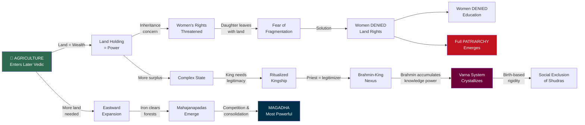

# 🏺 VEDIC AGE — UPSC TOPPER NOTES
### *From Aryans to Mahajanapadas | Rank-Holder Edition*

---

> **📌 UPSC Relevance:** GS Paper I (Ancient History) | PYQ 2023: *"What are the main features of Vedic society and religion? Do you think some of the features are still prevailing in Indian Society?"*

---

## 🧠 PART 1: STORY-BASED CONCEPTUAL EXPLANATION

---

### 📍 SETTING THE STAGE: Where Are We in History?

Before diving in, here's the **timeline context** — the foundation of everything:

| Period | Time | Significance |
|--------|------|--------------|
| Palaeolithic → Mesolithic → Neolithic | 2 million BC → 10,000 BC | Prehistory |
| Indus Valley Civilization (IVC) | 2600–1700 BC | Proto-history |
| **Vedic Age begins** | **1500 BC** | **Historical period starts** |

> **⚠️ Critical Gap:** Between 1700 BC (IVC decline) and 1500 BC (Vedic Age), there is a **200-year dark period** — NO sources, no records, complete silence.

*(This gap is UPSC-important because it helps explain why IVC and the Vedic period have NO real connection)*

---

### 🌍 WHO ARE THE ARYANS? — The Most Misunderstood Concept

**Step 1: Understand Race vs. Ethnicity**

Before understanding Aryans, you MUST know this distinction:

| Term | Definition | Example |
|------|------------|---------|
| **Race** | Physical/biological differentiation | Indian, African, Chinese look different |
| **Ethnicity** | Cultural differentiation — traditions, language, customs | French, German, Portuguese look same but are culturally different |

> **Key Insight:** Same race → multiple ethnicities (India's Gujarat, Rajasthan, Bengal — same race, different culture). Multiple races → same ethnicity (Indians, Americans, Africans all speaking English).

---

**Step 2: The Language Connection — The Real Proof**

Now observe this stunning pattern:

| Concept | Sanskrit | English | Greek | Latin | Armenian |
|---------|----------|---------|-------|-------|----------|
| Mother | Mātā | Mother | Mēter | Mater | Mayr |
| Father | Pitā | Father | Patēr | Pater | Hayr |
| Brother | Bhrātā | Brother | Phrāter | Frater | Eghbayr |
| Same | Sama | Same | — | — | — |
| Navy | Nau | Navy | Naus | Navis | — |

> **This cannot be a coincidence.** Languages from Europe to India — Greek, Latin, Sanskrit, Armenian, Germanic, Russian, Ukrainian — all share **similar-sounding words** because they come from **ONE parent language**.

That parent language is called → **Proto-Indo-European (PIE) Language**

---

**Step 3: So Who Exactly Are the Aryans?**

> **DEFINITION (UPSC-ready):** Aryans were a **linguistic group** (NOT a racial group) — a collection of people from **multiple racial backgrounds** who spoke the **same Proto-Indo-European language** and migrated from **Central Asia (near the Caspian Sea)** towards Europe and Asia, creating regional language variations wherever they went.

**The Formula:**
```
Indo-European Language + Indigenous Regional Dialects = Regional Languages
(X) + (M, N, O, P) = (XM, XN, XO, XP)
Sanskrit = Indo-European Language + Indigenous North Indian Dialects
```

> **Hitler's Distortion:** Adolf Hitler incorrectly called Aryans a *racial* group — a dangerous and historically wrong claim. *(For UPSC: Always state Aryans = linguistic group, NOT racial group)*

---

**Step 4: Inward vs. Outward Migration Debate**

| Theory | Claim | Evidence |
|--------|-------|----------|
| **Inward Migration** ✅ (Mainstream) | Aryans came FROM Central Asia INTO India | Genetic analysis shows common Caspian Sea gene across all Indo-European language groups — NOT an Indian-origin gene |
| **Outward Migration** | Aryans went FROM India OUTWARD | Sanskrit is the mother of all Indo-European languages |

> **For Examination:** Write "inward migration" — supported by genetic studies. *(The outward theory, while debated, lacks genetic consensus)*

**Key Conclusions:**
- Aryans brought **Sanskrit** (language) and **Brahmi** (script) into India
- They authored the **Vedas** — the first decipherable texts of India
- Aryan migration was NOT an invasion — it was a **gradual trickling** into the subcontinent
- IVC had its own undeciphered language/script — **NO real connection** with the Vedic people

---

### 📚 THE VEDIC TEXTS — Framework

```
Rigveda (1500–1000 BCE)     ← Early Vedic Period
    ↓
Samaveda, Yajurveda, Atharvaveda (1000–600 BCE) ← Later Vedic Period
```

> **Brahmi** = Script | **Sanskrit** = Language | **Shruti tradition** = Orally transmitted before being written

---

## 🔴 EARLY VEDIC PERIOD (1500–1000 BCE)

### 💰 Economy

The Aryans were **pastoralists** — people who rear animals and move in search of grazing land. This single fact shapes their ENTIRE economic and political structure.

| Feature | Detail |
|---------|--------|
| **Main Activity** | Pastoralism (animal rearing) with limited agriculture |
| **Unit of Wealth** | **Cattle** — the word *'go'* appears multiple times in Rigveda |
| **Currency** | None — only **Barter system** |
| **Trade** | Absent — neither internal nor external |
| **Comparison with IVC** | ⬇️ **Regression** — IVC had trade networks; absence of trade here confirms NO connection between IVC and Vedic people |
| **Occupations** | Craftsmen, animal rearers, potters — all present but occupational mobility existed |

> **Exam Tip:** The absence of trade in the Early Vedic period, compared to IVC, is the key argument for the **discontinuity theory** between IVC and the Vedic civilization.

---

### 🏛️ Polity (Political System)

Since there's no mature agriculture → no mature state. The political system is **Tribal**.

**The Rajan (Chief):**

| Feature | Early Vedic Rajan |
|---------|-------------------|
| Nature | **Non-hereditary, Non-permanent** |
| Selection | Chosen by people based on **experience and knowledge** |
| Role | **Protector of people and cattle** (NOT land — they were still semi-nomadic) |
| Concept | **First Among Equals** *(like India's Prime Minister among Cabinet)* |
| Taxation | **None** — only *Bali* (voluntary offering from grateful people) |
| Wars | **Cattle raids** — fought to acquire cattle |

---

**The Three Democratic Institutions** *(Early Democratic Institutions of India)*

| Body | Nature | Composition | Function | Women's Access |
|------|--------|-------------|----------|----------------|
| **Sabha** | Exclusive, smaller | Only tribal elders | Administrative deliberation | ✅ Allowed |
| **Samiti** | Inclusive, larger | ALL adult tribal members | Administrative deliberation | ✅ Allowed |
| **Vidhata** | Cultural body | All members | Religious and cultural ceremonies | ✅ Allowed |

> **Modern Equivalents:** Sabha ≈ Panchayat (elders) | Samiti ≈ Gram Sabha (all adults on electoral roll)

---

**Four-Level Administrative Structure:**

```
Jana (Tribe) → Rajan
    ↓
Vis (Sub-group) → Vishpati
    ↓
Grama (Village) → Gramani
    ↓
Kula (Family) → Kulapati
```
*Think: CM → DM → Village Head → Household Head*

**Key Officers under Rajan:**

| Officer | Role |
|---------|------|
| **Purohita** | Priest — religious matters |
| **Senapati** | Military commander |
| **Vrajapati** | Overseer of pastures/grazing lands |
| **Ugra** | Police-type law and order |
| **Spasha** | Spy on other tribes (intelligence) |
| **Duta** | Messenger between tribes |

---

### 👥 Society & Religion

**Society:**

| Feature | Detail |
|---------|--------|
| Structure | **Egalitarian** — economically equal, only occupational differences |
| Division | Occupational — but people could CHANGE their occupation (social mobility existed) |
| Family | Patriarchal and Patrilineal — but NOT fully formed yet |
| Women's Status | ≤ Men, but access to education and economic resources (cattle) existed |
| Notable Women Saints | **Lopamudra, Apala, Gargi** — women scholars of the Rigvedic age |
| Marriage | Monogamy, polygamy, and polyandry — all referenced |
| Slaves | **Dasa & Dasi** — debt bondage (NOT chattel slavery like Europe). If you couldn't barter, you served — could be freed |

**Religion:**
- **Naturalistic** — based on nature gods
- **Main gods:** Indra (Rain/Thunder — most mentioned), Varuna (Water), Vayu (Air), Agni (Fire)
- Religion was **developing but not institutionalized**
- No temples, no material remains found
- *(Cross-cultural note: Indra = Thor in Norse mythology = Zeus in Greek — same Indo-European root!)*

---

## 🔵 LATER VEDIC PERIOD (1000–600 BCE)

### 💰 Economy

**THE GREAT CHANGE:** Agriculture becomes the PRIMARY economic activity.

> *"Agriculture is poison"* — the teacher's metaphor. Once land becomes the unit of wealth, everything in society transforms — and not for the better.

| Feature | Detail |
|---------|--------|
| **Main Activity** | Agriculture (iron tools now used extensively) |
| **Unit of Wealth** | **Land** (not cattle) |
| **Currency** | Still absent — Barter continues |
| **Trade** | Still absent (no internal or external trade) |
| **Iron** | Now used EXTENSIVELY in agriculture — enables forest clearing → Eastward expansion |

---

### 🏛️ Polity — The Transformation

This is where democracy begins to **die** and monarchy begins to **emerge**.

**The Later Vedic Rajan:**

| Feature | Later Vedic |
|---------|-------------|
| Nature | **Hereditary, Permanent** — his son automatically becomes king |
| Justification | **Ritualized Kingship** — divine sanction through priests |
| Role | **Protector of Territory** (not people/cattle) |
| Taxation | **Baga** (land tax = 1/6th to 1/10th of produce) + **Bali** (now MANDATORY) |
| Wars | **For territory** — not cattle |

**Ritualized Kingship — The 3 Great Rituals:**

| Ritual | Purpose |
|--------|---------|
| **Ashvamedha** (Horse Sacrifice) | Territory marked by where the horse roams — divine legitimacy |
| **Rajasuya** | Coronation ceremony — priest confirms divine approval of succession |
| **Vajapeya** | Chariot racing — winner dines with king; symbolic of royal supremacy |

> **The Nexus:** King needs priest to justify his power → Priest gets wealth/protection from king. This **Brahmin-Kshatriya nexus** is born here and shapes Indian history for millennia.

**Fate of Democratic Institutions:**

| Institution | Fate in Later Vedic |
|-------------|---------------------|
| Sabha | Now **nominated by the king** — no longer independent |
| Samiti | **Diluted, then disbanded** |
| Vidhata | **Completely disappeared** |

**New Administrative Terms:**

| Term | Role |
|------|------|
| **Bhaga** | Land tax |
| **Sangrihitri** | Tax collection officer |
| **Baduga** | Treasury officer (like RBI — collects all taxes) |
| **Suta/Magadha** | Court historian — writes the ruler's history |
| **Akshavapa** | Accountant — counts incoming grain |
| **Sthapati** | Justice and governance official |

---

### 👥 Society & Religion — The Darkest Chapter

#### The Four-Fold Varna System Emerges

> **This is the Genesis of India's deepest social evils.**

The first organized religion of India — **Vedic Brahmanism** — emerges in the Later Vedic period. It is:
- Based on **rituals and sacrifices**
- **NOT** the same as Hinduism (Hinduism = Vedic Brahmanism + Bhakti movement + Puranic practices of Gupta period)

**The Varna Hierarchy:**

```
BRAHMIN    → Knowledge (control of Vedas, education)
    ↓
KSHATRIYA  → Power (warriors, kings)
    ↓
VAISHYA    → Commerce and economy
    ↓
SHUDRA     → Service — socially excluded, discriminated
```

| Feature | Varna System |
|---------|-------------|
| Origin | **Initially occupational** → Later became **birth-based** (rigid) |
| Mobility | **NONE** — closed, compartmentalized system |
| Problem | Shudras cannot perform rituals, wear sacred thread, access Vedas |
| Modern Relevance | *(UPSC 2023)* — caste-based discrimination, untouchability, social hierarchy all have roots here |

> **Important:** Do NOT use the word "caste" yet — caste (Jati) comes in the **post-Mauryan period**. Right now, it is Varna — based on occupation, then crystallized by birth.

---

#### Women — The Greatest Losers

**Why agriculture destroyed women's status — the logical chain:**

```
Agriculture → Land becomes wealth
    ↓
Land is inherited within family
    ↓
Daughter gets married → moves to husband's family
    ↓
She takes land with her → LAND FRAGMENTATION
    ↓
To prevent fragmentation → Women denied land rights
    ↓
No land → No economic power
    ↓
No economic power → Education denied (she'll ask questions)
    ↓
RESULT: Full patriarchy emerges
```

| Feature | Early Vedic Women | Later Vedic Women |
|---------|------------------|-------------------|
| Education | ✅ Access | ❌ Denied |
| Economic Resources | ✅ Cattle | ❌ Denied (no land rights) |
| Democratic Bodies | ✅ All three | ❌ Excluded |
| Status | ≤ men | <<< men |
| Role | Scholar, equal participant | Mother and wife only |

> **UPSC Insight:** This pattern is universal — in ALL agrarian societies globally (China, Japan, Southeast Asia), women face the most oppression. In tribal/hunter-gatherer societies, women hold more power. Agriculture is the variable. *(Excellent Mains content)*

---

### 🔑 EARLY vs. LATER VEDIC — MASTER COMPARISON TABLE

| Parameter | Early Vedic (1500–1000 BCE) | Later Vedic (1000–600 BCE) |
|-----------|----------------------------|---------------------------|
| **Economy** | Pastoralism + limited agriculture | Agriculture = main activity |
| **Iron** | Known but NOT used extensively | Used EXTENSIVELY |
| **Wealth** | Cattle | Land |
| **Currency** | Absent (Barter) | Absent (Barter) |
| **Trade** | Absent | Absent |
| **Taxation** | None (only voluntary Bali) | Bhaga (land tax) + mandatory Bali |
| **Polity** | Tribal polity | Territorial Monarchy |
| **Rajan** | Non-hereditary, non-permanent | Hereditary, permanent |
| **Rajan's role** | Protector of people & cattle | Protector of territory & Brahmin |
| **Wars** | For cattle | For territory |
| **Democratic bodies** | Sabha, Samiti, Vidhata — strong | Disbanded/diluted |
| **King-Priest relation** | No Nexus | Strong Brahmin-King Nexus |
| **Society** | Egalitarian, occupational differences | Varna-based, rigid, discriminatory |
| **Religion** | Nature gods, naturalistic | Vedic Brahmanism — ritual/sacrifice centric |
| **Women** | Access to education & resources | Denied education & resources |
| **Patriarchy** | Emerging | Fully formed |
| **Varna** | Absent | Four-fold Varna emerges |

---

## 🏙️ MAHAJANAPADAS & THE 6TH CENTURY BCE

### The Eastward Expansion — How It Happened

```
Iron implements (axes, ploughs)
    ↓
Forests of the Northern Plains CLEARED
    ↓
Entry into the Doab (Ganga-Yamuna region)
    ↓
More fertile land → More agriculture → More surplus
    ↓
Rise of complex society and states
    ↓
22 Janapadas emerge → Consolidate into 16 Mahajanapadas
```

> **Doab** = *Do* (two) + *Ab* (water) = land between two rivers = Ganga-Yamuna plains

---

### 16 Mahajanapadas — Smart Revision Strategy

**Total:** 16 Mahajanapadas | **11 Monarchies** + **5 Ganas/Oligarchies**

**The 5 Ganas (Oligarchies/Republics) — KOOPA CMA Trick:**
- **Ko**sala — wait, use:
- **Kuru, Panchal, Kamboj, Vajji, Malla** → *"Koopa CMA"* or *"KP K V M"* — learn full names for safety

| Mahajanapada | Capital | Type | Key Fact |
|-------------|---------|------|----------|
| **Magadha** | Rajagriha → Pataliputra | Monarchy | **Most powerful** |
| **Anga** | Champa | Monarchy | Captured by Bimbisara; easternmost |
| **Kashi** | Varanasi | Monarchy | Earlier powerful; conquered by Koshala |
| **Vajji** | Vaishali | **Republic** | Confederacy of 8 clans; Lichchhavis most powerful |
| **Mallas** | Kushinara & Pava | **Republic** | Northeast UP |
| **Kamboj** | — | Republic | Northwesternmost |
| **Gandhara** | — | Monarchy | Northwestern sector |
| **Matsya** | Viratnagar | Tribal Polity | Rajasthan; absorbed into Magadha |
| **Asmaka** | — | Monarchy | Southernmost |
| **Avanti** | — | Monarchy | Westernmost |

**Remember extremities for Prelims:**
- **Northwest** → Kamboj, Gandhara
- **East** → Anga (sometimes Vanga)
- **South** → Asmaka, Avanti
- **West** → Surasena, Matsya

---

### 🌟 WHY WAS MAGADHA THE MOST POWERFUL?

**Four Geographic Advantages:**

| Advantage | Detail |
|-----------|--------|
| **1. Plateau Location** | Higher ground → military advantage — could see enemies approaching from all directions |
| **2. Three Rivers** | Ganga, Son, Champa surrounded it on three sides → natural defence; entry only from one side |
| **3. Iron Mines** | Located near today's Jharkhand — best quality iron → best weapons, tools, and armies |
| **4. Fertile Land** | Excellent agricultural base → surplus → strong economy |

---

### Three Dynasties of Magadha

```
Haryanka Dynasty → Shishunaga Dynasty → Nanda Dynasty
(H)                (Shi)                 (N)
```

**Five Key Rulers to Remember:**

| Ruler | Dynasty | Key Fact |
|-------|---------|----------|
| **Bimbisara** | Haryanka | First great ruler; conquered Anga |
| **Ajatashatru** | Haryanka | Expanded Magadha greatly |
| **Udayin** | Haryanka | Shifted capital from Rajagriha to **Pataliputra** (modern Patna) |
| **Kalashoka** | Shishunaga | Presided over **Second Buddhist Council** |
| **Dhanananda** | Nanda | Last Nanda king; insulted Chanakya; defeated by Chandragupta Maurya |

> *(Bindusara = father of Ashoka, comes AFTER all this in the Maurya Dynasty — don't confuse)*

---

### 6th Century BCE — Three Defining Features

| Feature | Detail |
|---------|--------|
| **Mahajanapadas** | 16 major political structures |
| **Revival of Trade** | Internal and external trade revived after centuries (last seen in IVC!) |
| **First Currency** | **Punch-marked coins** — India's first currency |

**Urban Centers Emerge:**

```
Rajdhani (Capital)
    ↓
Mahanagara (Large city)
    ↓
Nagara (Town with fortress)
    ↓
Nigama (Commercial town)
    ↓
Pura (Small town)
```

**First Mahanagars of India:** Champa, Rajagriha, Shravasti, Saketa, Ayodhya, Kaushambi, Varanasi

**Two Trade Routes (still followed by Indian Railways!):**

| Route | Direction | Path |
|-------|-----------|------|
| **Uttarapatha** | East–West (North India) | Follows Shivalik foothills |
| **Dakshinapatha** | North–South | Connects Pataliputra/Kaushambi to southern ports |

---

---

## 🔄 PART 2: FLOWCHARTS & MINDMAPS

```mermaid
flowchart TD
    A["🏛️ VEDIC AGE — COMPLETE OVERVIEW"] --> B["ARYANS"]
    A --> C["EARLY VEDIC PERIOD\n1500–1000 BCE"]
    A --> D["LATER VEDIC PERIOD\n1000–600 BCE"]
    A --> E["MAHAJANAPADAS\n6th Century BCE"]

    B --> B1["Linguistic Group\nNOT racial group"]
    B --> B2["Spoke Proto-Indo-European\nLanguage"]
    B --> B3["Migrated from Central Asia\nnear Caspian Sea"]
    B --> B4["Brought Sanskrit + Brahmi\ninto India"]
    B --> B5["Authored the Vedas\n1st decipherable texts"]
    B3 --> B6{"Inward vs Outward\nMigration Debate"}
    B6 --> B7["✅ Inward — Mainstream\nGenetic evidence: Caspian gene"]
    B6 --> B8["Outward — Sanskrit is\nmother of all PIE languages"]

    C --> C1["ECONOMY\nPastoralism + limited agriculture\nCattle = wealth | Barter | No trade"]
    C --> C2["POLITY\nTribal — Rajan as Chief\nNon-hereditary | Non-permanent\nProtects people & cattle\nBali = voluntary offering"]
    C --> C3["DEMOCRATIC BODIES\nSabha + Samiti + Vidhata\nWomen allowed in all three"]
    C --> C4["SOCIETY\nEgalitarian + occupational mobility\nNaturalistic religion\nWomen have education + resources\nPatriarchy emerging"]

    D --> D1["ECONOMY\nAgriculture = main activity\nLand = wealth | Iron used\nBhaga tax emerges\nBali = mandatory"]
    D --> D2["POLITY\nTerritorial Monarchy\nHereditary + permanent king\nRitualized Kingship\nBrahmin-King Nexus\nDemocratic bodies disbanded"]
    D --> D3["SOCIETY\n4-fold Varna System\nVedic Brahmanism\nSocial exclusion of Shudras\nNo mobility — rigid\nWomen lose all rights"]

    E --> E1["22 Janapadas consolidate\ninto 16 Mahajanapadas\n11 Monarchies + 5 Republics"]
    E --> E2["MAGADHA — Most Powerful\n4 Advantages:\nHigher ground + 3 rivers\n+ Iron mines + Fertile land"]
    E --> E3["3 Dynasties\nHaryanka → Shishunaga → Nanda"]
    E --> E4["6th Century Landmarks\nRevival of Trade\nPunch-marked coins\nUrban centres emerge\nUttarapatha + Dakshinapatha"]

    style A fill:#1a1a2e,stroke:#e94560,color:#fff
    style B fill:#16213e,stroke:#0f3460,color:#fff
    style C fill:#0f3460,stroke:#e94560,color:#fff
    style D fill:#533483,stroke:#e94560,color:#fff
    style E fill:#e94560,stroke:#fff,color:#fff
```





---

---

## ⚡ PART 3: QUICK REVISION NOTES

---

### 🔵 ARYANS — 10 Bullets

- Aryans = **Linguistic Group** (NOT racial) — this is the most tested fact
- Spoke **Proto-Indo-European (PIE)** language
- Origin: **Central Asia near the Caspian Sea**
- Migration: **Inward** (Central Asia → India) — supported by **genetic evidence** (Caspian Sea gene)
- Brought: **Sanskrit** (language) + **Brahmi** (script)
- Pastoralists → moved in search of grazing lands
- **NO connection** between IVC and Vedic civilization (different script, language, period)
- Vedas = transmitted orally (**Shruti tradition**) → written later in Sanskrit/Brahmi
- **Hitler's distortion**: Called Aryans a race — historically incorrect
- Brahmi = **mother of ALL Indian scripts** (Devanagari, Tamil, Malayalam, etc.)

---

### 🟢 EARLY VEDIC — 15 Key Points

1. Period: **1500–1000 BCE** | Source: **Rigveda**
2. Economy: **Pastoralism** + limited agriculture
3. Wealth: **Cattle** | Exchange: **Barter** | Currency: **None**
4. Iron: **Known but NOT extensively used**
5. Trade: **Absent** (internal & external)
6. Tax: **None** — only **Bali** (voluntary offering to Rajan)
7. Rajan: **Non-hereditary, Non-permanent** — chosen by experience & knowledge
8. Rajan = **First Among Equals** — protects **people & cattle**
9. Wars = **Cattle raiding**
10. **Sabha** (elders) + **Samiti** (all adults) + **Vidhata** (cultural) — all have **women's access**
11. Administration: **Jana → Vis → Grama → Kula**
12. Society: **Egalitarian** — occupational mobility existed
13. Women: Access to **education** (Lopamudra, Apala, Gargi) and **economic resources**
14. Religion: **Naturalistic** — Indra (most), Varuna, Vayu, Agni
15. **Dasa & Dasi** = debt bondage (not chattel slavery)

---

### 🔴 LATER VEDIC — 15 Key Points

1. Period: **1000–600 BCE** | Sources: **Samaveda, Yajurveda, Atharvaveda**
2. Economy: **Agriculture = main** | Iron used **extensively**
3. Wealth: **Land** | Cattle = secondary | Barter continues
4. Tax: **Bhaga** (land tax = 1/6th to 1/10th) | Bali = **mandatory** now
5. Rajan: **Hereditary + Permanent** territorial king
6. Rajan protects: **Territory & Brahmin** (NOT cattle/people)
7. Wars: **For territory**
8. **Ritualized Kingship**: Ashvamedha + Rajasuya + Vajapeya
9. **Brahmin-King Nexus** — king legitimised by priest
10. Democratic institutions: Sabha nominated by king | **Samiti & Vidhata disbanded**
11. First religion: **Vedic Brahmanism** — ritual & sacrifice-centric
12. **4-fold Varna System**: Brahmin > Kshatriya > Vaishya > Shudra — **rigid, birth-based**
13. Shudras: **Excluded** from rituals, sacred thread, Vedas
14. Women: **Lose access** to education & economic resources
15. **Patriarchy fully emerges** — woman's role = mother & wife only

---

### 🟡 MAHAJANAPADAS — 10 Key Points

1. Period: **6th Century BCE**
2. Iron → cleared forests → **Eastward expansion** → **Doab region** fertile
3. **22 Janapadas** consolidated into **16 Mahajanapadas**
4. **Janapada** = where people (*jan*) put their feet (*pada*) = political territory
5. **11 Monarchies** + **5 Republics** (Ganas: Kuru, Panchal, Kamboj, Vajji, Malla)
6. Extremities: NW = Kamboj/Gandhara | East = Anga | South = Asmaka/Avanti
7. **Magadha = most powerful** — 4 advantages: plateau, 3 rivers, iron mines, fertile land
8. Magadha dynasties: **Haryanka → Shishunaga → Nanda**
9. Key rulers: Bimbisara, Ajatashatru, Udayin (shifted capital to Pataliputra), Dhanananda
10. 6th century BCE = **Mahajanapadas + Revival of Trade + Punch-marked coins**

---

### 🏆 MAINS ANSWER FRAMEWORK — UPSC 2023 Question

**Q: What are the main features of Vedic society and religion? Do some features still prevail in Indian Society?**

**Structure:**
1. **Intro:** Vedic period (1500–600 BCE) — divided into Early & Later
2. **Early Vedic features:** Egalitarian, naturalistic religion, women empowered, tribal polity
3. **Later Vedic features:** Varna system, Vedic Brahmanism, patriarchy, ritualized kingship
4. **Still prevailing today:**
   - Caste-based discrimination (Varna → Jati → Modern caste)
   - Gender inequality and patriarchy
   - Exclusion of Shudra communities (SC/ST atrocities)
   - Religious ritualism and priest-authority
5. **Conclusion:** Constitutional remedies (Art 15, 17, 21) vs. deep-rooted social reality

---

### 📌 IMPORTANT KEYWORDS FOR PRELIMS

| Keyword | Meaning |
|---------|---------|
| **Brahmi** | Mother of all Indian scripts |
| **Bali** | Voluntary (early) / Mandatory (later) offering to king |
| **Bhaga** | Land tax in Later Vedic (1/6th – 1/10th) |
| **Ashvamedha** | Horse sacrifice — territorial legitimacy |
| **Rajasuya** | Coronation ceremony |
| **Vajapeya** | Chariot race — royal ceremony |
| **Vidhata** | Cultural assembly — FIRST democratic institution |
| **Dasa/Dasi** | Debt bondage — NOT racial slavery |
| **Doab** | Land between two rivers (Ganga-Yamuna) |
| **Uttarapatha** | East-West trade route, North India |
| **Dakshinapatha** | North-South trade route |
| **Punch-marked coins** | First currency of India (Mahajanapada period) |
| **Gana/Sangha** | Republic/Oligarchy (5 out of 16 Mahajanapadas) |
| **Suta/Magadha** | Court historian who writes king's history |

---

### 🔗 LOGICAL CHAIN — The "Agriculture is Poison" Formula

```
Agriculture → Surplus → Land = Power
→ Territorial State → Hereditary King → Taxation
→ Brahmin-King Nexus → Varna System → Social Discrimination
→ Women lose land rights → Patriarchy
→ Buddhism & Jainism emerge as REACTION ← (next module)
```

---

*📖 Next Module: Buddhism, Jainism & Ajivika — Three New Religions (6th Century BCE)*

---
*Notes compiled from lecture transcript | UPSC GS Paper I | Ancient Indian History*
