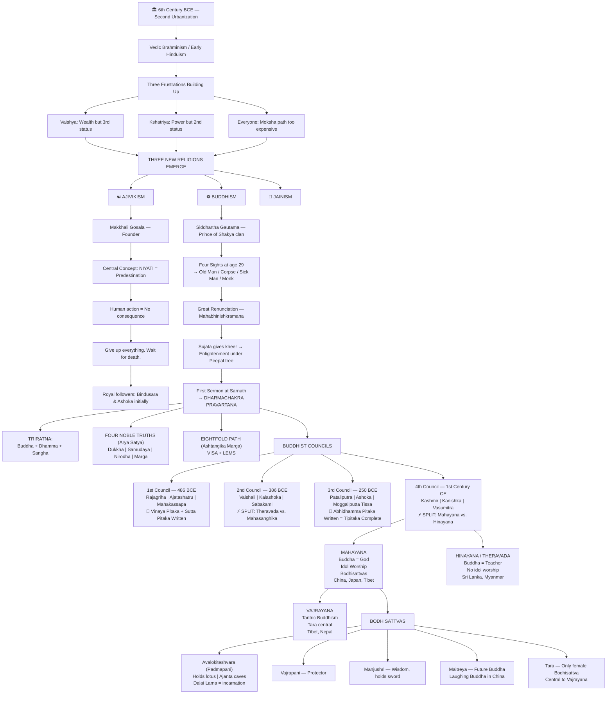
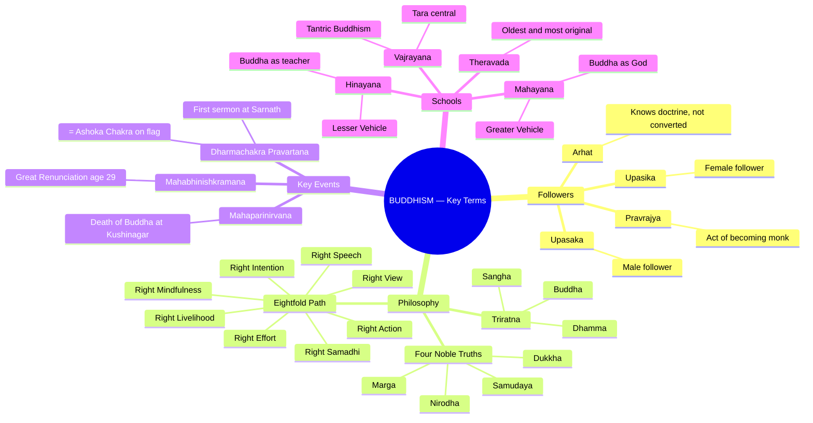

# 📚 UPSC Ancient India — Module 3: Heterodox Traditions
## Buddhism | Jainism | Ajivikism
### *Topper-Style Notes | 16+ Years Teaching Experience*

---

> **⚡ Exam Alert:** Buddhism & Jainism = Most favourite topic of UPSC. At least 1–2 questions appear every year — from Prelims (MCQs on terms) to Mains (context & philosophy).

---

# 🧠 PART 1: STORY-BASED CONCEPTUAL EXPLANATION

---

## 📍 SETTING THE STAGE: Why 6th Century BCE?

The **6th Century BCE** is called the **"Second Urbanization"** in Indian history.

> 🏙️ *First Urbanization = Indus Valley Civilization (IVC). Second = 6th Century BCE.*

This period (600–400 BCE) is extraordinarily dynamic because of:
- Rise of **Territorial States (Mahajanapadas)**
- Rise of **Trade & Commerce**
- Rise of **Punchmark Coins**
- Rise of **Magadha** as a dominant power
- AND — the rise of **THREE NEW RELIGIONS**

This module (Module 3) is the **only standalone module on religious history** in Ancient India — covering **Ajivikism, Buddhism, and Jainism**.

> 📌 *Definition:* **Heterodox** = any tradition that does NOT accept the authority of the Vedas.
> **Orthodox** = Vedic/Brahmanical tradition (early Hinduism).

---

## 🔥 THE FRUSTRATION BUILDING: Context for New Religions

To understand WHY these new religions arose, you must understand **Vedic Brahminism** and what was wrong with it.

### The Varna System Problem

Vedic Brahminism operated on a **fourfold Varna system**:

| Varna | Status | Position |
|-------|--------|----------|
| Brahmin | Priestly Class | **1st** |
| Kshatriya | Warrior/Ruler Class | **2nd** |
| Vaishya | Merchant/Trading Class | **3rd** |
| Shudra | Service Class | **4th** |

**Key rule:** Status was determined **by birth** — rigid, fixed, unchangeable.

### Now the 6th Century BCE Happens...

**Trade and Commerce EXPLODES** in this period. Who benefits most? The **Vaishya community** — they become enormously wealthy. But here's the frustration:

> *"Irrespective of how much money you have, your status cannot change. You remain THIRD."*

Similarly, the **Kshatriyas** — they now rule massive territorial states (Mahajanapadas), they have enormous power. But socially?

> *"You are still SECOND. At every ritual, the Brahmin sits first, eats first, is respected first."*

**Two frustrated communities. A constituency was building.**

---

### The Path to Moksha Problem

In Vedic Brahminism, **Moksha** (liberation of the soul) was the ultimate goal.

**Concept of Moksha:**
- You have a physical body (perishable/nashvar)
- Inside lives the **Atma (Soul)**
- The Soul is trapped in an endless cycle of **birth and rebirth**
- **Moksha** = when the soul breaks this cycle and becomes part of Brahma (God)

**How to get Moksha in Vedic Brahminism?**

> **Sacrifice + Rituals + Service to Brahmins = Punya (Merit) → Accumulate enough Punya → Moksha**

**THE PROBLEM:** Both sacrifice and rituals were **expensive**. Not everyone could afford them. And every time you needed Moksha-merit, you had to pay Brahmins.

---

### Three Frustrations = Context for New Religions

| Frustration No. | Who | Why |
|----------------|-----|-----|
| 1 | Vaishya Community | Huge wealth, still 3rd in social order |
| 2 | Kshatriya Community | Huge political power, still 2nd in ritual status |
| 3 | General Society | Path to Moksha (sacrifice/rituals) too expensive, Brahmin-controlled |

Plus the popular explanation: **Materialism, moral degeneration, sorrow, death, disease** of the 6th Century BCE.

> 🎯 *UPSC Insight:* Books give you the "official" reasons (materialism, moral degeneration). But the DEEPER reasons are social frustration of Vaishyas & Kshatriyas with the Brahmanical order. Understand BOTH.

---

## ☯️ RELIGION 1: AJIVIKISM (आजीविक)

### Who Founded It?

The most important proponent was **Makkhali Gosala** (also called Makkali Gosala).
- Father: **Makkha**
- Mother: **Bhadra**
- Named after the goala (cowshed) where he was born

### The Central Concept: NIYATI (नियति)

Makkhali Gosala gave one powerful, radical answer to the question "How do you get Moksha?"

> **"No Human Action has any consequence. Everything is predetermined by fate (Niyati)."**

In simple terms:
- If you are destined to get Moksha, you will get it.
- If you are not destined to get it, no amount of sacrifice or ritual will help.
- Therefore — ALL the expensive Brahmanical rituals are **USELESS**.

**This brilliantly undercut Vedic Brahminism.** Instead of saying "spend money on rituals," Gosala said "don't bother — it's already decided."

### What Should Ajivikas Do?

Since nothing matters, the Ajivikas said:
- Give up everything — material world, money, clothes, desires
- Go into the forest
- Live an ascetic life
- **Wait for death** (wait for Moksha to happen)

> 💡 *Exam Trick:* **Niyati = Predestination/Fate = Central belief of Ajivikism. Human action = NO consequence.**

### Ajivikism: Key Facts

- **First heterodox religion** to emerge (before Buddhism & Jainism)
- Followers wore **no clothes** (digambara-like)
- Lived in organized ascetic groups in forests
- Received grants from Kings — survived on royal patronage
- **Worshipped no particular God** — just waited for fate
- Two important royal followers: **Bindusara** and **Ashoka** (initially)
- Still exists in some pockets of India today, but not popular
- Primarily a **North India / Pataliputra** phenomenon

---

## ☸️ RELIGION 2: BUDDHISM (बौद्ध धर्म)

> ⭐ **MOST IMPORTANT SECTION** — Buddhism generates 1–2 UPSC questions every single year.

---

### The Story of Siddhartha Gautama

**Birth:** Born to the **Shakya Kshatriya clan**
- Father: **Suddhodana** (ruler)
- Mother: **Maya**
- Name: **Siddhartha**

At birth, Brahmins saw **32 signs** on his body and predicted he would become either:
1. **World Conqueror** (chakravarti king), OR
2. **World Renunciant** (greatest monk)

Suddhodana, wanting a king for a son, surrounded Siddhartha with **all possible comforts** — wealth, pleasure, palaces — to prevent him from choosing renunciation.

**Siddhartha was married to Yashodhara. They had a son: Rahula.**

---

### The Four Sights (Age 29) — The Turning Point

One day, standing on his balcony, Siddhartha saw four things:

| Sight | Realization |
|-------|-------------|
| **Old Man** | Money cannot stop aging |
| **Corpse** | Death is the only guaranteed truth |
| **Sick Man (Diseased person)** | Money cannot stop disease |
| **Monk (Ascetic)** | There is another way to live |

> *"What is the point of money if it cannot stop aging, disease, and death?"*

This is called **Mahabhinishkramana** — the Great Renunciation.

**At age 29**, Siddhartha jumped onto his horse **Kanthaka** and rode away, joining **five wandering monks**.

---

### The Path to Enlightenment

- Wandered with five monks, practicing extreme asceticism including **fasting**
- Could not concentrate properly during meditation
- One day, across a river, a woman named **Sujata** offered him **kheer** (rice cooked in milk)
- He accepted the kheer → the five monks abandoned him ("not a serious aspirant!")
- But eating the kheer gave him the **concentration needed for meditation**
- **Sat under a Peepal Tree** and meditated deeply
- Attained **Enlightenment (Bodhi)** — became the **Buddha (the Enlightened One)**

**First Sermon:** Given to the **same five monks** who had abandoned him
- Location: **Sarnath** (near Varanasi)
- This event is called: **Dharmachakra Pravartana** (Turning of the Wheel of Dharma)
- The chakra representing this moment = **Dharma Chakra = Ashoka Chakra** (used in our national emblem!)

> 📌 *UPSC Insight:* The Ashoka Chakra on the Indian flag is actually the **Dharmachakra** from Buddhism — the wheel of dharma that Buddha set in motion.

**Buddha died at Kushinagar at the age of 80.**

---

### The Three Ratnas (Triratna) — Three Pillars of Buddhism

| Ratna | Meaning |
|-------|---------|
| **Buddha** | The Enlightened Teacher |
| **Dhamma** (Dharma) | His Teachings |
| **Sangha** | The Monastic Order/Institution |

> 📌 *Note:* **Dhamma** is the Pali/Prakrit word; **Dharma** is Sanskrit. Both used — don't get confused.

---

### The Four Noble Truths (Arya Satya / Chatvari Arya Satyani)

| Truth | Meaning |
|-------|---------|
| **1. Dukkha** | There is suffering |
| **2. Samudaya** | Suffering has a cause |
| **3. Nirodha** | Suffering can be ended |
| **4. Marga** | The path to end suffering (Eightfold Path) |

---

### The Eightfold Path (Ashtangika Marga)

> 🎯 *Memory Trick:* **VISA + SMEL** → View, Intention, Speech, Action + Livelihood, Effort, Mindfulness, Samadhi

| Step | Name | Meaning |
|------|------|---------|
| 1 | **Right View** | See the world correctly |
| 2 | **Right Intention** | Good inner motivations |
| 3 | **Right Speech** | Speak truth and kindness |
| 4 | **Right Action** | Act ethically and honestly |
| 5 | **Right Livelihood** | Earn through honest means (Trading = ideal profession!) |
| 6 | **Right Effort** | Direct energy in the right direction |
| 7 | **Right Mindfulness** | Correct thinking and awareness |
| 8 | **Right Samadhi** | Correct meditation/concentration |

> 💡 **Key Point:** Unlike Vedic Brahminism, the Eightfold Path requires **NO MONEY**. Anyone can follow it. This is why it became so popular with the Vaishya community!

---

### Important Buddhist Terms

**Types of Followers:**

| Term | Meaning |
|------|---------|
| **Arhat** | A layperson who knows Buddhist doctrine but hasn't formally converted (like someone who watches a YouTube channel but hasn't subscribed) |
| **Upasaka** | Male lay follower (subscribed!) |
| **Upasika** | Female lay follower |
| **Pravrajya** | The moment of formally becoming a monk (leaving householder life) |
| **Monk** | Full renunciant, on the path to Enlightenment |

**Nirvana vs. Parinirvana:**

| Term | Meaning |
|------|---------|
| **Nibbana/Nirvana** | Extinction of desire + death of the physical body = Moksha. Can be used symbolically (desire died) or literally (person died). |
| **Parinirvana (Mahaparinirvana)** | Death of an enlightened/important person — specifically used for Buddha's death. |

> 🎯 *Memory Rule:* When YOU die = Nibbana. When BUDDHA died = Mahaparinirvana. (Like when PM dies = State funeral.)

---

## 🏛️ THE FOUR BUDDHIST COUNCILS

> ⭐ **Pattern Rule (NEVER FORGET):**
> - **ODD Councils (1st, 3rd)** → Books were written
> - **EVEN Councils (2nd, 4th)** → Splits happened

---

### First Buddhist Council — 486 BCE (also given as 483 BCE)

| Detail | Info |
|--------|------|
| **Location** | Rajagriha (capital of Magadha) |
| **Organized by** | Ajatashatru (ruler) |
| **Presided by** | Mahakassapa (monk) |
| **What happened?** | Two texts written: **Vinaya Pitaka** (rules for monks) and **Sutta Pitaka** (teachings of Buddha) |
| **Significance** | Institutionalization of Buddhism — the religion was codified without Buddha |

> 📌 **Vinaya Pitaka** = Rule book for monks | **Sutta Pitaka** = Buddha's sermons/teachings

---

### Second Buddhist Council — 386 BCE

| Detail | Info |
|--------|------|
| **Location** | Vaishali |
| **Organized by** | Kalashoka (ruler) |
| **Presided by** | Sabakami (monk) |
| **What happened?** | Dispute over Vinaya Pitaka — one group said rules are too hard to follow; other said don't change them |
| **Result** | **FIRST SPLIT in Buddhism** → Theravada vs. Mahasanghika |

# 🧠 Theravāda vs Mahāsāṃghika – Quick Revision

| Feature | Theravāda | Mahāsāṃghika |
|--------|-----------|-------------|
| 🕰️ Origin | Elder school (Sthavira tradition) | “Great Community” (liberal group) |
| 🎯 Goal | Arhat ideal (self-liberation) | Bodhisattva ideal (help all beings) |
| 👤 View of Buddha | Human teacher | More divine / superhuman |
| 📚 Text Language | Pali | Prakrit / Hybrid Sanskrit |
| 🧘 Focus | Personal enlightenment | Universal salvation |
| 🌏 Spread | Sri Lanka, Thailand, Myanmar | Early base for Mahayana ideas |
| 🧠 Philosophy | Conservative | Liberal, evolving doctrines |

---

| School | Position |
|--------|----------|
| **Theravada** (also Sthaviravada) | Minority; Vinaya need NOT be changed; oldest, most orthodox form of Buddhism |
| **Mahasanghika** | Majority; Vinaya needs to be changed/relaxed so more people can follow |

> 🎯 **Theravada = The OLDEST, MOST ORIGINAL school of Buddhism.** They preserved Buddhism closest to what Buddha actually taught.

---

### Third Buddhist Council — 250 BCE (Ashoka's period)

| Detail | Info |
|--------|------|
| **Location** | Pataliputra |
| **Organized by** | **Ashoka** (ruler) |
| **Presided by** | Moggaliputta Tissa (monk) |
| **What happened?** | Third book written: **Abhidhamma Pitaka** — the philosophy/interpretation of Buddha's teachings |
| **Result** | **Tipitaka (Tripitaka) COMPLETED** — three canonical texts of Buddhism |

**The Three Pitakas (Tipitaka = "Three Baskets"):**

| Text | Content |
|------|---------|
| **Vinaya Pitaka** | Rules & regulations for monks |
| **Sutta Pitaka** | Teachings of Buddha (like the Constitution) |
| **Abhidhamma Pitaka** | Philosophy & interpretation of teachings (like a commentary on the Constitution) |

> 📌 Also in Third Council: Ashoka sends Buddhist missions to South India, Burma, Sri Lanka, and Southeast Asia.

---

### Fourth Buddhist Council — 1st Century CE (Kanishka's period)

| Detail | Info |
|--------|------|
| **Location** | Kundalvana, Kashmir |
| **Organized by** | **Kanishka** (Kushana ruler) |
| **Presided by** | Vasumitra (monk); Ashvaghosha also important |
| **What happened?** | Major split on the question: **"Is Buddha God or just a great teacher?"** |
| **Result** | **SECOND MAJOR SPLIT** → Mahayana vs. Hinayana |

| School | Belief |
|--------|--------|
| **Mahayana** ("Greater Vehicle") | Buddha IS God; idol worship; bodhisattvas as subsidiary gods |
| **Hinayana** ("Lesser Vehicle") | Buddha was a great teacher, NOT a god; no idol worship |

> 📌 *Note:* The word "Hinayana" is used by Mahayanists to describe the other group — it's slightly derogatory. The other group calls themselves **Theravada**.

---

## 🌟 MAHAYANA vs. HINAYANA vs. THERAVADA vs. VAJRAYANA

### The Complete Buddhism Family Tree

```
BUDDHISM (Original)
│
├── THERAVADA (broke away at 2nd Council — most original form)
│
└── MAHASANGHIKA (continued as main body)
    │
    ├── MAHAYANA (after 4th Council — "Greater Vehicle")
    │   └── VAJRAYANA (emerged later from Mahayana)
    │
    └── HINAYANA (after 4th Council — "Lesser Vehicle")
```

---

### Mahayana Buddhism — Key Concepts

**Three Core Ideas of Mahayana:**

1. **Buddha is GOD** — to be worshipped as a deity
2. **Idol Worship** of Buddha begins
3. **Concept of Bodhisattvas** develops

**What is a Bodhisattva?**

> A Bodhisattva is an enlightened being who **DELAYED their own Nirvana** in order to help others attain it first.

*(Think: A teacher who could have retired but stayed to help you pass the exam first.)*

**In Mahayana, Buddha is like Nick Fury, and Bodhisattvas are like the Avengers — subsidiary gods around the main God.**

---

### The Main Bodhisattvas (Must Know for UPSC!)

**Three Primary Bodhisattvas:**

| Bodhisattva | Also Known As | Role/Characteristic |
|-------------|---------------|---------------------|
| **Avalokiteshvara** | Padmapani, Lokeshvara | Most popular; holds a lotus flower; listens to world's cries; Dalai Lama considered his incarnation; depicted extensively in Ajanta caves |
| **Vajrapani** | — | Second protective deity; protector of Buddhist community |
| **Manjushri** | — | Embodies wisdom of Buddha; holds a sword |

**Other Important Bodhisattvas:**

| Bodhisattva | Role |
|-------------|------|
| **Maitreya** | The **Future Buddha** — believed to be Buddha's next incarnation; Laughing Buddha in Chinese tradition is said to be Maitreya *(came in UPSC 2019!)* |
| **Vasudharā** | Goddess of wealth, prosperity, and abundance (like Lakshmi) |
| **Tara** | **Only female Bodhisattva**; central to Vajrayana Buddhism |
| **Skanda** | Protector of monks |
| **Sitatapatra** | Protects Buddhists from supernatural dangers |

> 🎯 **UPSC Exam Tip:** Whenever you see the word **"Bodhisattva"** in a question → immediately link it to **Mahayana Buddhism**.

# 🧠 BODHISATTVA – 1 PAGE REVISION (UPSC)

## 🌟 CORE IDEA
👉 “Reached Nirvana, but stayed back to help others”  
👉 Linked to Mahayana Buddhism

---

# 🔺 THREE MAIN BODHISATTVAS (CWP RULE)

## 🟢 C → Compassion  
**Avalokiteshvara**  
- Hears suffering of world 🌍  
- Lotus (Padmapani)  
- Associated with Dalai Lama  
⚡ Keyword: HELP ALL

---

## 🔵 W → Wisdom  
**Manjushri**  
- Sword cuts ignorance ⚔️  
⚡ Keyword: KNOWLEDGE

---

## 🔴 P → Power / Protection  
**Vajrapani**  
- Protector of Buddhism 💪  
⚡ Keyword: BODYGUARD

---

# 🔸 OTHER IMPORTANT BODHISATTVAS

## 🟡 Future  
**Maitreya**  
- Next Buddha ⏳  
⚡ Keyword: COMING SOON

---

## 🟠 Wealth  
**Vasudhara**  
- Prosperity 💰  
⚡ Keyword: MONEY

---

## 🟣 Female / Protection  
**Tara**  
- Saves from fear 👩‍🦰  
⚡ Keyword: MOTHER

---

## ⚫ Monk Protector  
**Skanda**  
⚡ Keyword: SECURITY

---

## ⚪ Spiritual Shield  
**Sitatapatra**  
⚡ Keyword: SHIELD

---

# 🎯 SUPER MEMORY LINE (10 sec)
👉 CWP → Future → Money → Protection Team

(C = Compassion, W = Wisdom, P = Power)

---

# ⚡ EXAM TRIGGER
👉 “Bodhisattva” → Mahayana Buddhism + Helping others before Nirvana

---

### Vajrayana Buddhism

- Emerged **from Mahayana**
- **Tara** (the only female Bodhisattva) is central to this form
- Also called **Tantric Buddhism**
- Heavily practiced in **Tibet, Nepal, and parts of Northeast India**
- The **Dalai Lama** tradition belongs to Vajrayana

---

### Mahayana vs. Hinayana — Quick Comparison

| Feature | Mahayana | Hinayana (Theravada) |
|---------|----------|----------------------|
| View of Buddha | God / Deity | Great Teacher |
| Idol Worship | Yes | No |
| Bodhisattvas | Yes | No |
| Spread | China, Japan, Korea, Tibet, Vietnam | Sri Lanka, Thailand, Myanmar, Cambodia |
| Merit accumulation | Through multiple rebirths | Through personal discipline |
| Accessibility | For both monks AND laypersons | More focused on monastic path |

---

# 🔄 PART 2: FLOWCHART / MINDMAP (MERMAID CODE)



---



---

# ⚡ PART 3: QUICK REVISION NOTES

---

## 🔑 Context

- **Second Urbanization** = 6th Century BCE (First = IVC)
- **Heterodox** = Non-Vedic traditions (Jainism, Buddhism, Ajivikism)
- **Moksha** = Liberation of soul from birth-rebirth cycle
- Vedic path to Moksha = Sacrifice + Rituals (expensive, Brahmin-controlled)
- **Three frustrations** → Vaishya (money, no status) + Kshatriya (power, 2nd place) + General (expensive rituals)

---

## 🔑 Ajivikism

- Founder: **Makkhali Gosala**
- Central belief: **Niyati** (Predestination/Fate)
- Human action = **NO consequence**
- Royal followers: **Bindusara** and **Ashoka** (initially)
- First heterodox religion to emerge
- Followers wore **no clothes** — lived as ascetics in forests

---

## 🔑 Buddhism — Life of Buddha

| Event | Detail |
|-------|--------|
| Father | Suddhodana |
| Mother | Maya |
| Wife | Yashodhara |
| Son | Rahula |
| Horse | Kanthaka |
| Great Renunciation | Age 29 — Mahabhinishkramana |
| Woman who gave kheer | Sujata |
| Enlightenment under | Peepal Tree (Bodh Gaya) |
| First Sermon | Sarnath |
| Event name | Dharmachakra Pravartana |
| Death at | Kushinagar, age 80 |

---

## 🔑 Buddhist Terms Cheatsheet

| Term | Meaning |
|------|---------|
| Arhat | Knows doctrine, not formally converted |
| Upasaka/Upasika | Male/Female formal lay follower |
| Pravrajya | Act of becoming a monk |
| Nibbana/Nirvana | Extinction of desire + death = Moksha |
| Parinirvana | Death of the enlightened one |
| Mahaparinirvana | Death of Buddha himself |
| Triratna | Buddha + Dhamma + Sangha |
| Tipitaka | Three Pitakas (canonical texts) |
| Dhamma | Teachings (Pali word; Sanskrit = Dharma) |
| Sangha | Monastic institution/order |

---

## 🔑 Four Buddhist Councils — Quick Table

| Council | Year | Location | Ruler | Monk | Outcome |
|---------|------|----------|-------|------|---------|
| **1st** | 486 BCE | Rajagriha | Ajatashatru | Mahakassapa | Vinaya + Sutta Pitaka written |
| **2nd** | 386 BCE | Vaishali | Kalashoka | Sabakami | SPLIT: Theravada vs. Mahasanghika |
| **3rd** | 250 BCE | Pataliputra | **Ashoka** | Moggaliputta Tissa | Abhidhamma Pitaka written; missions sent |
| **4th** | 1st CE | Kashmir | **Kanishka** | Vasumitra | SPLIT: Mahayana vs. Hinayana |

> 🎯 **Pattern:** ODD = Books | EVEN = Splits

---

## 🔑 Three Pitakas

| Pitaka | Content |
|--------|---------|
| **Vinaya Pitaka** | Rules for monks |
| **Sutta Pitaka** | Teachings of Buddha |
| **Abhidhamma Pitaka** | Philosophy and interpretation |

---

## 🔑 Mahayana — Must-Know Bodhisattvas

| Bodhisattva | Key Identity |
|-------------|-------------|
| **Avalokiteshvara** (Padmapani/Lokeshvara) | Most popular; holds lotus; Dalai Lama = incarnation; extensively in Ajanta |
| **Vajrapani** | Protector of Buddhist community |
| **Manjushri** | Wisdom; holds sword |
| **Maitreya** | Future Buddha; Laughing Buddha = Maitreya *(UPSC 2019)* |
| **Tara** | Only female Bodhisattva; Central to Vajrayana |
| **Vasudhara** | Wealth and prosperity |
| **Skanda** | Protector of monks |
| **Sitapatara** | Protects from supernatural dangers |

---

## 🔑 Schools of Buddhism

| School | Key Feature | Spread to |
|--------|-------------|-----------|
| **Theravada** | Oldest; most original; no change to Vinaya | Sri Lanka, Thailand, Myanmar |
| **Mahayana** | Buddha as God; idol worship; bodhisattvas | China, Japan, Korea, Tibet |
| **Hinayana** | Buddha as great teacher (Mahayana's term for Theravada) | — |
| **Vajrayana** | Tantric; Tara central; from Mahayana | Tibet, Nepal |

---

## 🔑 UPSC PYQ Connections

- **Dharmachakra Pravartana** → directly links to Ashoka Chakra on Indian flag
- **Avalokiteshvara/Padmapani** → depicted in Ajanta Caves (Art & Culture overlap)
- **Maitreya** → UPSC 2019 direct question on Future Buddha
- **Nibbana/Nirvana** → definitional MCQ favourite
- **Buddhist Councils** → match the following type questions
- **Tipitaka** → canonical texts questions
- **Theravada** → oldest school — definitional question

---

## 🔑 Special Connection: Ashoka Chakra = Dharma Chakra

> The **Ashoka Chakra** on the Indian national flag is derived from the **Dharma Chakra Pravartana** — the moment Buddha gave his first sermon at Sarnath, symbolized by the turning of the Wheel of Dharma.

---

## 🔑 Buddhism Timeline (900 Years of Dominance)

> **6th Century BCE → 3rd–4th Century CE**: Buddhism was the dominant religion of India's rulers and merchants for nearly 900 years — from Ajatashatru's patronage to the Gupta period, when Puranic Hinduism rose and Buddhism began to decline.

---

*📝 Notes compiled from lecture — Ancient India, Module 3 | UPSC CSE Preparation*
*These notes cover Prelims MCQs + Mains conceptual understanding*
